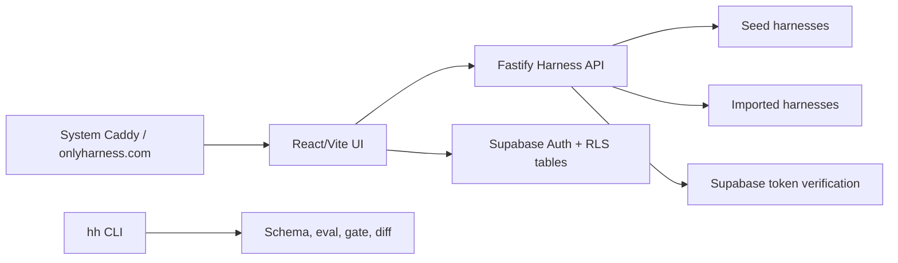

# OnlyHarness

[onlyharness.com](https://onlyharness.com) is a friendly hub for forkable AI-agent harnesses: browse workflows, try examples, read the thread, fork, star, and publish with a CLI-ready trust layer.

The UI ships as **OnlyHarness 98** — a deliberately playful Windows 98 / MS Paint / WordArt desktop (per `design_handoff_harness_hub_98`): every surface is a window, harnesses open as draggable windows with a taskbar, auth is a Log On dialog, and the share card is `harness_flex.exe`. Design decisions live in [docs/plans/2026-07-04-win98-redesign-design.md](docs/plans/2026-07-04-win98-redesign-design.md). Internal package names still use `@harnesshub/*`.

## What is a harness?

A harness is a versioned agent workflow package:

- `harness.yaml` manifest with runtime, tools, permissions, quality gates, and risk profile.
- Prompt, examples, eval cases, and expected outputs.
- CLI commands for validate, eval, gate, diff, import, and PR annotation.
- Social layer: stars, forks, threads, runs, heat, tags, outcomes, and maintainer review.

## Live MVP

- App: [https://onlyharness.com](https://onlyharness.com)
- API health: [https://onlyharness.com/api/healthz](https://onlyharness.com/api/healthz)
- Registry API: [https://onlyharness.com/api/registry](https://onlyharness.com/api/registry)

Supabase auth is enabled for signup/login, stars/forks, thread posts, and authenticated publish.

## Features

- HuggingFace-style discovery for agent harnesses, wrapped in a Win98 desktop with a real window manager (drag, minimize, z-order, taskbar, Start menu).
- Outcome filters, global search, leaderboard, Harness Heat, stars, forks, runs, and threads.
- Harness detail opens as its own window with Overview, Try, Thread, Evals, and Files tabs plus a plain-tone trust panel.
- Authenticated publish flow (`New Harness Wizard`) that imports markdown into a harness scaffold.
- Share card window (`harness_flex.exe`), Wild West awards, Paint heat chart, and a paperclip mascot that opens the wizard.
- CLI package with `hh search`, `hh pull`, `hh run`, `hh publish`, `hh doctor`, `hh validate`, `hh inspect`, `hh risk`, `hh diff`, `hh eval`, `hh gate`, `hh import-md`, and `hh annotate-pr` (`HH_REGISTRY_URL` targets any registry, default `https://onlyharness.com/api`).
- Agent-friendly discovery: [`/llms.txt`](https://onlyharness.com/llms.txt) documents the HTTP API (`/api/registry?q=`, `/api/repos/:owner/:name/archive`) so an AI agent can find and pull a harness without a browser.
- Semantic PR review and quality gate sidecar API.
- Docker production stack with system Caddy deployment mode for shared VPS hosts.

## Architecture



## Run locally

```bash
npm install
npm run seed
npm run check
npm run smoke
npm run dev
```

Open:

- UI: `http://127.0.0.1:5177`
- API: `http://127.0.0.1:8787/healthz`
- Local Gitea forge: `http://127.0.0.1:3000`

Create local env from the examples:

```bash
cp .env.example .env.local
cp .env.example apps/registry-web/.env.local
```

## Production deploy

The current VPS uses a shared system Caddy on ports `80/443`. OnlyHarness runs behind it on `127.0.0.1:8097`.

```bash
SSH_TARGET=hetzner-root DEPLOY_MODE=system-caddy scripts/deploy-production.sh
```

Deployment artifacts:

- `infra/production-compose.yml`
- `infra/production-system-caddy.override.yml`
- `infra/Caddyfile.local-smoke`
- `scripts/deploy-production.sh`
- `scripts/smoke-production-compose.sh`
- `scripts/smoke-production-auth.ts`

Production smoke:

```bash
scripts/smoke-production-compose.sh

set -a
. infra/production.env
set +a
SMOKE_API_URL=https://onlyharness.com/api npm run smoke:prod-auth
```

## Verification

Current verification gates:

```bash
npm run build
npm run check
npm run smoke
scripts/smoke-production-compose.sh
```

The production auth smoke creates a QA Supabase user, obtains an access token, and publishes a harness through the public API.

## Repository Layout

```text
apps/
  harness-api/       Fastify API and registry endpoints
  registry-web/      React/Vite OnlyHarness UI
packages/
  cli/               hh CLI
  schema/            harness.yaml schema, validation, risk checks
  semantic-diff/     harness semantic diff and PR review markdown
seed-harnesses/      curated MVP harness examples
supabase/            auth/social/thread schema migrations
infra/               Docker, Caddy, Gitea, and production compose
scripts/             seed, smoke, deploy, Gitea proof scripts
```

## Security Notes

- Real `.env.local`, app env, and `infra/production.env` files are gitignored.
- Publish requires a valid Supabase bearer token in production.
- Internal webhook/eval endpoints require `HARNESS_WEBHOOK_TOKEN` when configured.
- Supabase tables use RLS policies for profiles, user actions, and thread posts.
