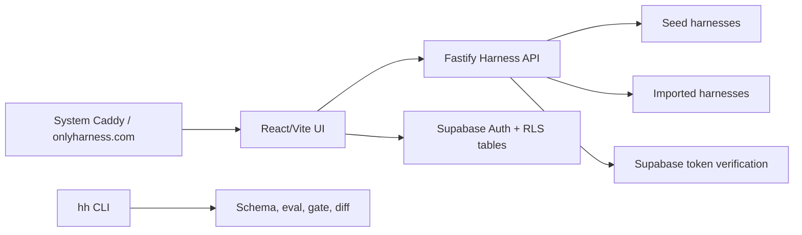

# OnlyHarness

[onlyharness.com](https://onlyharness.com) is a friendly hub for forkable AI-agent harnesses: browse workflows, try examples, read the thread, fork, star, and publish with a CLI-ready trust layer.

The UI ships as **OnlyHarness 98** — a deliberately playful Windows 98 / MS Paint / WordArt desktop (per `design_handoff_harness_hub_98`): every surface is a window, harnesses open as draggable windows with a taskbar, auth is a Log On dialog, and the share card is `harness_flex.exe`. Design decisions live in [docs/plans/2026-07-04-win98-redesign-design.md](docs/plans/2026-07-04-win98-redesign-design.md). Internal package names still use `@harnesshub/*`, except the public CLI workspace/package is `onlyharness`.

## What is a harness?

A harness is a versioned agent workflow package:

- `harness.yaml` manifest with runtime, tools, permissions, quality gates, and risk profile.
- Prompt, examples, eval cases, and expected outputs.
- CLI commands for validate, eval, gate, diff, import, and PR annotation.
- Social layer: stars, forks, threads, runs, heat, tags, outcomes, and maintainer review.

## Live MVP

- App: [https://onlyharness.com](https://onlyharness.com)
- API health: [https://onlyharness.com/api/healthz](https://onlyharness.com/api/healthz)
- Registry API: [https://onlyharness.com/api/registry](https://onlyharness.com/api/registry)

Supabase auth is enabled for signup/login, stars/forks, thread posts, and authenticated publish.

## Features

- HuggingFace-style discovery for agent harnesses, wrapped in a Win98 desktop with a real window manager (drag, minimize, z-order, taskbar, Start menu).
- Outcome filters, global search, leaderboard, Harness Heat, stars, forks, runs, and threads.
- Harness detail opens as its own window with Overview, Try, Thread, Evals, and Files tabs plus a plain-tone trust panel.
- Authenticated publish flow (`New Harness Wizard`) that imports markdown into a harness scaffold.
- Share card window (`harness_flex.exe`), Wild West awards, Paint heat chart, and a paperclip mascot that opens the wizard.
- CLI package `onlyharness` with `hh search`, `hh pull`, `hh run`, `hh publish`, `hh doctor`, `hh audit-setup`, `hh extract`, `hh setup @org`, `hh validate`, `hh inspect`, `hh risk`, `hh diff`, `hh eval`, `hh gate`, `hh pin`, `hh outdated`, `hh update`, `hh import-md`, and `hh annotate-pr` (`HH_REGISTRY_URL` targets any registry, default `https://onlyharness.com/api`).
- Agent-friendly discovery: [`/llms.txt`](https://onlyharness.com/llms.txt), [`/api/openapi.json`](https://onlyharness.com/api/openapi.json), [`/server.json`](https://onlyharness.com/server.json), and `/mcp` document the HTTP/MCP surfaces so an AI agent can find and pull a harness without a browser.
- Semantic PR review and quality gate sidecar API.
- Docker production stack with system Caddy deployment mode for shared VPS hosts.

## Architecture



## Run locally

```bash
npm install
npm run seed
npm run check
npm run smoke
npm run dev
```

Open:

- UI: `http://127.0.0.1:5177`
- API: `http://127.0.0.1:8787/healthz`
- Local Gitea forge: `http://127.0.0.1:3000`

## Operator Reports

Payout reporting is dry-run only. It reads settled `purchases` plus `payout_accounts`, applies the current manual rates, and prints blocked rows instead of moving money.

```bash
npm run payout:report -- --month 2026-07
npm run payout:report -- --month 2026-07 --json
```

Use `SUPABASE_URL` + `SUPABASE_SERVICE_ROLE_KEY`, or local JSON fixtures via `--purchases` and `--payout-accounts`. Rows without `creator_user_id` are marked `MISSING_CREATOR_ID` and get no payout amount.

## CLI

After the npm package is published:

```bash
npx onlyharness search market research
npx onlyharness pull harnesses/deep-market-researcher
npm i -g onlyharness   # installs the `hh` command
```

This local branch prepares the `onlyharness` npm bundle but does not publish it. For local development, build the workspace bundle and run it directly:

```bash
npm run build -w onlyharness
node packages/harness-cli/dist/hh.mjs doctor
node packages/harness-cli/dist/hh.mjs audit-setup
node packages/harness-cli/dist/hh.mjs extract ~/.claude/skills/my-skill --out my-skill-harness
HH_ORG_TOKEN=<org-token> node packages/harness-cli/dist/hh.mjs setup @acme
HH_ORG_TOKEN=<org-token> node packages/harness-cli/dist/hh.mjs publish workflow.md --org acme --name my-private-harness
HH_ORG_TOKEN=<org-token> node packages/harness-cli/dist/hh.mjs sync git@github.com:acme/skills.git --org acme
TELEGRAM_BOT_TOKEN=<bot-token> HH_ORG_TOKEN=<org-token> TELEGRAM_CHANNEL_ID=<channel-id> npm run telegram:gate-bot
```

## For agents

- Discovery: [`/llms.txt`](https://onlyharness.com/llms.txt), [`/AGENTS.md`](https://onlyharness.com/AGENTS.md), [`/api/openapi.json`](https://onlyharness.com/api/openapi.json), and MCP Registry metadata at [`/server.json`](https://onlyharness.com/server.json).
- MCP: `https://onlyharness.com/mcp` with `search_harnesses`, `harness_detail`, `pull_instructions`, `pull_harness`, `search_docs`, and `publish_markdown_to_harness`.
- Registry publish: `server.json` is remote-only (`com.onlyharness/registry`) and ready for MCP Registry domain auth; publish still requires a DNS/HTTP ownership proof for `onlyharness.com`.
- Team setup and publish: `hh setup @acme` reads `GET /api/orgs/{slug}/bundle`; `hh publish --org acme` writes an org-private harness. Both use `HH_ORG_TOKEN` when `ORGS_ENABLED=true`.
- Team workspace UI/API: Network Neighborhood uses `GET /api/orgs/{slug}/workspace` with the same org token and returns org-private cards, sanitized audit rows, and a permission/risk summary.
- Team git sync: `hh sync <git-url-or-local-path> --org acme` clones/scans markdown skills and runbooks, then imports them through the org publish endpoint. First version has no webhooks.
- Org-private pulls use the same token path: `HH_ORG_TOKEN=<org-token> hh pull @acme/private-harness`.
- Paid pulls return 402 until entitled. When `PAYMENTS_ENABLED=true`, `X402_ENABLED=true`, and `X402_PAY_TO` is set, the archive response also includes an x402 v2 `PAYMENT-REQUIRED` header. Successful `hh pull --pay` archive delivery requires `X402_FACILITATOR_URL` to verify/settle and then grants a wallet entitlement.
- Bot gates can call `GET /api/entitlements/check?subject=user:<id>&harness=owner/name` with an org token that has `entitlements:read`; this returns a decision only, never archive files.
- Safer community gates use short-lived signed codes: the buyer calls `POST /api/community/invite-code` after entitlement, then the Telegram/Discord bot calls `POST /api/community/verify-code` with a scoped org token before granting access. `COMMUNITY_INVITE_SECRET` must be configured on the API.
- Registry items include `installConfirms`; only authenticated `kind=install&client=claude-code` events count toward the `works in Claude Code: N confirms` badge.
- Claude Code plugin: `claude plugin marketplace add elvismusli/onlyharness` then `claude plugin install onlyharness@onlyharness`.
- Local validation: `npm run check:mcp-registry && claude plugin validate . && claude plugin validate plugins/onlyharness`.

Create local env from the examples:

```bash
cp .env.example .env.local
cp .env.example apps/registry-web/.env.local
```

## Production deploy

The current VPS uses a shared system Caddy on ports `80/443`. OnlyHarness runs behind it on `127.0.0.1:8097`.

```bash
SSH_TARGET=hetzner-root DEPLOY_MODE=system-caddy scripts/deploy-production.sh
```

Deployment artifacts:

- `infra/production-compose.yml`
- `infra/production-system-caddy.override.yml`
- `infra/Caddyfile.local-smoke`
- `scripts/deploy-production.sh`
- `scripts/smoke-production-compose.sh`
- `scripts/smoke-production-auth.ts`

Production smoke:

```bash
scripts/smoke-production-compose.sh

set -a
. infra/production.env
set +a
SMOKE_API_URL=https://onlyharness.com/api SMOKE_EXPECT_EMAIL_CONFIRMATION=1 npm run smoke:prod-auth
```

## Verification

Current verification gates:

```bash
npm run build
npm run check
npm run smoke
scripts/smoke-production-compose.sh
```

The production auth smoke creates a QA Supabase user and verifies that email confirmation blocks immediate sign-in. To test authenticated publish with a pre-confirmed token, pass `HH_TOKEN` to the CLI publish flow or run the API publish smoke against a confirmed session.

## Repository Layout

```text
apps/
  harness-api/       Fastify API and registry endpoints
  registry-web/      React/Vite OnlyHarness UI
packages/
  cli/               hh CLI
  schema/            harness.yaml schema, validation, risk checks
  semantic-diff/     harness semantic diff and PR review markdown
seed-harnesses/      curated MVP harness examples
supabase/            auth/social/thread schema migrations
infra/               Docker, Caddy, Gitea, and production compose
scripts/             seed, smoke, deploy, Gitea proof scripts
```

## Security Notes

- Real `.env.local`, app env, and `infra/production.env` files are gitignored.
- Publish requires a valid Supabase bearer token in production.
- Internal webhook/eval endpoints require `HARNESS_WEBHOOK_TOKEN` when configured.
- Organization setup is behind `ORGS_ENABLED`; org tokens are stored as `sha256:` hashes and audit logs must not contain raw tokens.
- Supabase tables use RLS policies for profiles, user actions, and thread posts.
