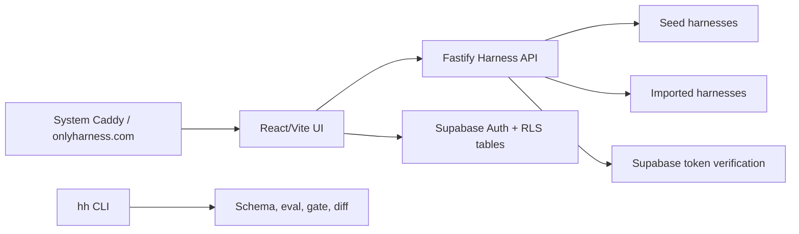

# OnlyHarness

[onlyharness.com](https://onlyharness.com) is a friendly hub for reusable AI-agent resources: browse skills, plugins, workflows, MCP servers, runtimes, guides and native harness-format packages, try examples, read the thread, create local remix drafts, and use a CLI-ready trust layer.

The UI ships as **OnlyHarness 98** — a deliberately playful Windows 98 / MS Paint / WordArt desktop (per `design_handoff_harness_hub_98`): every surface is a window, harnesses open as draggable windows with a taskbar, auth is a Log On dialog, and the share card is `harness_flex.exe`. Design decisions live in [docs/plans/2026-07-04-win98-redesign-design.md](docs/plans/2026-07-04-win98-redesign-design.md). Internal package names still use `@harnesshub/*`, except the public CLI workspace/package is `onlyharness`.

## What is a native harness package?

A native harness package is the strict, verified package format inside the broader OnlyHarness resource catalog:

- `harness.yaml` manifest with runtime, tools, permissions, quality gates, and risk profile.
- Prompt, examples, eval cases, and expected outputs.
- CLI commands for validate, eval, gate, diff, import, and PR annotation.
- Social layer: stars, server-side remix forks, threads, verified gate runs, install confirms, heat, tags, outcomes, and maintainer review.

## Live MVP

- App: [https://onlyharness.com](https://onlyharness.com)
- API health: [https://onlyharness.com/api/healthz](https://onlyharness.com/api/healthz)
- Registry API: [https://onlyharness.com/api/registry](https://onlyharness.com/api/registry)

Supabase auth is enabled for signup/login, stars, local remix drafts, thread posts, and authenticated publish.

## Features

- HuggingFace-style discovery for agent resources, wrapped in a Win98 desktop with a real window manager (drag, minimize, z-order, taskbar, Start menu).
- Outcome filters, global search, leaderboard, Harness Heat, stars, server-side remix fork counters, threads, and verified gate-run counters.
- Harness detail opens as its own window with Overview, Install, Trust, Try sample, Thread, Files, and Versions tabs plus a plain-tone trust panel; Versions is backed by archive snapshot history.
- Authenticated quick publish flow (`New Resource Wizard`) that imports markdown into a small unverified scaffold.
- Share card window (`harness_flex.exe`), Wild West awards, Paint heat chart, and a paperclip mascot that opens the wizard.
- CLI package `onlyharness` with `hh search`, `hh resources search/detail/open/import`, `hh suggest`, `hh pull`, `hh run`, `hh publish`, `hh publish-resource`, `hh doctor`, `hh audit-setup`, `hh benchmark`, `hh extract`, `hh setup @org`, `hh validate`, `hh inspect`, `hh risk`, `hh diff`, `hh eval`, `hh gate`, `hh pin`, `hh outdated`, `hh update`, `hh import-md`, and `hh annotate-pr` (`HH_REGISTRY_URL` targets any registry, default `https://onlyharness.com/api`).
- Agent-friendly discovery: [`/llms.txt`](https://onlyharness.com/llms.txt), [`/api/openapi.json`](https://onlyharness.com/api/openapi.json), [`/server.json`](https://onlyharness.com/server.json), and `/mcp` document the HTTP/MCP surfaces so an AI agent can find and pull a harness without a browser.
- Local bounty flow: create/claim/deliver/accept work-state over the existing `gate_escrow` rail; `paid` is set only after a matching escrow purchase captures against the delivered gate receipt.
- Semantic PR review and quality gate sidecar API.
- Docker production stack with system Caddy deployment mode for shared VPS hosts.

## Architecture



## Run locally

```bash
npm install
npm run seed
npm run check
npm run smoke
npm run dev
```

Open:

- UI: `http://127.0.0.1:5177`
- API: `http://127.0.0.1:8787/healthz`
- Local Gitea forge: `http://127.0.0.1:3000`

## Operator Payouts

Payout reporting and ledger creation are manual-ops only. The script reads settled `purchases` plus `payout_accounts`, applies the current rates, and can create an idempotent draft payout ledger. It never calls a payout provider and never marks items paid.

```bash
npm run payout:report -- --month 2026-07
npm run payout:report -- --month 2026-07 --json
npm run payout:ledger -- --month 2026-07 --ledger-out data/payout-ledgers/2026-07.json
```

Use `SUPABASE_URL` + `SUPABASE_SERVICE_ROLE_KEY`, or local JSON fixtures via `--purchases` and `--payout-accounts`. `--record-ledger` upserts `payout_runs`/`payout_items` through Supabase service role. Rows without `creator_user_id` are marked `MISSING_CREATOR_ID`; rows without payout account are blocked as `MISSING_PAYOUT_ACCOUNT`.

## CLI

The npm package is published:

```bash
npx onlyharness@latest search market research
npx onlyharness@latest suggest market research --json
npx onlyharness@latest resources search superpowers --json
npx onlyharness@latest resources detail github:obra/superpowers --json
npx onlyharness@latest resources open github:obra/superpowers --json
npx onlyharness@latest install harnesses/deep-market-researcher --target claude-code --json
npx onlyharness@latest publish-resource ./agent-tool --name agent-tool --type command_pack --json
npx onlyharness@latest publish-resource ./agent-tool --workspace acme --name agent-tool --type command_pack --json
npx onlyharness@latest mcp-config deep-market-researcher --target claude-desktop --json
npm i -g onlyharness   # installs the `hh` command
```

Resource catalog and `publish-resource` commands are available in published `onlyharness@0.2.4` and through MCP/HTTP.

For local development, build the workspace bundle and run it directly:

```bash
npm run build -w onlyharness
node packages/harness-cli/dist/hh.mjs doctor
node packages/harness-cli/dist/hh.mjs audit-setup
node packages/harness-cli/dist/hh.mjs suggest market research --apply --out suggested-deep-market-researcher --json
node packages/harness-cli/dist/hh.mjs suggest market research --apply --target codex --out suggested-deep-market-researcher --adapter-out .codex/harnesses/deep-market-researcher --json
node packages/harness-cli/dist/hh.mjs install harnesses/deep-market-researcher --target codex --out deep-market-researcher --adapter-out .codex/harnesses/deep-market-researcher --json
node packages/harness-cli/dist/hh.mjs pull harnesses/deep-market-researcher --version 0.1.0 --out deep-market-researcher-0.1.0 --json
node packages/harness-cli/dist/hh.mjs mcp-config deep-market-researcher --target claude-desktop --out mcp.json
node packages/harness-cli/dist/hh.mjs benchmark benchmarks/research-discovery.yaml --json
node packages/harness-cli/dist/hh.mjs extract ~/.claude/skills/my-skill --out my-skill-harness
HH_TOKEN=<token> node packages/harness-cli/dist/hh.mjs publish git@github.com:acme/harnesses.git --path harnesses/my-harness --name my-harness --json
HH_TOKEN=<token> node packages/harness-cli/dist/hh.mjs publish-resource ./agent-tool --name agent-tool --type command_pack --json
HH_TOKEN=<token> node packages/harness-cli/dist/hh.mjs publish-resource https://github.com/acme/agent-tool.git --path packages/tool --name agent-tool --type command_pack --json
HH_WORKSPACE_TOKEN=<workspace-token> node packages/harness-cli/dist/hh.mjs publish-resource ./agent-tool --workspace acme --name agent-tool --type command_pack --json
HH_WORKSPACE_TOKEN=<workspace-token> node packages/harness-cli/dist/hh.mjs resources search agent-tool --workspace acme --json
HH_WORKSPACE_TOKEN=<workspace-token> node packages/harness-cli/dist/hh.mjs resources detail @acme/agent-tool --json
HH_ORG_TOKEN=<org-token> node packages/harness-cli/dist/hh.mjs setup @acme
HH_ORG_TOKEN=<org-token> node packages/harness-cli/dist/hh.mjs publish workflow.md --org acme --name my-private-harness
HH_ORG_TOKEN=<org-token> node packages/harness-cli/dist/hh.mjs sync git@github.com:acme/skills.git --org acme
TELEGRAM_BOT_TOKEN=<bot-token> HH_ORG_TOKEN=<org-token> TELEGRAM_CHANNEL_ID=<channel-id> npm run telegram:gate-bot
```

## For agents

- Discovery: [`/llms.txt`](https://onlyharness.com/llms.txt), [`/AGENTS.md`](https://onlyharness.com/AGENTS.md), [`/api/openapi.json`](https://onlyharness.com/api/openapi.json), MCP Registry metadata at [`/server.json`](https://onlyharness.com/server.json), OAuth protected-resource metadata at [`/.well-known/oauth-protected-resource`](https://onlyharness.com/.well-known/oauth-protected-resource), and authorization-server metadata at [`/.well-known/oauth-authorization-server`](https://onlyharness.com/.well-known/oauth-authorization-server).
- MCP: `https://onlyharness.com/mcp` with `search_harnesses`, `harness_detail`, `pull_instructions`, `pull_harness`, `search_resources`, `resource_detail`, `resource_use_instructions`, `search_docs`, `publish_markdown_to_harness`, and `publish_resource_package`. `harness_detail`/`pull_instructions` expose read-only access/payment state; only `pull_harness`/archive delivery returns native harness files after entitlement.
- Registry publish: `server.json` is remote-only (`com.onlyharness/registry`) and ready for MCP Registry domain auth; publish still requires a DNS/HTTP ownership proof for `onlyharness.com`.
- Team setup and publish: `hh setup @acme` reads `GET /api/orgs/{slug}/bundle`; `hh publish --org acme` writes an org-private harness. Both use `HH_ORG_TOKEN` when `ORGS_ENABLED=true`. Org auth/bundles/audit read Supabase service-role tables first and keep `HARNESS_ORGS_PATH`/`HARNESS_ORG_AUDIT_PATH` as the local smoke fallback.
- Team workspace UI/API: Network Neighborhood uses `GET /api/orgs/{slug}/workspace` with the same org token and returns org-private cards, sanitized audit rows, and a permission/risk summary.
- Workspace resource catalogs: `GET /api/workspaces/{slug}/workspace`, `GET /api/workspaces/{slug}/resources`, `GET /api/workspaces/{slug}/resources/{id}`, `GET /api/workspaces/{slug}/resources/{id}/archive`, and `POST /api/workspaces/{slug}/imports/resource-package` are gated by `WORKSPACES_ENABLED=true` and `HH_WORKSPACE_TOKEN` with `HH_ORG_TOKEN` as a migration fallback.
- Team git sync: `hh sync <git-url-or-local-path> --org acme` clones/scans markdown skills and runbooks, then imports them through the org publish endpoint. First version has no webhooks.
- Maintainer publish: `hh publish <harness-dir>` requires local `.harnesshub/results.json`; `hh publish <git-url> --path <harness-dir>` clones to a temp dir, runs local eval/gate there, then publishes only if the server rechecks schema, security and gate successfully.
- Resource package publish: `hh publish-resource <dir-or-git-url> --name <slug> --type <type>` packages safe bounded text files from skills, plugins, workflows, MCP servers, command packs, scripts, docs or source bundles into OnlyHarness archive storage and lists the result in `/api/resources`. It is not a Verified harness badge.
- Workspace resource package publish: `hh publish-resource <dir-or-git-url> --workspace acme --name <slug> --type <type>` publishes the same full package into a private workspace catalog as `@acme/name`; it does not go through the markdown scaffold path and does not claim a Verified badge.
- Org-private pulls use the same token path: `HH_ORG_TOKEN=<org-token> hh pull @acme/private-harness`.
- Directory shelf entries are link-only discovery indexes under owner `directories`. They show `open <url>` in search results and `GET /api/repos/directories/{name}/archive` returns `409 DIRECTORY_LINK_ONLY` instead of runnable files.
- Server-side remix is a local draft flow with a real fork graph row: `POST /api/repos/{owner}/{repo}/remixes` creates a free unverified `local/{name}` copy from archive files only and records the source -> fork edge. Paid, org/private, directory, link-only and unspecified-license sources fail closed; copied fallback recipes do not increment forks or store prompts/local paths.
- Public API payloads never expose server filesystem paths: registry/detail use public forge, OnlyHarness GitHub mirror, or upstream URLs when available, `/healthz` only returns status, and maintainer review in detail is explicitly a `local-demo` preview until a real forge PR source is connected.
- `/api/resources` is the primary mixed source-aware catalog for skills, plugins, workflows, MCP servers, configs, guides, runtimes, directories and native harness-format packages. `/api/registry` keeps the harness-plus-link-only-directory contract for existing agent clients.
- Category benchmark infrastructure is local-first: `hh benchmark <suite.yaml>` compares candidate and analog harnesses from local paths using declared eval case scores. Suites live in `benchmarks/`, smoke runs every YAML suite there, and this remains a runner/comparison layer, not an independent LLM quality measurement.
- Agent autopilot: `hh suggest <task> --json` searches, returns ranked candidates with trust fields, fetches detail for the selected harness, prints a full trust summary, and records a privacy-safe `suggested` event. Use `--pick <rank>` to inspect/apply another candidate. `hh suggest <task> --apply --out <dir>` installs the selected harness through the same archive path as `hh pull`, records `accepted` when `--apply` is chosen, and records `applied` only after files are written. Add `--target cli|claude-code|codex|cursor` to run the full adapter install path before `applied`.
- Versioned archives: harness detail includes `versions[]`; `hh pull owner/name --version <semver>` and `hh install owner/name --version <semver>` request the same immutable `/archive?version=` path and keep `.harnesshub/source.json` pinned to the resolved version.
- `hh eval` and `hh gate` record privacy-safe `eval`/`gate` events for pulled harnesses when they pass; detail payloads expose `verification.lastVerifiedAt` from those events. Registry `runs` are counted only from passed `gate` events, never from `hh run` sample preview.
- `hh gate --receipt` writes a signed gate receipt with harness ref, version, `resultsHash`, verdict and timestamp. `POST /api/receipts` verifies the ed25519 signature only; it is side-effect-free and does not store prompts, local paths, payments or entitlements.
- Gate escrow is reserved-first: `pricing.model: gate_escrow` checkout/webhook creates `reserved` plus an expiring `escrow_reserved` archive entitlement. `POST /api/billing/escrow/receipt` captures on a valid passing receipt or refunds on a valid failing receipt; `POST /api/billing/escrow/timeout` refunds after the 72h window.
- Bounties are work-state over the same escrow rail: `/api/bounties*` supports create, claim, deliver and accept; accept verifies the delivered receipt, escrow target, amount and currency, blocks escrow reuse, and writes `paid` only after capture.
- Hosted endpoints are not live yet: `hh run` executes locally as sample preview only, and HTTP/MCP surfaces deliver harness files rather than running author code server-side. `pricing.model=per_call` returns `409 HOSTED_EXECUTION_NOT_AVAILABLE` until a runner/partner path is shipped and smoked.
- Paid installs/pulls return 402 until entitled. When `PAYMENTS_ENABLED=true`, `X402_ENABLED=true`, and `X402_PAY_TO` is set, the archive response also includes an x402 v2 `PAYMENT-REQUIRED` header. Successful `hh install --pay` or `hh pull --pay` archive delivery requires `X402_FACILITATOR_URL` to verify/settle and then grants a wallet entitlement.
- Checkout URLs land on `/checkout`: without `provider_ref` the web UI asks the buyer to log on and create a manual checkout session; with `provider_ref` it shows a pending manual handoff. Neither state grants access client-side.
- Manual checkout is the only enabled checkout provider (`PAYMENT_PROVIDER` unset or `manual`). Any other provider value fails closed before creating a purchase; x402 remains a separate archive-payment rail.
- Buyer receipts are read-only: `GET /api/billing/receipt?provider_ref=<ref>` returns the authenticated user's pending/paid purchase status and entitlement flag, but never settles providers or grants access.
- Bot gates can call `GET /api/entitlements/check?subject=user:<id>&harness=owner/name` with an org token that has `entitlements:read`; this returns a decision only, never archive files.
- Safer community gates use short-lived signed codes: the buyer calls `POST /api/community/invite-code` after entitlement, then the Telegram/Discord bot calls `POST /api/community/verify-code` with a scoped org token before granting access. `COMMUNITY_INVITE_SECRET` must be configured on the API.
- Registry items include `installConfirms`; only authenticated `kind=install&client=claude-code` events count toward the `works in Claude Code: N confirms` badge.
- Claude Code plugin: `claude plugin marketplace add elvismusli/onlyharness` then `claude plugin install onlyharness@onlyharness`.
- Codex MCP setup: `codex mcp add onlyharness --url https://onlyharness.com/mcp --bearer-token-env-var HH_TOKEN`.
- Local validation: `npm run check:mcp-registry && npm run check:plugin`; when Claude CLI is installed, also run `claude plugin validate . && claude plugin validate plugins/onlyharness`.

Create local env from the examples:

```bash
cp .env.example .env.local
cp .env.example apps/registry-web/.env.local
```

## Production deploy

The current VPS uses a shared system Caddy on ports `80/443`. OnlyHarness runs behind it on `127.0.0.1:8097`.

```bash
SSH_TARGET=hetzner-root DEPLOY_MODE=system-caddy scripts/deploy-production.sh
```

`scripts/deploy-production.sh` runs public smoke by default after containers reload: `/api/healthz`, `/server.json`, `/.well-known/oauth-protected-resource`, `/.well-known/oauth-authorization-server`, `/checkout`, and `/mcp`. Override `PUBLIC_BASE_URL` for a non-default hostname or set `RUN_DEPLOY_SMOKE=0` only for a deliberately partial deploy.
For authenticated production smoke without creating throwaway users, set `ONLYHARNESS_QA_EMAIL` and `ONLYHARNESS_QA_PASSWORD` in the ignored production env and run `scripts/smoke-production-auth.ts` against `https://onlyharness.com/api`.

Deployment artifacts:

- `infra/production-compose.yml`
- `infra/production-system-caddy.override.yml`
- `infra/Caddyfile.local-smoke`
- `scripts/deploy-production.sh`
- `scripts/smoke-production-compose.sh`
- `scripts/smoke-production-auth.ts`

Production smoke:

```bash
scripts/smoke-production-compose.sh

set -a
. infra/production.env
set +a
SMOKE_API_URL=https://onlyharness.com/api SMOKE_EXPECT_EMAIL_CONFIRMATION=1 npm run smoke:prod-auth
```

## Verification

Current verification gates:

```bash
npm run build
npm run check
npm run smoke
npm run smoke:mcp
npm run smoke:x402
scripts/smoke-production-compose.sh
```

The production auth smoke creates a QA Supabase user and verifies that email confirmation blocks immediate sign-in. To test authenticated publish with a pre-confirmed token, pass `HH_TOKEN` to the CLI publish flow or run the API publish smoke against a confirmed session.

## Repository Layout

```text
apps/
  harness-api/       Fastify API and registry endpoints
  registry-web/      React/Vite OnlyHarness UI
packages/
  cli/               hh CLI
  schema/            harness.yaml schema, validation, risk checks
  semantic-diff/     harness semantic diff and PR review markdown
seed-harnesses/      curated MVP harness examples
supabase/            auth/social/thread schema migrations
infra/               Docker, Caddy, Gitea, and production compose
scripts/             seed, smoke, deploy, Gitea proof scripts
```

## Security Notes

- Real `.env.local`, app env, and `infra/production.env` files are gitignored.
- Publish requires a valid Supabase bearer token in production.
- Internal webhook/eval endpoints require `HARNESS_WEBHOOK_TOKEN` when configured.
- Organization setup is behind `ORGS_ENABLED`; org tokens are stored as `sha256:` hashes in Supabase or the local fallback store, and audit logs must not contain raw tokens.
- Supabase tables use RLS policies for profiles, user actions, and thread posts.
