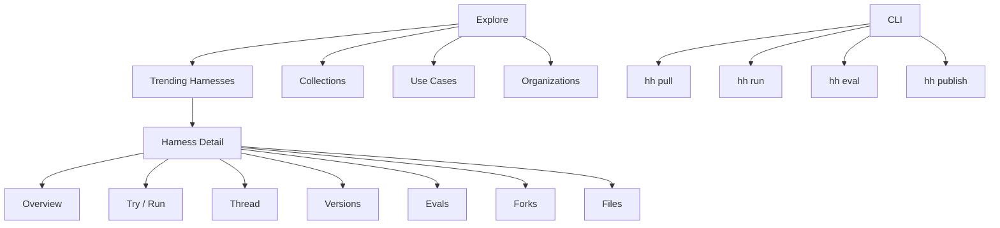
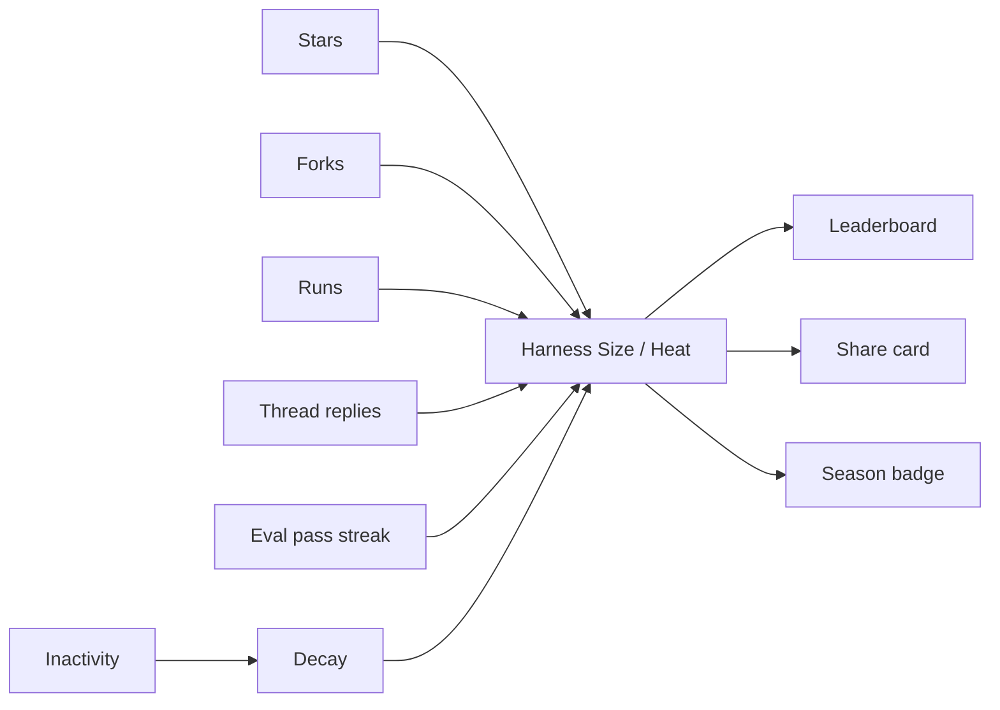
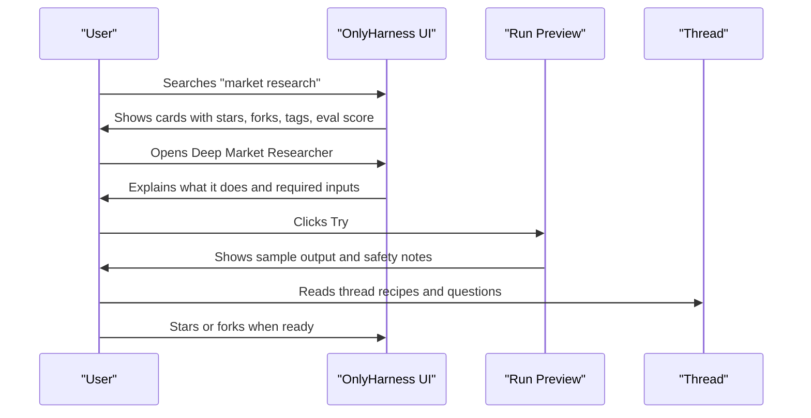
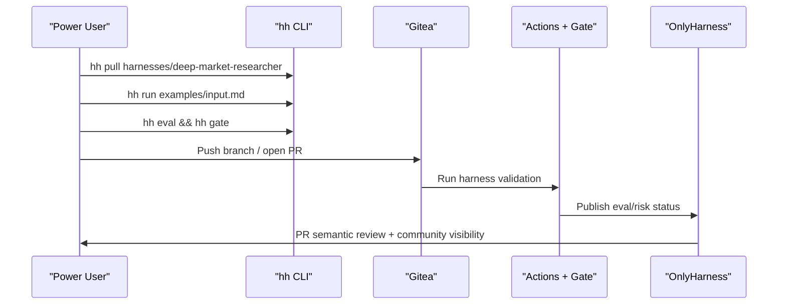
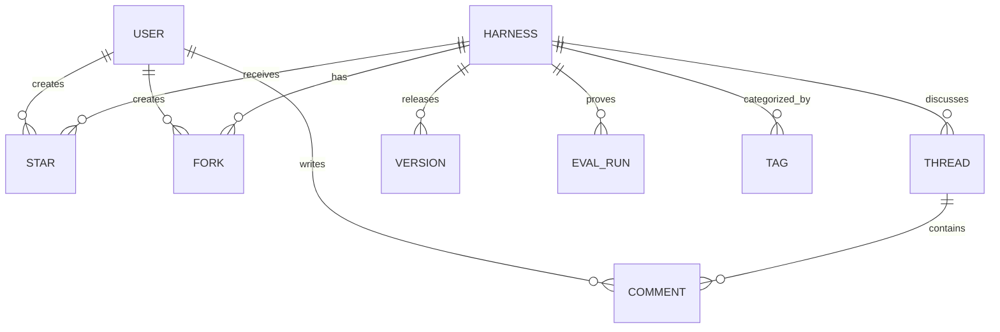

# OnlyHarness: friendly hub for agent harnesses

## Core Thesis

OnlyHarness должен ощущаться не как “еще один GitHub”, а как HuggingFace-style витрина для готовых агентских workflow:

- не программист видит понятный каталог: что делает harness, насколько он популярен, кто его использует, можно ли доверять;
- продвинутый пользователь получает CLI, fork, eval gate, PR review и полный контроль;
- центральная единица продукта: не repository, а reusable agent harness с thread, stars, forks, tags, examples, evals и safety score.

## Product Shift

| Было в MVP | Нужно для user-friendly v1 |
|---|---|
| Registry как dev-dashboard | Explore как marketplace/community hub |
| Risk/eval в центре | Stars/forks/thread/popularity в центре, risk/eval как trust layer |
| Repo-first | Harness-first |
| PR semantic review как основной экран | Detail page harness card + thread + examples + CLI |
| Навигация для инженеров | Навигация для людей: Explore, Collections, Threads, Learn |

## Humor And Lightness From 07-04 Discussion

Что важно забрать из разговора:

- GitHub ощущается скучным и непонятным для обычного человека: MD-файлы, commits, PR, Actions и repo chrome не должны быть первым слоем продукта.
- Проект должен быть смешным, живым и “трушным”, ближе к social/community product, а не к корпоративному devtool.
- Нужно сделать так, чтобы человек хотел показывать свой harness: “смотрите, какой у меня классный harness”.
- Social competition важнее сухой utility: stars, forks, threads, activity, badges, рейтинги, сезонные лидерборды.
- Инвайт-модель может помочь раннему вайбу, но лучше Gmail-style controlled rollout, а не резкий Clubhouse-график.
- Open-source / non-commercial-first важен для доверия и комьюнити.
- Смешная внутренняя метрика “размер harness” полезна как мем, но в публичном интерфейсе ее лучше упаковать аккуратно.

Public-safe productization:

| Raw idea from conversation | Productized UI mechanic |
|---|---|
| “Помериться харнесами” | Show-off score, leaderboard, share card |
| “Сантиметры вместо звезд” | Harness Size / Heat / Hype meter |
| “Растет от внимания” | Score grows from stars, forks, runs, thread replies |
| “Падает в холоде” | Freshness decay if no recent runs/forks/updates |
| “Дикий Запад” | Seasonal badge: Best Harness in the Wild West |
| “Бугага / Windows 98 / OpenClone vibe” | Playful microcopy, retro easter eggs, friendly empty states |
| “Гэмблинг” | Avoid real betting; use prediction/playful polls only |

Recommended tone:

- playful, but not cringe;
- funny inside product details, not in safety-critical states;
- serious around credentials, money movement, external sending and privacy;
- meme-friendly in share cards, badges and leaderboards.

## Inspiration From HuggingFace

Что берем как паттерн:

- top-level категории, похожие на Models / Datasets / Spaces, но для агентских workflow;
- “trending this week” как главный discovery-механизм;
- social proof прямо на карточке: stars, forks, runs, comments;
- detail page с owner, tags, card/files/community tabs;
- простые “Use this” snippets для CLI и low-code запуска;
- community thread как часть страницы, а не отдельный developer-only issue tracker.

## Proposed Information Architecture



## Main Navigation

Recommended nav:

- Explore
- Harnesses
- Collections
- Threads
- Organizations
- Learn
- CLI

Secondary filters:

- Research
- Coding
- Support
- Finance
- GTM
- Data
- Browser
- Ops
- Safety-reviewed
- Beginner-friendly

## Homepage Concept

```text
┌──────────────────────────────────────────────────────────────────────────────┐
│ OnlyHarness                         Search harnesses...      CLI  Sign in   │
├──────────────────────────────────────────────────────────────────────────────┤
│ Build with proven agent workflows                                           │
│ Find, fork, run and improve reusable AI-agent harnesses.                    │
│ [Explore trending] [Publish a harness]                                      │
├──────────────────────────────────────────────────────────────────────────────┤
│ Trending this week                                                          │
│ ┌──────────────────────┐ ┌──────────────────────┐ ┌──────────────────────┐ │
│ │ Deep Market Research │ │ Payment Safety Review│ │ Support Triage       │ │
│ │ Multi-agent research │ │ Ledger/provider gate │ │ Drafts, quotes, risk │ │
│ │ #research #strategy  │ │ #finance #safety     │ │ #support #ops        │ │
│ │ ★ 1.8k ⑂ 312 💬 42   │ │ ★ 940 ⑂ 188 💬 17    │ │ ★ 611 ⑂ 91 💬 36     │ │
│ │ eval 0.91 safe       │ │ eval 0.89 strict     │ │ eval 0.87 reviewed   │ │
│ └──────────────────────┘ └──────────────────────┘ └──────────────────────┘ │
├──────────────────────────────────────────────────────────────────────────────┤
│ Browse by outcome                                                           │
│ [Research] [Code review] [Customer support] [Finance safety] [GTM]          │
└──────────────────────────────────────────────────────────────────────────────┘
```

Homepage should make a non-programmer understand three things in 10 seconds:

- what this harness does;
- whether people trust/use it;
- how to try it without understanding repo internals.

## Harness Card

Primary card fields:

| Field | Why it matters |
|---|---|
| Title | Human-readable use case, not repo slug |
| One-line promise | Plain-language outcome |
| Tags | Discovery and filtering |
| Stars | Social proof |
| Forks | Reuse/remix proof |
| Threads/comments | Community activity |
| Eval score | Trust signal |
| Safety badge | Non-programmer confidence |
| Owner/avatar/org | Credibility |
| Last updated | Freshness |
| “Try” button | Low-friction entry |
| “CLI” button | Power-user path |
| Size/Heat meter | Playful competition and freshness signal |

Card visual hierarchy:

```text
┌────────────────────────────────────────┐
│ Deep Market Researcher        ★ 1.8k   │
│ Source-backed research -> memo         │
│ #research #strategy #evidence          │
│                                        │
│ ⑂ 312 forks   💬 42 threads   size 21.4│
│ eval 0.91      heat warm               │
│ Safety: reviewed   Updated 2d ago      │
│ [Try] [CLI] [Fork]                     │
└────────────────────────────────────────┘
```

## Gamification Layer

The game layer should make the product memorable without turning it into a toy.

Core mechanic:



Possible public names:

- Harness Heat
- Harness Size
- Hype Score
- Wild Score
- Adoption Meter

My recommendation:

- public UI: `Harness Heat`;
- private alpha / meme mode: `cm`;
- enterprise/private orgs: use neutral `Adoption Score`.

Scoring should not grow linearly forever:

- early stars/forks give quick dopamine;
- later growth slows down;
- recent usage matters more than old hype;
- no activity means decay;
- eval failures cap or cool down the score;
- unsafe permissions reduce leaderboard eligibility.

Example:

```text
Harness Heat: 21.4
Trend: +2.1 this week
Why: +forks, +runs, +thread replies
Cooling: no release in 12 days
Badge: Wild West Top 10
```

## Harness Detail Page

The detail page should be closer to a HuggingFace model page than GitHub repo page.

```text
┌──────────────────────────────────────────────────────────────────────────────┐
│ owner / Deep Market Researcher                        ★ Star  ⑂ Fork  Share │
│ Source-backed market research with critique and eval evidence.              │
│ #research #strategy #web-search #beginner-friendly                          │
├───────────────────────────────┬──────────────────────────────────────────────┤
│ Tabs                          │ Right trust panel                           │
│ Overview | Try | Thread       │ ★ 1.8k stars                                │
│ Versions | Evals | Files      │ ⑂ 312 forks                                 │
│                               │ 💬 42 thread messages                       │
│ Overview                      │ eval 0.91 / min 0.82                        │
│ - What it does                │ safety reviewed                             │
│ - Inputs needed               │ permissions: network allowlist              │
│ - Output example              │ CLI: hh pull owner/deep-market-researcher   │
│ - Who should use it           │                                              │
│                               │ [Run in browser] [Copy CLI] [Fork]          │
└───────────────────────────────┴──────────────────────────────────────────────┘
```

Recommended tabs:

- Overview: plain-language explanation and examples.
- Try: guided input form, sample output, required credentials warning.
- Thread: community discussion, recipes, questions, results.
- Versions: releases and compatibility.
- Evals: score history, cases, regressions.
- Files: raw harness.yaml, prompts, examples.
- Forks: remixes tree and popular variants.

## Thread Under Harness

Thread is not GitHub Issues. It is closer to “community + usage notes + recipes”.

Thread types:

- Question: “Can I use this for B2B SaaS market maps?”
- Recipe: “How I changed it for Indonesian market research”
- Result: “Run output from my project”
- Proposal: “Add competitor pricing stage”
- Bug/risk: “This overclaims when source count is low”

Thread UI:

```text
Thread
├─ Pinned by maintainer: Best way to use this harness
├─ Recipe: Market map for fintech GTM
├─ Question: Does it support private source docs?
├─ Proposal: Add contradiction detector
└─ Run result: 0.91 eval after prompt patch
```

Important product rule:

- GitHub issue asks “what changed in code?”
- Harness thread asks “how do people use, trust and improve this workflow?”

## Non-Programmer Flow



## Pro / CLI Flow



CLI should be visible but not dominant:

```bash
hh pull harnesses/deep-market-researcher
hh run --input examples/input.md
hh eval
hh fork --name my-market-researcher
hh publish
```

## Data Model Additions



Minimum new fields:

- `stars_count`
- `forks_count`
- `thread_count`
- `runs_count`
- `last_eval_score`
- `safety_badge`
- `beginner_friendly`
- `featured`
- `owner_profile`
- `cover_gradient` or `card_theme`

## Visual Direction

Do:

- friendly light UI by default;
- colorful tags and badges;
- large clear titles;
- cards with soft borders and compact stats;
- approachable copy: “What it does”, “Try it”, “Used by”, “Works best for”;
- visible community activity;
- explicit “CLI for developers” block.

Avoid:

- looking like enterprise admin dashboard;
- making risk/eval the first thing a non-technical user sees;
- exposing raw repo/files before explaining outcome;
- dark-only devtool aesthetic;
- PR-centric homepage.

## Current MVP Changes Needed

Priority order:

1. Replace left-dashboard shell with public Explore layout.
2. Add stars/forks/thread counters to registry data.
3. Add Harness Heat / Size as playful social metric.
4. Redesign harness cards around title, promise, tags, stars, forks, thread count and heat.
5. Create harness detail route instead of only inline detail panel.
6. Add Thread tab with seeded comments/recipes.
7. Add Try tab with sample input/output and “copy CLI” command.
8. Move risk/eval into trust panel, not main hero.
9. Keep PR Semantic Review as pro/maintainer view.
10. Add Collections page: “Best for research”, “Finance-safe”, “Beginner-friendly”.
11. Add profile/org page with published harnesses, stars and followers.
12. Add share card: “Look at my harness” with star/fork/heat badges.

## MVP Screen Set For Next Iteration

| Screen | Purpose |
|---|---|
| Explore | Fun discovery, trending, categories |
| Harness Detail | Trust, understand, try, fork |
| Thread | Community around one harness |
| Collections | Curated bundles |
| CLI Modal | Copy commands for power users |
| Publish Flow | Import markdown or repo into harness |
| PR Review | Maintainer safety/eval workflow |
| Leaderboard | Weekly social competition |
| Share Card | Viral preview for Telegram/X/Reddit |

## Product Positioning

One-line:

> OnlyHarness is the community hub for reusable AI-agent workflows: discover, try, fork, evaluate and improve agent harnesses.

Short pitch:

> GitHub stores code. HuggingFace popularized model discovery. OnlyHarness does the same for agent workflows: every harness has examples, evals, safety gates, threads, stars, forks and a clean CLI path for builders.

## Success Metrics

Discovery:

- search to detail open rate;
- card star rate;
- tag/category click-through.

Trust:

- Try tab starts;
- eval panel opens;
- safety badge hover/open.

Community:

- thread replies per harness;
- forks per star;
- recipes posted.

Builder activation:

- CLI copy events;
- `hh pull` events;
- PRs opened;
- eval gates passed.
