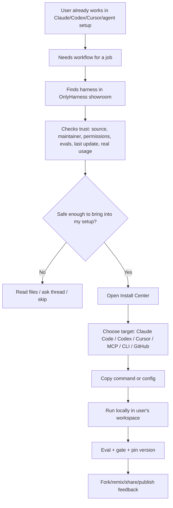
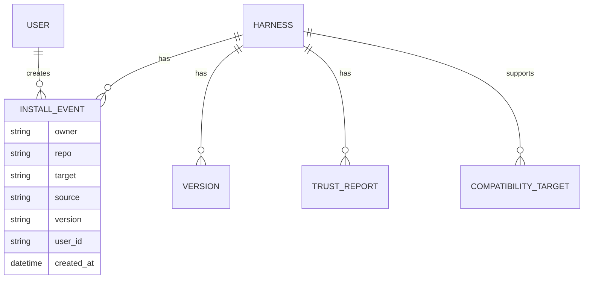
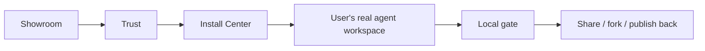

# OnlyHarness: install-first showroom flow

Дата: 2026-07-06.

## Короткий вывод

OnlyHarness не должен становиться основным workspace пользователя. Его правильная роль:

- fun/showroom layer: смешная витрина, которую хочется открыть, показать и зашарить;
- trust layer: быстро понять, можно ли тащить чужой harness в свой агентский сетап;
- install layer: забрать harness в Claude Code, Codex, Cursor, MCP/client setup, CLI или repo.

То есть главный продуктовый глагол не `Run in OnlyHarness`, а `Connect to my setup`.

## Что сохраняем

Win98/desktop/retro слой остается. Это не украшение, а часть продукта:

- дает продукту запоминаемость;
- делает карточки и share cards мемными;
- отличает от GitHub/HuggingFace/dev dashboard;
- помогает авторам хотеть показывать свои harness-ы;
- делает каталог живым, а не сухим enterprise registry.

Важно: retro UI должен быть showroom-ом, а не местом, где человек реально каждый день выполняет агентские задачи.

## Что меняем в мышлении

| Было в текущем MVP | Должно стать |
|---|---|
| Explore -> Detail -> Try -> CLI | Explore -> Trust -> Install into my setup -> Local run/gate |
| `Try` выглядит как главное действие | `Install` / `Connect` становится главным действием |
| CLI окно как power-user bonus | Install center с вариантами Claude/Codex/Cursor/MCP/CLI |
| `Fork` выглядит как social button | `Fork/remix` должен означать реальную копию/вариант workflow |
| Heat/stars/runs выглядят как trust proof | Trust должен опираться на реальные usage/eval/source signals |
| Publish wizard из markdown как основной publish | GitHub/CLI publish основной, wizard как быстрый смешной scaffold |

## Target user flow



## Product principle

Every harness page must answer five questions in order:

1. What job does this solve?
2. Can I trust it?
3. Does it work with my agent setup?
4. What exact command/config do I copy?
5. How do I pin, test, update, or fork it safely?

The fun layer can wrap this, but cannot hide it.

## Screen-level changes

### Explore window

Keep the Win98 desktop and cards. Change the intent of the first screen:

- Primary CTA: `Find a harness to install`.
- Secondary CTA: `Publish / show off your harness`.
- Add compatibility chips on cards:
  - `Claude Code`
  - `Codex`
  - `Cursor`
  - `MCP`
  - `CLI`
- Card primary button: `Install`.
- Card secondary buttons: `Try sample`, `Share`, `Fork/remix`.
- Outcome filters stay, but should map to jobs, not technical categories.

Card should say:

```text
Deep Market Researcher
For: market maps, competitor scans, source-backed memos
Works with: Claude Code, Codex, CLI
Trust: eval 0.88, MEDIUM risk, network allowlist
[Install] [Try sample] [Share]
```

### Harness detail window

Tabs should become:

```text
Overview | Install | Trust | Try sample | Thread | Files | Versions
```

`Install` should be first after Overview. `Try sample` remains useful, but it is not the main conversion.

Right panel should be renamed from general trust panel to `Ready to install?`:

- supported targets;
- version;
- last verified date;
- eval score;
- risk tier;
- permission summary;
- source/repo;
- `Copy install command`.

### Install Center window

New window kind: `install`.

This replaces the current idea that `MS-DOS Prompt` is enough. Keep MS-DOS styling, but make it a real connection hub.

Tabs:

```text
Claude Code | Codex | Cursor | MCP | CLI | GitHub
```

Each tab gives one exact path.

Example:

```text
Claude Code
1. Pull harness files
2. Add generated AGENTS.md / skill / plugin files
3. Run local gate

hh pull harnesses/deep-market-researcher
hh adapt --target claude-code
hh eval && hh gate
```

```text
Codex
hh pull harnesses/deep-market-researcher
hh adapt --target codex --out .codex/harnesses/deep-market-researcher
codex
```

```text
MCP
hh pull harnesses/deep-market-researcher
hh mcp-config --target claude-desktop
```

Even if some commands are not implemented yet, the UI plan should reserve the slots. Do not fake availability in production copy; mark unavailable targets as `Planned`.

### Try sample

Keep sample run, but reposition it:

- This proves shape and eval case.
- It does not mean the harness ran against the user's real task.
- Copy should stay plain:
  - `Runs bundled example only. No credentials are used.`
  - `For real work, install locally and run the gate.`

### Publish flow

Split publishing into two flows:

1. `Quick scaffold` - current markdown wizard, playful, good for demos and draft harnesses.
2. `Maintainer publish` - serious flow:
   - publish from repo;
   - validate manifest;
   - run evals;
   - generate trust report;
   - open review;
   - publish version.

The wizard should not pretend that pasted markdown equals production-grade harness.

### Share cards

Share cards stay playful. But they should include useful install proof, not just hype:

- harness title;
- job solved;
- works-with icons/chips;
- eval/risk badge;
- one-line install command;
- short URL.

This makes sharing useful for both social attention and adoption.

## Backend and data changes

### Replace synthetic social proof

Current public `stars/forks/runs/heat` should not be treated as real trust. Target state:

- `stars_count` from persisted user actions;
- `forks_count` from actual fork/remix records;
- `runs_count` from real sample/local/API run events where available;
- `installs_count` from CLI/API install events;
- `thread_count` from persisted posts;
- `last_verified_at` from latest successful eval/gate;
- `compatibility_targets` from manifest or adapter output.

Do not remove Heat. Change its meaning:

- Heat is a fun popularity/freshness score;
- Trust is a separate serious block;
- unsafe or unverified harnesses can be hot, but must not look trusted.

### Add install events

Track install intent without overclaiming execution:



Targets:

- `claude-code`
- `codex`
- `cursor`
- `mcp`
- `cli`
- `github`
- `agent-api`

### Manifest additions

Add or derive:

```yaml
compatibility:
  targets:
    - codex
    - claude-code
    - cli
  adapters:
    codex:
      status: planned|available|verified
      command: hh adapt --target codex
    claude-code:
      status: planned|available|verified
      command: hh adapt --target claude-code
trust:
  last_verified_at: 2026-07-06T00:00:00Z
  verified_by: hh gate
  source_repo: https://github.com/...
```

## CLI/API changes

The CLI should support the real user journey:

```bash
hh search "market research"
hh inspect harnesses/deep-market-researcher
hh install harnesses/deep-market-researcher --target codex
hh adapt --target codex
hh eval && hh gate
hh pin --version 0.1.0
hh update --diff
```

Keep `hh pull`, but introduce `hh install` as the friendlier primary command.

API should expose:

- `/api/registry`
- `/api/repos/:owner/:repo/harness`
- `/api/repos/:owner/:repo/archive`
- `/api/repos/:owner/:repo/install?target=codex`
- `/api/repos/:owner/:repo/trust-report`
- `/api/repos/:owner/:repo/compatibility`

`/llms.txt` should tell an agent:

1. search;
2. inspect;
3. check trust;
4. choose target;
5. download/archive or install config.

## Prioritized implementation plan

### Phase 1 - UX wording and flow correction

No schema migration required.

- Rename primary action from `Try` to `Install`.
- Add `Try sample` as secondary.
- Add compatibility chips, even if initially static from manifest/runtime.
- Add Install tab/window with current CLI command and planned target placeholders.
- Add plain warning that sample run is bundled-only.
- Rename `Fork` to `Fork/remix` where user-facing.

Acceptance:

- a first-time visitor understands that OnlyHarness is for finding and installing into their own agent setup;
- no page implies that browser sample equals real workflow execution.

### Phase 2 - Trust separation

- Split `Heat` from `Trust`.
- Label current Heat as popularity/freshness.
- Move eval/risk/permissions/source/date into a serious trust block.
- Stop using synthetic stars/runs as primary trust language.
- Add copy: `Usage stats are community signals, not safety guarantees.`

Acceptance:

- unsafe/high-risk harness can still be fun, but cannot appear "trusted" because it is hot.

### Phase 3 - Real install center

- Add `install` window kind.
- Implement target tabs: CLI first, then Codex/Claude/Cursor/MCP as planned/available.
- Add copy-to-clipboard snippets per target.
- Add `hh install --target` command stub or documented plan.
- Update `/llms.txt` around install-first flow.

Acceptance:

- user can choose their actual work environment before copying anything.

### Phase 4 - Real social and install telemetry

- Replace synthetic counts with persisted aggregate counts.
- Add `install_events`.
- Count unauthenticated install-copy events carefully without storing sensitive data.
- Preserve privacy: no project paths, no prompts, no credentials.

Acceptance:

- public stats can be described honestly as real platform activity.

### Phase 5 - Maintainer-grade publish

- Keep markdown wizard as quick scaffold.
- Add publish-from-repo path.
- Require validate/eval/gate before verified badge.
- Add versions and update diff.
- Add adapter compatibility checks.

Acceptance:

- a maintainer can publish a serious harness without pretending the web wizard is enough.

## Copy rules

Use fun copy for:

- cards;
- share cards;
- empty states;
- leaderboard;
- desktop easter eggs.

Use plain copy for:

- install commands;
- permissions;
- credentials;
- external sends;
- money movement;
- eval failures;
- risk tiers;
- publish verification.

Bad:

```text
This harness is hot, so it is safe.
```

Good:

```text
Heat: popular this week.
Trust: MEDIUM risk, eval 0.88, network allowlist, verified 2d ago.
```

## Final target shape



OnlyHarness wins if people say:

> I found the right workflow there, checked whether it was safe, installed it into my agent setup, and shared the card because it looked fun.

Not:

> I moved my work into OnlyHarness.
