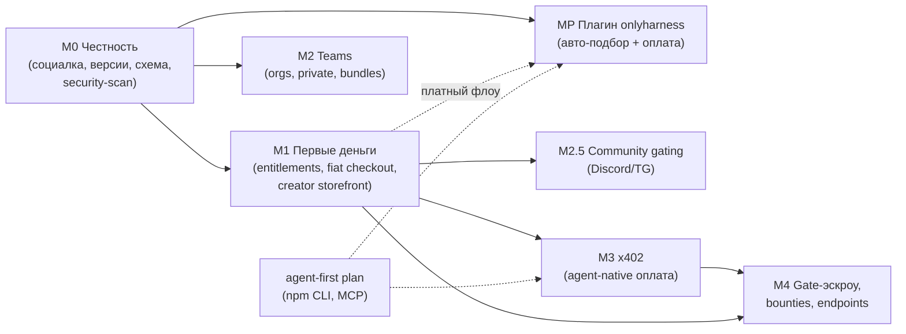

# OnlyHarness Monetization + Teams Master Plan

> **For Claude:** REQUIRED SUB-SKILL: Use superpowers:executing-plans to implement this plan task-by-task. Milestones M0 and M1 are specified to code level and executable now. M2–M4 start with a mandatory "detail this stage" task — do NOT improvise their code from this document alone.

**Goal:** Turn OnlyHarness from a free showroom into a monetized registry: real social signals, paid harnesses with entitlements (fiat + x402), creator storefronts with referral attribution, team workspaces with private harnesses, and later gate-escrow payments.

**Architecture:** Disk stays the source of truth for harness *content* (seed-harnesses/, data/imports/, immutable version snapshots in data/versions/); Supabase becomes the source of truth for *money, social and orgs* (counters, entitlements, purchases, organizations, audit). The Fastify API mediates: reads counters/entitlements via PostgREST, gates the archive route, and answers `402 Payment Required` with a dual payload (checkout URL for humans, x402 requirements for agents). Payment providers sit behind one `PaymentProvider` port so the in-house fintech rails, Paddle-stopgap and x402 are interchangeable adapters.

**Tech Stack:** Fastify 5 + TypeScript (apps/harness-api), Zod (packages/harness-schema), Supabase (Postgres + RLS + PostgREST), commander CLI (packages/harness-cli), React/Vite (apps/registry-web), node:test for pure logic, tsx smoke scripts for integration (repo idiom — no unit-test runner in apps).

**Related docs:** [концепт монетизации и команд](2026-07-06-monetization-and-teams-concept.md) (зачем), [agent-first plan](2026-07-06-agent-first-implementation.md) (параллельный워크стрим: npm CLI, MCP `/mcp`, OAuth discovery — Milestone M3 here rides on it).

---

## Карта милстоунов и зависимостей



| Milestone | Что демонстрируем в конце | Оценка (2 разработчика) | Гейт перед стартом |
|---|---|---|---|
| M0 | Звёзды/треды настоящие; у харнесов есть версии и поля pricing/visibility | ~1–1.5 недели | нет — можно начинать сегодня |
| M1 | Первый платный `hh pull`: 402 → checkout → оплата → архив; страница @handle с ref-ссылками | ~3 недели | **Юрзаключение по MoR** (какой провайдер первым: свои рельсы или Paddle) |
| MP | Плагин в Claude Code сам предлагает харнес под задачу, ставит бесплатный, продаёт платный | ~1.5–2 недели MVP | M0.6 security-scan задеплоен; платный флоу — после M1.3 |
| M2 | `hh setup @acme` ставит набор команды; Network Neighborhood в UI; приватный харнес не отдаётся чужому | ~3–4 недели (параллельно M1 после M0) | Решение принято — делаем; кастдев команд 5+ идёт параллельно и калибрует фичи |
| M2.5 | Покупка харнеса открывает закрытый Discord/TG-канал | ~1 неделя | 1–2 анкор-креатора с комьюнити подписаны |
| M3 | Агент без аккаунта платит USDC и получает архив; листинг в x402 Bazaar | ~2–3 недели | MCP `/mcp` из agent-first плана задеплоен |
| M4 | «Плати, если gate прошёл»: резерв → receipt → списание; первый bounty | ~3–4 недели | Работающий M1 GMV; решение build-vs-partner по hosted endpoints |

**Распараллеливание на 2 разработчиков:** Dev A: M0 → M1 (деньги). Dev B: agent-first plan (Stage A npm CLI — уже расписан) → MP (плагин) → M2 (Teams). Сходятся на M3. Track S (см. внизу) — свободные слоты любого.

**Замороженные решения (не решать в коде раньше гейта):**
1. Провайдер фиата (свои рельсы vs Paddle) — после юрзаключения; до тех пор код пишется против порта `PaymentProvider`.
2. Хранение ключей x402-кошелька в CLI — решается в M3 (env `HH_WALLET_KEY` для MVP, дальше keychain).
3. Build vs partner для hosted endpoints (M4) — после первых данных о спросе от авторов.

---

## Milestone M0 — Честность: реальная социалка, версии, поля монетизации

Сейчас `computeSocial()` ([server.ts:315-334](../../apps/harness-api/src/server.ts)) выдумывает stars/forks/runs из хэша имени, а `threadFor()` (server.ts:360-392) мокает треды, хотя настоящие таблицы `user_harness_actions` и `harness_thread_posts` уже наполняются веб-клиентом. Деньги поверх фейковых сигналов включать нельзя.

### Task M0.1: Таблица счётчиков + триггеры

**Files:**
- Create: `supabase/migrations/20260707090000_harness_counters.sql`

**Step 1: написать миграцию**

```sql
create table if not exists public.harness_counters (
  owner text not null,
  repo text not null,
  stars integer not null default 0,
  forks integer not null default 0,
  runs integer not null default 0,
  threads integer not null default 0,
  primary key (owner, repo)
);

alter table public.harness_counters enable row level security;

drop policy if exists "Counters are readable by everyone" on public.harness_counters;
create policy "Counters are readable by everyone"
  on public.harness_counters for select
  using (true);
-- Никаких insert/update policy: пишут только security definer триггеры.

create or replace function public.bump_harness_counter()
returns trigger
language plpgsql
security definer
set search_path = public
as $$
declare
  delta integer := case when tg_op = 'INSERT' then 1 else -1 end;
  act text := coalesce(new.action, old.action);
  own text := coalesce(new.owner, old.owner);
  rep text := coalesce(new.repo, old.repo);
begin
  insert into public.harness_counters (owner, repo) values (own, rep)
  on conflict (owner, repo) do nothing;
  update public.harness_counters set
    stars = greatest(0, stars + case when act = 'star' then delta else 0 end),
    forks = greatest(0, forks + case when act = 'fork' then delta else 0 end),
    runs  = greatest(0, runs  + case when act = 'run'  then delta else 0 end)
  where owner = own and repo = rep;
  return coalesce(new, old);
end;
$$;

drop trigger if exists on_harness_action_change on public.user_harness_actions;
create trigger on_harness_action_change
after insert or delete on public.user_harness_actions
for each row execute procedure public.bump_harness_counter();

create or replace function public.bump_thread_counter()
returns trigger
language plpgsql
security definer
set search_path = public
as $$
begin
  insert into public.harness_counters (owner, repo) values (new.owner, new.repo)
  on conflict (owner, repo) do nothing;
  update public.harness_counters set threads = threads + 1
  where owner = new.owner and repo = new.repo;
  return new;
end;
$$;

drop trigger if exists on_thread_post_created on public.harness_thread_posts;
create trigger on_thread_post_created
after insert on public.harness_thread_posts
for each row execute procedure public.bump_thread_counter();

-- Backfill из существующих данных
insert into public.harness_counters (owner, repo, stars, forks, runs)
select owner, repo,
  count(*) filter (where action = 'star'),
  count(*) filter (where action = 'fork'),
  count(*) filter (where action = 'run')
from public.user_harness_actions
group by owner, repo
on conflict (owner, repo) do update
  set stars = excluded.stars, forks = excluded.forks, runs = excluded.runs;

update public.harness_counters c
set threads = t.cnt
from (select owner, repo, count(*)::int as cnt from public.harness_thread_posts group by owner, repo) t
where c.owner = t.owner and c.repo = t.repo;
```

**Step 2: применить и проверить**

Run: `supabase db push` (прод привязан через `supabase link`; локально — `supabase db reset`).
Expected: миграция применилась без ошибок.

Проверка триггера (SQL editor в Supabase):
```sql
select * from public.harness_counters limit 5;
```
Expected: строки с реальными счётчиками (или пусто, если действий ещё не было — это честный ноль).

**Step 3: Commit**

```bash
git add supabase/migrations/20260707090000_harness_counters.sql
git commit -m "feat(db): real social counters with triggers and backfill"
```

### Task M0.2: Модуль чтения счётчиков в API

**Files:**
- Create: `apps/harness-api/src/social.ts`
- Test: `apps/harness-api/test/social.test.ts`

**Step 1: написать failing test** (node:test; в `apps/harness-api/package.json` добавить `"test": "node --test test/"`)

```ts
import test from "node:test";
import assert from "node:assert/strict";
import { heatFor, badgeFor, socialFromCounters } from "../src/social.ts";

test("socialFromCounters returns zeros when no row exists", () => {
  const social = socialFromCounters(undefined, { riskTier: "LOW", evalScore: 0.9, updatedAt: new Date().toISOString() });
  assert.equal(social.stars, 0);
  assert.equal(social.runs, 0);
});

test("heat grows with real signals and is 0-based, no fake floor", () => {
  const cold = heatFor({ stars: 0, forks: 0, threads: 0, runs: 0 }, 0, "LOW", new Date().toISOString());
  const warm = heatFor({ stars: 50, forks: 10, threads: 5, runs: 400 }, 0.9, "LOW", new Date().toISOString());
  assert.equal(cold, 0);
  assert.ok(warm > cold);
});

test("badge is 'new' for fresh harness without signals", () => {
  assert.equal(badgeFor("LOW", 0, 0, 0), "new");
});
```

**Step 2: убедиться, что тест падает**

Run: `node --test apps/harness-api/test/`
Expected: FAIL — `Cannot find module '../src/social.ts'`.

**Step 3: минимальная реализация**

```ts
// apps/harness-api/src/social.ts
export type Counters = { stars: number; forks: number; threads: number; runs: number };

const supabaseUrl = process.env.SUPABASE_URL?.replace(/\/$/, "");
const supabaseAnonKey = process.env.SUPABASE_ANON_KEY;

export async function fetchCountersMap(): Promise<Map<string, Counters>> {
  const map = new Map<string, Counters>();
  if (!supabaseUrl || !supabaseAnonKey) return map;
  try {
    const response = await fetch(`${supabaseUrl}/rest/v1/harness_counters?select=owner,repo,stars,forks,threads,runs`, {
      headers: { apikey: supabaseAnonKey, authorization: `Bearer ${supabaseAnonKey}` }
    });
    if (!response.ok) return map;
    for (const row of await response.json() as Array<Counters & { owner: string; repo: string }>) {
      map.set(`${row.owner}/${row.repo}`, { stars: row.stars, forks: row.forks, threads: row.threads, runs: row.runs });
    }
  } catch { /* реестр живёт и без счётчиков */ }
  return map;
}

export function heatFor(c: Counters, evalScore: number, riskTier: string, updatedAt: string): number {
  const daysOld = Math.max(0, (Date.now() - Date.parse(updatedAt)) / 86_400_000);
  const decay = Math.min(3.8, daysOld * 0.08);
  const riskPenalty = riskTier === "CRITICAL" ? 4.2 : riskTier === "HIGH" ? 2.3 : riskTier === "MEDIUM" ? 0.9 : 0;
  const heat = c.stars / 5 + c.forks / 2 + c.threads / 3 + c.runs / 50 + evalScore * 4.8 - riskPenalty - decay;
  return Math.max(0, Number(heat.toFixed(1)));
}

export function badgeFor(riskTier: string, evalScore: number, heat: number, totalSignals: number): string {
  if (totalSignals === 0) return "new";
  if (heat >= 24) return "Wild West Top 10";
  if (evalScore >= 0.9) return `eval ${evalScore.toFixed(2)}`;
  if (riskTier === "LOW") return "safe to try";
  if (riskTier === "HIGH" || riskTier === "CRITICAL") return "needs review";
  return "community pick";
}

export function socialFromCounters(
  c: Counters | undefined,
  ctx: { riskTier: string; evalScore: number; updatedAt: string }
) {
  const counters = c ?? { stars: 0, forks: 0, threads: 0, runs: 0 };
  const heat = heatFor(counters, ctx.evalScore, ctx.riskTier, ctx.updatedAt);
  const total = counters.stars + counters.forks + counters.threads + counters.runs;
  const daysOld = Math.max(0, (Date.now() - Date.parse(ctx.updatedAt)) / 86_400_000);
  return {
    ...counters,
    heat,
    heatDelta: 0, // честно: дельту посчитаем, когда появится история снапшотов
    freshness: daysOld < 2 ? "warm" : daysOld < 9 ? "cooling" : "needs release",
    badge: badgeFor(ctx.riskTier, ctx.evalScore, heat, total)
  };
}
```

**Step 4: тесты зелёные**

Run: `node --test apps/harness-api/test/`
Expected: PASS (3 tests).

**Step 5: Commit**

```bash
git add apps/harness-api/src/social.ts apps/harness-api/test/social.test.ts apps/harness-api/package.json
git commit -m "feat(api): real social counters module with honest heat/badge"
```

### Task M0.3: Вырезать мок из server.ts

**Files:**
- Modify: `apps/harness-api/src/server.ts` (удалить `computeSocial` :315-334, `threadFor` :360-392; перевести `scanRegistry`/`registryItemFromDir` на counters map)

**Step 1:** `scanRegistry()` становится `async scanRegistry(countersMap)`; роуты `/registry`, `/leaderboard`, `/repos/:owner/:repo/harness` сначала делают `const counters = await fetchCountersMap()` (один запрос на HTTP-запрос, без кэша — YAGNI). `registryItemFromDir(owner, repoPath, counters)` берёт `socialFromCounters(counters.get(`${owner}/${name}`), …)`.

**Step 2:** `/repos/:owner/:repo/thread` и поле `thread` в detail-роуте читают PostgREST:
`GET ${supabaseUrl}/rest/v1/harness_thread_posts?owner=eq.${owner}&repo=eq.${repo}&order=created_at.desc&limit=50`, затем один запрос профилей `GET /rest/v1/profiles?id=in.(…)&select=id,display_name` и join в JS. Пустой тред — честный `{ items: [] }` (веб показывает «Be the first to post»).

**Step 3: smoke.** Расширить `scripts/smoke.ts`: после старта API — `GET /registry` и assert, что у всех items `stars >= 0` и нет ни одного item с прежним фейковым минимумом `stars >= 380` на пустой базе.

Run: `npm run check && npm run smoke`
Expected: typecheck OK, smoke зелёный.

**Step 4: Commit** — `feat(api): serve real social signals and threads, drop deterministic mock`.

### Task M0.4: Поля visibility / pricing / org в манифесте

**Files:**
- Modify: `packages/harness-schema/src/index.ts` (в `harnessManifestSchema`, после `license`)
- Test: `packages/harness-schema/test/pricing.test.ts` (node:test уже используется пакетами по agent-first плану; если нет — добавить `"test": "node --test test/"`)

**Step 1: failing test** — валидный манифест без новых полей проходит (backward compat, дефолты public/free); `pricing.model: one_time` без `amount_usd` — ошибка; `visibility: org` без `org` — ошибка.

**Step 2: реализация**

```ts
const pricingSchema = z.object({
  model: z.enum(["free", "one_time", "subscription", "per_call", "gate_escrow"]).default("free"),
  amount_usd: z.number().positive().optional(),
  period: z.enum(["month", "year"]).optional()
}).strict();

// в harnessManifestSchema:
  visibility: z.enum(["public", "org", "private"]).default("public"),
  org: idSchema.optional(),
  pricing: pricingSchema.default({ model: "free" }),
```

плюс `.superRefine` на манифесте: paid-модель требует `amount_usd`; `visibility === "org"` требует `org`; `subscription` требует `period`.

**Step 3:** `node --test packages/harness-schema/test/` → PASS; `npm run check` → все 8 seed-манифестов валидны без правок (дефолты).

**Step 4: Commit** — `feat(schema): visibility, pricing and org manifest fields`.

### Task M0.5: Immutable-версии при publish + `?version=` в archive

**Files:**
- Modify: `apps/harness-api/src/server.ts` (route `/imports/markdown-to-harness` :141-163 — после успешного импорта снапшот в `data/versions/local/<name>/<version>/` через существующий `copyDir`; route `/repos/:owner/:repo/archive` :111-124 — параметр `?version=x.y.z` резолвит `data/versions/<owner>/<repo>/<version>` вместо live-директории; невалидный version → 404 со списком доступных)
- Create: `apps/harness-api/test/versions.test.ts` (чистая функция `resolveVersionPath` выносится и тестируется)

**Steps:** failing test на `resolveVersionPath` (traversal-защита: `version` матчится `/^\d+\.\d+\.\d+(-[a-z0-9.-]+)?$/` до join) → реализация → `npm run check && npm run smoke` → commit `feat(api): immutable version snapshots and versioned archive`.

### Task M0.6: Security-scan при публикации (custdev Н1 — 4/4 респондентов)

**Files:**
- Create: `apps/harness-api/src/security-scan.ts`
- Test: `apps/harness-api/test/security-scan.test.ts`
- Modify: `apps/harness-api/src/server.ts` (скан в import-роуте; поле `security` в RegistryItem; новый endpoint)

**Step 1: failing test** — `scanText` находит: пайп в шелл, base64+exec, экфильтрацию секретов, prompt-override, «скрой от пользователя»; чистый текст → `pass`.

**Step 2: реализация** — статический сканер:

```ts
export type SecurityFinding = { rule: string; file: string; excerpt: string; severity: "warn" | "fail" };
export type SecurityReport = { verdict: "pass" | "warn" | "fail"; findings: SecurityFinding[]; scannedAt: string; scanner: "static-v1" };

const RULES: Array<{ id: string; severity: "warn" | "fail"; pattern: RegExp }> = [
  { id: "pipe-to-shell", severity: "fail", pattern: /(curl|wget)[^\n]{0,120}\|\s*(ba)?sh/i },
  { id: "base64-exec", severity: "fail", pattern: /base64\s+(-d|--decode)[^\n]{0,80}\|\s*(ba)?sh|eval\(atob/i },
  { id: "secret-exfiltration", severity: "fail", pattern: /\$\{?[A-Z0-9_]*(KEY|TOKEN|SECRET|PASSWORD)[A-Z0-9_]*\}?[^\n]{0,120}(curl|wget|fetch|http)/i },
  { id: "prompt-override", severity: "fail", pattern: /ignore (all )?(previous|prior|above) instructions|disregard (the )?system prompt/i },
  { id: "hidden-from-user", severity: "warn", pattern: /do not (tell|show|inform|reveal)[^\n]{0,40}(user|human)/i },
  { id: "external-url", severity: "warn", pattern: /https?:\/\/(?!onlyharness\.com|github\.com)[a-z0-9.-]+/i }
];
```

`scanHarnessDir(root)` идёт по всем текстовым файлам (кроме `.harnesshub/`), verdict = худший finding; хосты из `permissions.network_allowlist` манифеста не считаются external-url. Отчёт пишется в `.harnesshub/security.json`; `fail` исключает харнес из листинга `/registry` (detail остаётся доступен с отчётом); verdict попадает в `RegistryItem.security` и на карточку. Новый endpoint `GET /repos/:owner/:repo/security-report` отдаёт отчёт как есть — **машиночитаемо: его потребляют агенты и плагин MP**. LLM-ревью вторым слоем — за флагом `SECURITY_LLM_REVIEW`, не в этой задаче (YAGNI до бюджета на ключи).

**Step 3:** `node --test apps/harness-api/test/` → PASS; smoke: фикстурный «злой» харнес в `data/imports/` отсутствует в `/registry`, `/security-report` отдаёт `fail`.

**Step 4: Commit** — `feat(api): static security scan with public machine-readable report`.

### Task M0.7: Бейдж «OnlyHarness Standard» (custdev Н8)

**Files:** Modify `apps/harness-api/src/server.ts`, `apps/registry-web/src/main.tsx`; Test: `apps/harness-api/test/standard.test.ts`.

Чистая функция `standardLevel(...)` → `"conformant" | "partial"`: conformant = манифест валиден + evals-конфиг существует + examples непусты + `security.verdict === "pass"`. Поле в RegistryItem, бейдж на карточке и в detail. TDD → commit `feat: OnlyHarness Standard conformance badge`.

### Task M0.8: Milestone-демо и фиксация

Прогнать полный цикл: `npm run seed && npm run dev` → в веб-UI поставить звезду → `GET /registry` показывает +1 у этого харнеса → пост в тред виден в detail → «злой» фикстур не листится, `/security-report` объясняет почему. Commit чек-листа результатов в `docs/plans/` не нужен — достаточно зелёного smoke в CI-логе деплоя ([scripts/deploy-production.sh](../../scripts/deploy-production.sh)).

---

## Milestone M1 — Первые деньги: entitlements, fiat checkout, creator storefront

**Гейт:** юрзаключение по MoR → выбор адаптера №1 (`fintech` свои рельсы или `paddle` stopgap). Код до этого пишется против порта.

### Task M1.1: Миграция денег

**Files:** Create: `supabase/migrations/20260714090000_payments_core.sql`

Таблицы (все с RLS; клиентских insert-политик нет — пишет только API сервис-ролью):

```sql
create table public.purchases (
  id uuid primary key default gen_random_uuid(),
  subject_type text not null check (subject_type in ('user','wallet','org')),
  subject_id text not null,
  owner text not null,
  repo text not null,
  amount_usd numeric(10,2) not null,
  provider text not null check (provider in ('fintech','paddle','x402','manual')),
  provider_ref text,
  referral_code text,
  status text not null default 'pending'
    check (status in ('pending','paid','reserved','captured','refunded','failed')),
  created_at timestamptz not null default now(),
  updated_at timestamptz not null default now()
);

create table public.entitlements (
  id uuid primary key default gen_random_uuid(),
  subject_type text not null check (subject_type in ('user','wallet','org')),
  subject_id text not null,
  owner text not null,
  repo text not null,
  kind text not null check (kind in ('one_time','subscription','escrow_reserved')),
  expires_at timestamptz,
  purchase_id uuid references public.purchases(id),
  created_at timestamptz not null default now(),
  unique (subject_type, subject_id, owner, repo, kind)
);

create table public.payout_accounts (
  user_id uuid primary key references auth.users(id) on delete cascade,
  method text not null check (method in ('usdc_wallet','fiat_manual')),
  address text not null,
  created_at timestamptz not null default now()
);

create table public.referral_codes (
  code text primary key,
  user_id uuid not null references auth.users(id) on delete cascade,
  created_at timestamptz not null default now()
);
```

RLS: `purchases`/`entitlements` select для `auth.uid()::text = subject_id and subject_type = 'user'`; `payout_accounts`/`referral_codes` — владелец CRUD своё. Индексы: `entitlements (subject_type, subject_id)`, `purchases (owner, repo, status)`.

**Verification:** `supabase db push`; вставка/чтение сервис-ролью в SQL-редакторе. Commit: `feat(db): purchases, entitlements, payouts, referral codes`.

### Task M1.2: Порт PaymentProvider + entitlement-gate на archive

**Files:**
- Create: `apps/harness-api/src/payments.ts` (порт + адаптер `manual` для тестов)
- Modify: `apps/harness-api/src/server.ts` (archive route)
- Test: `apps/harness-api/test/entitlement.test.ts`

Порт:

```ts
export type CheckoutSession = { url: string; providerRef: string };
export interface PaymentProvider {
  name: "fintech" | "paddle" | "manual";
  createCheckout(input: { owner: string; repo: string; amountUsd: number; subject: { type: "user"; id: string } | { type: "anon" }; referral?: string }): Promise<CheckoutSession>;
  verifyWebhook(rawBody: string, headers: Record<string, string | string[] | undefined>): { ok: boolean; purchaseRef?: string; status?: "paid" | "refunded" };
}
```

Archive route (после `resolveHarnessPath`): читаем манифест; `pricing.model === "free"` → как сейчас; иначе `optionalUser(request)` (тот же Supabase-вызов, но без 401) → `hasEntitlement(subject, owner, repo)` через PostgREST c `SUPABASE_SERVICE_ROLE_KEY` (новый env, только на сервере) → нет entitlement → **402**:

```json
{
  "error": "payment_required",
  "harness": "creator/pro-harness",
  "price_usd": 19,
  "checkout_url": "https://onlyharness.com/buy/creator/pro-harness?ref=…",
  "x402": null
}
```

TDD: тест на чистую функцию `entitlementDecision(manifest, entitlementRows)` (free → allow; paid+active → allow; paid+expired subscription → deny; paid+none → deny). Smoke: платный фикстур-харнес в `data/imports/` → `GET /archive` без токена = 402, с токеном+entitlement (вставленным сервис-ролью) = 200. Commit: `feat(api): 402 entitlement gate on archive with PaymentProvider port`.

### Task M1.3: Checkout endpoint + webhook → entitlement

**Files:** Modify `apps/harness-api/src/server.ts`: `POST /billing/checkout` (auth required → provider.createCheckout → pending purchase) и `POST /webhooks/payments` (verifyWebhook → purchase paid → insert entitlement; идемпотентно по `provider_ref`). Провайдер-адаптер по гейту (paddle или fintech; конфиг через env `PAYMENT_PROVIDER`). Referral: `?ref=` код из checkout-запроса пишется в `purchases.referral_code`.

**Verification:** smoke с `manual`-адаптером (эмуляция вебхука подписанным телом), полный цикл 402 → checkout → webhook → 200. Commit.

### Task M1.4: CLI — платный pull

**Files:** Modify `packages/harness-cli/src/index.ts` (`pull` :60-91): слать `Authorization: Bearer $HH_TOKEN`, ловить 402 и печатать:

```
This harness is paid: $19 one-time.
  Buy in browser: https://onlyharness.com/buy/creator/pro-harness
  Already bought? Log on and export HH_TOKEN, then retry.
```

Exit code 4 (needs-confirmation по таксономии agent-first плана), `--json` печатает 402-payload как есть (агент сам решает). Тест node:test на функцию форматирования. Commit.

### Task M1.5: Creator storefront + attribution в вебе

**Files:** Modify `apps/registry-web/src/main.tsx`, `apps/registry-web/src/desktop.tsx`, `apps/registry-web/src/styles.css`; migration `20260714091000_profile_handles.sql` (`profiles.handle` unique, `profiles.bio`).

Окно `@handle` (Win98: «My Briefcase» стиль): харнесы автора, бандл-цена, кнопка Copy ref-link (`https://onlyharness.com/@handle?ref=CODE` и на карточках `?ref=`). `ref` из URL кладётся в `localStorage`, передаётся в `/billing/checkout`. Share-card (`harness_flex.exe`) добавляет ref автора в ссылку. **Detail-before-execution:** точную вёрстку окна согласовать с дизайн-хендоффом `design_handoff_harness_hub_98`.

### Task M1.6: Payout ledger + ручные выплаты

**Files:** Create `scripts/payout-report.ts`: агрегирует `purchases.status='paid'` за месяц по авторам с учётом ставок (95% ref-attributed / 85% catalog / 100% анкоры из конфига `data/anchors.json`), выводит таблицу к выплате. Выплаты первые месяцы руками (USDC/фиат) — скрипт даёт суммы и адреса из `payout_accounts`. Commit.

### Task M1.7: Event log для GTM-метрик

**Files:** migration `analytics_events` (id, kind: view|pull|checkout|purchase, owner, repo, ref, subject, created_at; insert только сервис-ролью), запись из archive/checkout/webhook роутов, `scripts/gtm-report.ts` (воронка пост→карточка→покупка по ref-кодам). Без сторонней аналитики — YAGNI. Commit.

---

### Task M1.8: Context-cost метрика (custdev Н3, гипотеза — дёшево проверить)

**Files:** Modify `apps/harness-api/src/server.ts`, `apps/registry-web/src/main.tsx`.

При сканировании директории: суммарный размер инструкционных файлов (`*.md` корня и `skills/`) → `contextCost: { approxTokens: Math.round(bytes / 4), files }` в RegistryItem; карточка показывает «context: ~1.2k tokens». Commit.

### Task M1.9: Verified-install (custdev Н7; detail-before-execution)

MVP из двух половин: (а) `hh doctor --harness <dir>` — проверка раскладки под целевой клиент (frontmatter скила, пути, имена — по конвенциям Claude Code/Codex/Cursor); (б) агрегация реальных подтверждений установки из телеметрии плагина MP.5 → бейдж «works in Claude Code: N confirms». CI-прогон по клиентам — только если ручных сигналов окажется мало.

---

## Milestone MP — Плагин onlyharness: авто-подбор харнеса под задачу

Концепт: [раздел 6 монетизационного концепта](2026-07-06-monetization-and-teams-concept.md). **Гейт:** M0.6 security-scan задеплоен — плагин не имеет права предлагать непросканированное. Платный флоу (MP.4) — после M1.3.

- **MP.1 Marketplace-репо и скаффолд**: публичный репо `onlyharness/claude-plugin` с `.claude-plugin/marketplace.json`; плагин = скилл `onlyharness-autopilot` + MCP-конфиг на `https://onlyharness.com/mcp` (из agent-first плана; до его релиза — REST через `npx onlyharness --json`). Установка: `/plugin marketplace add onlyharness/claude-plugin` → `/plugin install onlyharness`.
- **MP.2 Скилл авто-подбора**: триггер «задача требует специализированного воркфлоу» → поиск в реестре → топ-3 кандидата → **обязательная trust-сводка** (security-verdict из M0.6, Standard-бейдж из M0.7, evals, permissions, context-cost) → подтверждение пользователя → scoped-установка (в проект или во временную директорию сессии с удалением по завершении) → применение.
- **MP.3 Правила безопасности (не обсуждаются)**: не ставить без явного подтверждения; не предлагать харнесы без пройденного security-scan; permissions всегда на экране до установки; платное — только через explicit-покупку. Авто-применение чужих инструкций = поверхность prompt-injection, поэтому эти правила зашиваются в текст скила и проверяются в ревью каждого релиза плагина.
- **MP.4 Платный флоу**: 402 от archive → плагин показывает цену и `checkout_url`; после оплаты retry с HH_TOKEN. x402-путь (кошелёк агента) подключается в M3.
- **MP.5 Телеметрия подбора**: события suggested/accepted/installed/applied в `analytics_events` (M1.7) — одновременно GTM-воронка и датасет качества matching-а.
- **MP.6 Мульти-клиент**: Codex/Cursor — инструкция в AGENTS.md + `npx onlyharness` fallback (после Stage A agent-first плана).

Оценка: MVP (MP.1–MP.3, бесплатные харнесы) ~1.5–2 недели после M0; MP.4 — +3–4 дня после M1.3.

---

## Milestone M2 — Teams: orgs, приватные харнесы, бандлы

> Решение «делать» принято; кастдев команд 5+ идёт параллельно и калибрует фичи, не гейтит старт. Первая задача милстоуна — **M2.0 Detail this stage**: расписать задачи ниже до уровня кода тем же форматом. Ожидаемый состав:

- **M2.1 Миграция orgs**: `organizations` (id, slug unique, name, plan), `org_members` (org_id, user_id, role owner|admin|publisher|member), `org_tokens` (hash, scopes read|publish, expires), `org_audit_log` (append-only). RLS: членство читает состав; harness-visibility=org проверяется в API сервис-ролью.
- **M2.2 API**: CRUD орга/членов/токенов; archive+detail для `visibility: org` требуют членства или org-токена; `POST /orgs/:slug/audit` пишется автоматически из pull/publish/gate-приёмки.
- **M2.3 Публикация в орг**: `hh publish --org acme` → import в `data/orgs/acme/<name>` (новый scan-root с owner=`@acme`), манифест получает `visibility: org, org: acme`; approval-флоу: `pending` → админ подтверждает в UI → виден команде.
- **M2.4 Bundles + `hh setup`**: тип манифеста `bundle.v0.1` (список harness-ссылок с пинами версий + конфиг-снипеты для Claude Code/Codex/Cursor); `hh setup @acme` тянет бандл по org-токену, ставит всё, печатает отчёт.
- **M2.5 UI Network Neighborhood**: окно воркспейса (иконка «сеть» на десктопе), замочки на приватных карточках, вкладка Audit, сводка permissions по оргу (агрегация risk-профилей — переиспользовать `riskMarkdown` из `@harnesshub/schema`).
- **M2.6 Git-sync**: `hh sync <git-url> --org acme` — импорт репо со скилами/plugin-marketplace в воркспейс (первая версия: клон + import-md по файлам + отчёт, без вебхуков).
- **M2.7 Биллинг сидов** через провайдера из M1.3 (subscription per seat, webhook продлевает `organizations.plan`).

---

## Milestone M2.5 — Community gating (Discord/Telegram)

- **API**: `GET /entitlements/check?subject=…&harness=…` для ботов (org-токен со scope `entitlements:read`); webhook `entitlement.created` → URL бота.
- **Референс-бот**: маленький TG-бот (отдельный репо/скрипт): по `/start <code>` связывает покупателя, пускает в канал при активном entitlement, выкидывает при refund. Discord-версия — по спросу первого анкора.

---

## Milestone M3 — x402: агент платит сам

Зависимость: MCP `/mcp` и 402-дисциплина из agent-first плана (Stage C/D). Состав (detail-before-execution):

- **M3.1**: заполнить `x402` в 402-payload архива реальными `PaymentRequirements` (USDC, Base; параметры из env), verify/settle через facilitator SDK (`@coinbase/x402` или HTTP-фасилитатор CDP) → entitlement `subject_type='wallet'`.
- **M3.2**: `hh pull --pay` (env `HH_WALLET_KEY`, лимит `HH_MAX_PAY_USD` по умолчанию 20): получает 402 → подписывает платёж → повторяет запрос с `X-PAYMENT` header.
- **M3.3**: смоук на testnet (Base Sepolia) в `scripts/smoke-x402.ts`; фиче-флаг `X402_ENABLED`.
- **M3.4**: регистрация наших платных endpoints в x402 Bazaar / agentic.market (их индекс подхватывает живые 402); llms.txt дополняется разделом «paid harnesses: expect 402 with x402 requirements».
- **M3.5**: MCP-тулы purchase-aware: `pull` платного возвращает payment-requirements в структурированном ответе.

---

## Milestone M4 — Gate-эскроу, bounties, hosted endpoints

Состав (detail-before-execution; каждая фича — отдельный гейт по данным M1):

- **M4.1 Receipts**: `hh gate --receipt` → `{harness, version, resultsHash, verdict, at}` подписанный ключом установки (ed25519, генерится при первом запуске в `~/.onlyharness/key`); `POST /receipts` валидирует подпись.
- **M4.2 Эскроу**: `pricing.model: gate_escrow` → purchase `reserved` при pull → pass-receipt в 72ч → `captured`; fail-receipt или таймаут → `refunded`. Все переходы — в `purchases.status` с журналом в `analytics_events`.
- **M4.3 Bounties**: таблица `bounties` (title, spec, budget, status open|claimed|delivered|paid), эскроу из M4.2, приёмка через evals заказчика.
- **M4.4 Hosted endpoints (M1-модель из концепта)**: решение build-vs-partner; если build — отдельный план (runner-инфраструктура вне скоупа этого документа).

---

## Track S — независимые быстрые треки (вне критического пути)

- **S1 `hh audit-setup`** — линтер локального сетапа (custdev Н4; можно шипить в любой момент, зависимостей нет): сканирует `~/.claude` и `./.claude` — количество скилов, суммарный context-cost, пересечения trigger-описаний (похожие description = конфликт), давно не менявшиеся кандидаты на удаление; отчёт с рекомендациями + share-card. Бесплатный, без сервера — **вирусный GTM-инструмент** для аудиторий анкор-креаторов («проверь свой сетап»).
- **S2 Ручной bounty-пилот «скилл на создание спек»** (custdev, запрос респондента B): провести без инфраструктуры — бюджет от заказчика, исполнитель из круга авторов, приёмка через evals. Цель — прожить механику M4.3 руками до постройки эскроу.

## Сквозные правила исполнения

1. **TDD по идиоме репо**: чистая логика — node:test рядом с пакетом; сетевое поведение — расширение `scripts/smoke*.ts`; перед каждым коммитом `npm run check`.
2. **Каждая задача = отдельный коммит**; милстоун = деплой через `scripts/deploy-production.sh` + прогон `scripts/smoke-production-*.ts`.
3. **Секреты**: `SUPABASE_SERVICE_ROLE_KEY`, `PAYMENT_PROVIDER`-креды, `HARNESS_WEBHOOK_TOKEN` — только env на сервере, никогда в веб-бандл (в `apps/registry-web` попадает только anon key).
4. **Фиче-флаги**: `PAYMENTS_ENABLED`, `X402_ENABLED`, `ORGS_ENABLED` — деплой без включения, включение отдельно.
5. **Не начинать M1 до конца M0** — деньги поверх мок-сигналов запрещены концептом.
6. **Custdev-петля**: после M0 показать анкор-кандидатам реальные цифры; ответы на вопросы 9/10/37 брифа калибруют цены M1 до её деплоя.
