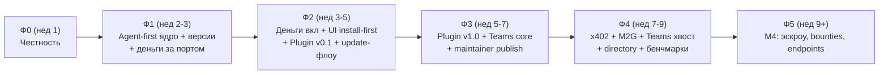

# OnlyHarness — единый план внедрения (unified rollout plan)

Дата: 2026-07-06, v1.1 (после адверсариальной проверки: 3 критика — полнота/последовательность/реализуемость; блокер и 9 major-находок вшиты). Статус: агрегирующий план-оркестратор. Основан на аудите кода (5 параллельных ридеров) и **агрегирует все существующие планы** — код-спеки не дублирует, а ссылается:

| Источник | Что берём |
|---|---|
| [agent-first-implementation](2026-07-06-agent-first-implementation.md) | Stages A–E: npm CLI, AGENTS.md, MCP `/mcp`, OpenAPI/Registry, плагин (21 задача, код-уровень) |
| [monetization-master-plan](2026-07-06-monetization-master-plan.md) | M0–M4 + MP + Track S: честность, деньги, плагин-автопилот, Teams, x402, эскроу |
| [install-first-showroom-flow](2026-07-06-install-first-showroom-flow.md) | UI-воркстрим: Install Center, chips, trust-first detail, честная копия, maintainer publish |
| [monetization-and-teams-concept](2026-07-06-monetization-and-teams-concept.md) | Экономика, GTM, правила продукта |
| [research/verified-catalog-2026-07](../research/verified-catalog-2026-07.md) | Контент-воркстрим: 255 позиций → волны сидирования |
| [research/custdev-results-2026-07](../research/custdev-results-2026-07.md) | Продуктовые правила Н1–Н8 и таблица достоверности |

## 1. Честный базлайн (аудит кода 2026-07-06)

**Работает в проде** (onlyharness.com, docker+Caddy): Fastify API (registry с поиском через `?q=`, leaderboard, detail, archive, import), полный Win98-UI (window manager, все окна, publish-wizard, share card), Supabase-auth (email-confirmation задеплоен с грязного дерева — код не закоммичен), CLI 15 команд с реальными search/pull/publish, схема+semantic-diff, deploy/smoke-скрипты, llms.txt.

**Фейки, которые надо вычистить до любых денег:** звёзды/форки/треды/runs/heat генерятся из хэша имени (`computeSocial`); треды в API — 3 хардкод-поста; «Run sample» — setTimeout(900ms) с ложным «passed the eval gate»; Maintainer Review показывает синтетический PR #7; `hh import-md` подкладывает eval-кейс со score 0.86 (в реестре до запуска eval висит «unknown», но локальный `hh eval` его «подтверждает»), `runLocalEval` даёт кейсам без score дефолт 0.85; publish-путь штампует `license: MIT` любому контенту. Настоящие данные УЖЕ копятся в Supabase (`user_harness_actions`, `harness_thread_posts`) — API их просто не читает.

**Отсутствует целиком:** npm-пакет CLI (private, bin→src/*.ts), `/mcp`, AGENTS.md/CLAUDE.md, openapi.json, .well-known, платежи/entitlements/orgs/visibility (grep чистый), Install Center и compatibility в UI, per-harness deep links (SPA без роутинга), version-история, `source/attribution`-поля манифеста (сам `license` в схеме есть), лицензионные данные каталога.

## 2. Разрешённые конфликты (решения этого плана)

1. **Плагин: agent-first Stage E ⊂ Milestone MP.** Один продукт, два релиза: **Plugin v0.1** = Stage E (тонкий: SKILL.md-гайд + .mcp.json) → **Plugin v1.0** = MP (автопилот + trust-сводка + scoped-install + оплата).
2. **Нумерация**: «Milestone M2.5 Community gating» → **M2G** (коллизия с задачей M2.5 Network Neighborhood). Идентификаторы моделей из концепта не используются — только милстоуны.
3. **Одно расширение манифеста — harness.v0.2** (вместо четырёх разрозненных): `visibility`/`pricing`/`org` (M0.4) + `source{upstream_url, upstream_license, attribution…}` (Wave 0) + `compatibility.targets` со статусами planned|available|verified (showroom) + `depends_on` (Н6) + поля контент-типа `directory` (спят до Ф4 — чтобы не плодить v0.3). Механика: `schemaVersion` literal→enum union (v0.1|v0.2), все новые блоки optional-with-defaults, регенерация `harnessJsonSchema`, фикстур-тест «8 сид-манифестов v0.1 валидны». **Порядок: 0.4 раньше npm-publish A7** — иначе опубликованный CLI отвергнет v0.2.
4. **Одна таблица событий `events`** (вместо install_events + analytics_events): kind view|copy|install|pull|checkout|purchase|suggested|applied; пишут UI, CLI, API и плагин. **Privacy-правило из showroom обязательно**: никаких project paths, промптов, credentials — только counts и анонимные субъекты.
5. **Реальные агрегаты = M0.1–M0.3** (showroom-требование тем же кодом). Плюс честная судьба heat: потребителей много (sortRegistry, badgeFor Top-10, leaderboard, PaintWindow, CLI-вывод) — heat переопределяется на реальных событиях с порогами показа, поля в payload остаются (честные нули), Top-10/freshness прячутся до достижения порогов.
6. **Deep links**: hash-роутинг `#/h/:owner/:name` без серверных правок; делается в Ф1 (пререквизит storefront, share-URL, плагина).
7. **`hh install` vs `pull`**: install = alias pull + `--target`-адаптеры позже; UI-копия переключается только когда команда работает. Install Center шипится с честными «Planned» (available на старте: CLI, GitHub-архив). **Update-флоу — отдельные команды** `hh pin` / `hh outdated` / `hh update --diff` (Ф2): без них модель «подписка на обновления» неполна; `hh adapt`/`hh mcp-config` появляются вместе с соответствующими табами Install Center.
8. **Fork/remix**: настоящий server-side форк — в Ф3 на модели владения M2; до того лейбл «Fork/remix» + рецепт `pull → rename → publish`; синтетический счётчик форков умирает в Ф0.
9. **Честность импорта и лицензий**: авто-импорт получает `evalStatus: unverified-import`; publish-путь требует явную лицензию (или ставит `unspecified` и показывает это); лицензия каталожного контента наследуется от upstream или блокирует вендоринг (link-only). Leaked-prompt-репо (2 шт.) исключены навсегда.
10. **Wave 3 каталога**: контент-тип `directory` (link-only, ~100 позиций) — в Ф4; поля заложены в v0.2 (реш. №3).
11. **Showroom-endpoints `/install?target=`, `/trust-report`, `/compatibility` не строятся**: их заменяют манифест-поле compatibility (v0.2), `/security-report` (M0.6) и обогащённый detail-payload. Если Install Center упрётся в клиентскую сборку сниппетов — пересмотреть в Ф2.
12. **Enterprise-тариф (SSO/SCIM/self-hosted) и affiliate-петля второй ступени — сознательно за горизонтом Ф5** (бэклог; referral_codes M1.1 покрывают только креатора).
13. **Exit-код платного pull**: таксономия agent-first (4 = NOT_FOUND) дополняется **EXIT.PAYMENT = 5** — агент должен отличать «купи» от «не существует» (конфликт master plan M1.4 ↔ Stage A2 разрешён в пользу нового кода).
14. **Maintainer publish** (публичный publish-из-репо: verified-бейдж только после validate+eval+gate, из showroom Phase 5) — не выброшен: задача Ф3 (3.6).

## 3. Инварианты исполнения

Диск = контент харнесов, Supabase = деньги/социум/орги. Платежи только через порт `PaymentProvider`. Фиче-флаги (`PAYMENTS_ENABLED`, `X402_ENABLED`, `ORGS_ENABLED`) — деплой отдельно от включения. **Секреты** (`SUPABASE_SERVICE_ROLE_KEY`, креды провайдера, `HARNESS_WEBHOOK_TOKEN`) — только серверный env, в веб-бандл попадает только anon key. TDD по идиоме репо; задача = коммит; милстоун = деплой + продовый smoke. Правила продукта: **честность до денег**, **paid = open source**, **security-scan перед плагином**, цены — гипотеза до экспериментов. Владельческие чекпоинты ставятся на понедельники фаз (не в середину недели).

## 4. Фазы и дорожки

Dev A «деньги/данные», Dev B «поверхности/агентность», Owner (юр/контент/GTM). Внутри фазы порядок в строке = порядок приземления коммитов, там где это важно — указано явно.

### Ф0 — Честность (неделя 1) — гейтов нет

Порядок коммитов в server.ts жёсткий: **0.2 (M0.3) приземляется до 0.5/0.6** (они строятся на новой сигнатуре scanRegistry).

| Дорожка | Задачи |
|---|---|
| Dev A | 0.1 Закоммитить email-confirmation из рабочего дерева. 0.2 **M0.1–M0.3** + прокладка `SUPABASE_SERVICE_ROLE_KEY` в deploy-env + **честный heat** (реш. №5: пороги показа, перечень потребителей) + `/thread` переводится на реальное чтение `harness_thread_posts` (нужен MCP-поверхности в Ф1). |
| Dev B | 0.4 **Манифест harness.v0.2** одним изменением (реш. №3, с фикстур-тестом). 0.5 **M0.6 security-scan** + `/security-report`. 0.6 **M0.7 Standard-бейдж**. 0.7 Честная копия и данные: Run sample перестаёт врать, Maintainer Review помечен demo, import-кейс 0.86 и дефолт 0.85 в runLocalEval устраняются (`unverified-import`), publish требует явную лицензию (реш. №9), дисклеймер «community signals, not safety guarantees». |
| Owner | 0.8 **Заказать юрзаключение MoR** (самый длинный lead-time). 0.9 Каталог **Wave 0** (парсинг в JSON + license-API + политика вендоринга). 0.10 Кастдев-волна 2 (команды 5+, платившие). |

**Демо Ф0:** звезда меняет реальный счётчик; злой фикстур не листится и объясним через `/security-report`; ни одной выдуманной цифры на проде.

### Ф1 — Agent-first ядро + версии + деньги за портом (недели 2–3)

**Синхроточка дорожек: Stage C1 (registry.ts экстракция, поведение не меняется) — первый коммит фазы**; Dev A трогает archive-роут только после его merge. Примечание к C1: move-list пересчитать после Ф0 — мок-символов уже нет, social.ts импортируется.

| Дорожка | Задачи |
|---|---|
| Dev B | 1.1 **Stage C1** (первым). 1.2 **Stage A1–A6**: esbuild-бандл, EXIT-таксономия (**+PAYMENT=5**, реш. №13), `--json` везде, smoke agent-loop, README/llms.txt; заодно чинится скаффолд (`.gitea/workflows` ссылается на несуществующий `@harnesshub/cli`, maintainer-штамп «Harness.Hub Local»). 1.3 **Stage B1–B3** (AGENTS.md/CLAUDE.md). 1.4 **Stage C2–C7**: mcp.ts, `/mcp`, .well-known, Caddy, smoke-mcp, деплой. 1.5 **Hash-роутинг `#/h/:o/:n` + скелет Install Center** (вытянуто вперёд — разгружает Ф2 и разблокирует storefront). |
| Dev A | 1.6 **M0.5 версии** (перенесено из Ф0: снапшот на publish + `?version=` на archive — уложить в минимальный скоуп). 1.7 **M1.1 миграция денег**. 1.8 **M1.2 порт PaymentProvider + 402-гейт на archive** (после 1.1; адаптер `manual`). 1.9 Таблица `events` + privacy-правило (реш. №4). 1.10 **M1.4 `hh pull` c HH_TOKEN + exit 5** — строго после 1.2 (тот же файл CLI, таксономия). |
| Owner | 1.11 **A7 npm publish — понедельник недели 2** (демо Ф1 зависит от него). 1.12 Каталог **Wave 1** (10–15 hand-authored флагманов, data-driven генератор вместо деструктивного массива). 1.13 Переговоры с 2 анкорами. |

**Демо Ф1:** `npx onlyharness search/pull` с чистого ноутбука; `claude mcp add … /mcp` → search из Claude Code; платный фикстур отвечает 402 (manual-провайдер); полка ~20 настоящих харнесов; у харнесов появились версии.

### Ф2 — Деньги включаются + UI install-first + Plugin v0.1 (недели 3–5)

**Гейт: юрзаключение получено ИЛИ дедлайн начала недели 4 → стартуем на Paddle-stopgap** (порт позволяет; свои рельсы подключаются позже без переписывания). Пока адаптер не выбран, Dev A идёт по не-блокированным задачам (2.1).

| Дорожка | Задачи |
|---|---|
| Dev A | 2.1 (не ждёт адаптера) **M1.6 payout-ledger**, **M1.8 context-cost**, **M1.9a `hh doctor --harness`**, **update-флоу: `hh pin` / `hh outdated` / `hh update --diff`** (реш. №7; на версиях 1.6). 2.2 **M1.3 checkout+webhook** на выбранном адаптере. 2.3 **Storefront-бэкенд**: миграция profile handles + ref-атрибуция в checkout (UI — у Dev B). 2.4 **Entitlement-гейт в MCP `pull_harness`** — фикс блокера: 402-payload в tool-result, та же entitlementDecision; **жёсткий гейт перед включением платежей**. |
| Dev B | 2.5 **Install Center полный** (табы, честные Planned; `hh adapt`/`hh mcp-config` по мере готовности). 2.6 Карточки: CTA Install, compatibility chips, Works-with, **outcome-фильтры перемаппить на jobs**; share-card дополняется works-with chips, eval/risk-бейджем и install-командой (short URL уже есть с 1.5). 2.7 Detail: табы Overview/Install/Trust/Try sample/Thread/Files/Versions; **Trust-таб строится в порядке трёх вопросов кастдева: «безопасно?» → «работает у меня?» → «лучше аналогов?»**; `last_verified_at` вычисляется из реальных eval/gate-событий. 2.8 **Storefront UI `@handle`** (после 1.5). 2.9 **Plugin v0.1 = Stage E1–E2**. 2.10 **Stage D1–D3** (openapi, server.json, MCP Registry; **DNS TXT — понедельник недели 5**). |
| Owner | 2.11 Каталог **Wave 2** (semi-auto, unverified-import). 2.12 Ценовые эксперименты. 2.13 **Включение PAYMENTS_ENABLED** — только после 2.4 и продового smoke. |

**Демо Ф2:** первый реальный платёж (402 → checkout → оплата → архив) и тот же флоу из MCP-тула без обхода; Install Center; `@handle` с ref-ссылкой; `hh outdated` показывает отставшие версии; плагин v0.1 ставится.

### Ф3 — Plugin v1.0 автопилот + Teams core + maintainer publish (недели 5–7)

Скоуп Teams сокращён до входящего в 2 недели (полный M2 ~3–4 нед): **M2.6 git-sync и M2.7 биллинг сидов уходят в Ф4** — демо фазы это переживает.

| Дорожка | Задачи |
|---|---|
| Dev B | 3.1 **MP.2–MP.3** (автопилот с trust-сводкой и scoped-install). 3.2 **MP.4 платный флоу** (теперь видит 402 и из archive, и из MCP — блокер закрыт в 2.4). 3.3 **MP.5 телеметрия** → events + **M1.9b confirms-бейдж** («works in Claude Code: N confirms»). 3.6 **Maintainer publish** (реш. №14: публикация из git-репо, verified-бейдж только после validate+eval+gate, update-diff). |
| Dev A | 3.4 **M2.0 → M2.1–M2.5**: orgs-миграция, org-API+токены+аудит, `hh publish --org`, бандлы + `hh setup @acme`, Network Neighborhood. 3.5 **Fork/remix** на модели владения + **`hh extract`** (custdev Н6-tooling: упаковка скила из живого сетапа с автоопределением depends_on). |
| Owner | 3.7 Кастдев команд 5+ → калибровка M2-фич. 3.8 Подписание анкоров, white-glove онбординг их каталогов. |

**Демо Ф3:** плагин сам предлагает и ставит харнес после подтверждения; `hh setup @acme` разворачивает сетап команды; приватный харнес не отдаётся не-члену; публикация из репо с честным verified-бейджем.

### Ф4 — x402 + M2G + хвост Teams + directory + бенчмарки (недели 7–9)

| Дорожка | Задачи |
|---|---|
| Dev A | 4.1 **M3.1–M3.5** (x402 requirements, facilitator, `hh pull --pay`, testnet-smoke, Bazaar-листинг, purchase-aware обогащение MCP). |
| Dev B | 4.2 **M2G** (`/entitlements/check` + референс-TG-бот; гейт: анкоры подписаны). 4.3 **M2.6 git-sync + M2.7 биллинг сидов** (хвост Teams). 4.4 **Directory-полка** (Wave 3, поля из v0.2). 4.5 **Н2-инфраструктура бенчмарков** (категорийный eval-раннер + сравнение аналогов; сами сьюты — контент-работа Owner). |
| Owner | 4.6 Авторинг бенчмарк-сьютов для 1–2 категорий. 4.7 Включение X402_ENABLED. 4.8 **GTM-запуск с анкорами: X/Reddit — основные каналы, TG — RU-сегмент** (+ `hh audit-setup` из Track S как виральный крючок). |

### Ф5 — M4 (недели 9+)

**M4.1 receipts → M4.2 эскроу → M4.3 bounties** (пилот S2 прожит руками) → **M4.4 hosted endpoints** (build-vs-partner по спросу авторов).

### Track S — свободные слоты любой фазы

**S1 `hh audit-setup`** (можно даже в Ф0) · **S2 ручной bounty-пилот «скилл на спеки»**.

## 5. Контрольные точки владельца

1. Ф0: заказать **юрзаключение MoR** (дедлайн-гейт Ф2). 2. **Понедельник недели 2: npm login/publish** (A7). 3. Ф2, **понедельник недели 5: DNS TXT** для MCP Registry (D3). 4. Ф2: выбор платёжного адаптера (или авто-fallback Paddle). 5. Ф2: включение PAYMENTS_ENABLED (после 2.4!). 6. Ф3→Ф4: подписание 1–2 анкоров (гейт M2G). 7. Постоянно: кастдев-волна 2, ценовые решения, Wave 1/2 контент.

## 6. Метрики по фазам

Ф0: 0 выдуманных цифр на проде. Ф1: TTFH через `npx onlyharness` < 2 мин; ≥20 флагманов. Ф2: первый GMV; конверсия 402→оплата; installs через Install Center; **0 бесплатных pull платного через /mcp** (проверяется smoke). Ф3: suggested→applied конверсия плагина; первый платящий org. Ф4: первый x402-платёж агента; creator-sourced GMV %. Ф5: gate-pass rate эскроу.

## 7. Реестр покрытия (traceability)

| Источник | Элементы | Куда легли |
|---|---|---|
| agent-first | A1–A7 / B1–B3 / C1 / C2–C7 / D1–D3 / E1–E2 | 1.2+1.11 / 1.3 / 1.1 / 1.4 / 2.10 / 2.9 |
| master plan | M0.1–M0.3 / M0.4 / M0.5 / M0.6 / M0.7 / M0.8 | 0.2 / 0.4 / **1.6 (перенос из Ф0 — перегруз)** / 0.5 / 0.6 / демо Ф0 |
| master plan | M1.1 / M1.2 / M1.3 / M1.4 / M1.5 / M1.6 / M1.7 / M1.8 / M1.9 | 1.7 / 1.8 / 2.2 / 1.10 / 2.3(API)+2.8(UI) / 2.1 / 1.9 / 2.1 / **2.1(a)+3.3(b — confirms после телеметрии)** |
| master plan | MP.1–MP.6 / M2.0–M2.5 / M2.6–M2.7 / M2G / M3.1–M3.5 / M4.1–M4.4 / S1–S2 | 2.9(v0.1)+3.1–3.3(v1.0) / 3.4 / **4.3 (хвост)** / 4.2 / 4.1 / Ф5 / Track S |
| showroom | Install Center / chips+Works-with / card CTA / jobs-фильтры / detail tabs / trust-panel+3 вопроса / Try честность / fork-remix / **maintainer publish** / share-card контент+URL / heat-trust дисклеймер / агрегаты / install-телеметрия+privacy / manifest compat+trust / **hh pin-update-outdated** / adapt+mcp-config / llms.txt rewrite / Versions / API-endpoints | 2.5 / 2.6 / 2.6 / 2.6 / 2.7 / 2.7 / 0.7 / 3.5 / **3.6** / 2.6+1.5 / 0.7 / 0.2 / 1.9 / 0.4+2.7(last_verified) / **2.1** / 2.5 / Ф1–Ф2 по мере поверхностей / 2.7+1.6 / **реш. №11 (не строим)** |
| catalog | Wave 0 / 1 / 2 / 3 / исключения+лицензии | 0.9 / 1.12 / 2.11 / 4.4 / реш. №9 |
| custdev | Н1 / Н2 / Н3 / Н4 / Н5 / Н6 / Н7 / Н8 / 4 правила / trust-порядок / GTM-каналы | 0.5 / 4.5+4.6 / 2.1 / S1 / внутри MP scoped-install / **0.4(схема)+3.5(hh extract)** / 2.1a+3.3b / 0.6 / раздел 3 / 2.7 / 4.8 |
| концепт | Тарифы+комиссии / рельсы 402 / Teams JTBD / update-каналы / Enterprise+affiliate | Ф2 включение + эксперименты / 1.8+2.4+4.1 / 3.4+4.3 / **2.1 (pin/outdated/update)** / **реш. №12 (бэклог)** |

## 8. Главные риски последовательности

1. **Юрзаключение задерживается** → дедлайн-гейт: неделя 4 = Paddle-stopgap автоматически.
2. **Обход оплаты через /mcp** — закрыт задачей 2.4; включение PAYMENTS_ENABLED без неё запрещено (чекпоинт №5, smoke-проверка в метриках Ф2).
3. **Файловые коллизии дорожек** — управляются синхроточками: Ф0 — 0.2 первым; Ф1 — C1 первым, M1.4 после A1–A6; Ф2 — storefront-UI у Dev B после 1.5.
4. **0.4 (манифест v0.2) обязан приземлиться до A7 (npm publish)** — опубликованный CLI со старой схемой отвергнет v0.2-манифесты.
5. **Wave 2 без лицензионного прохода Wave 0 запрещён.**
6. **Плагин без security-scan запрещён** (4/4 кастдев, prompt-injection поверхность).
7. **Anthropic может запустить официальную монетизацию** — ответ: скорость, мульти-CLI, agent-native 402, gate-эскроу.
