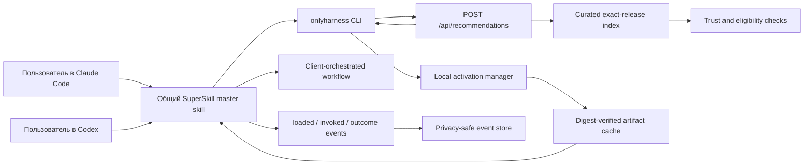

# SuperSkill MVP — аудит легаси и точный план доработок

Дата: 2026-07-12
Статус: **MVP EXECUTION PLAN**
Основание: [итоговая концепция SuperSkill](2026-07-11-superskill-final-service-concept.md)

Этот документ отвечает на практический вопрос: что именно нужно сохранить из
OnlyHarness, что исправить, что добавить и в какой последовательности, чтобы получить
настоящий MVP SuperSkill.

Визуальный дизайн нового сайта в scope этого плана не входит. Его пользователь пришлёт
отдельно. До этого момента мы стабилизируем backend-контракты, данные, CLI и plugin flow,
чтобы новый дизайн подключался к готовому продукту, а не определял его архитектуру.

---

## 1. Архитектурное решение

### Что является MVP

MVP — это один законченный цикл, одинаковый для Claude Code и Codex:

```text
Пользователь ставит SuperSkill один раз
→ описывает обычную задачу
→ SuperSkill возвращает один лучший проверенный resource и две альтернативы
→ показывает причину выбора, ограничения и новые permissions
→ пользователь явно подтверждает activation
→ exact artifact загружается и проверяется по digest
→ SuperSkill применяет его инструкции в текущей сессии Claude Code или Codex
→ фиксирует loaded / invoked / outcome
→ временная activation закрывается или resource закрепляется по выбору пользователя
```

### Жёсткие границы первой версии

- Первые clients: **Claude Code и Codex**.
- Internal activation acceptance: terminal-launched Claude Code и Codex CLI; Codex
  app/IDE остаются compatibility surfaces до отдельного GUI credential onboarding.
- Первый execution mode: **client-orchestrated instruction resources**.
- Управляемый каталог: **12 approved exact releases для старта Stage A**, рост до
  **20 exact releases** к финальному MVP proof.
- Первый consent mode: **явное подтверждение перед каждой новой activation**.
- Temporary activation выполняется через master-plugin, без установки нового skill в
  середине текущей сессии.
- Pinned activation создаёт управляемый skill в native discovery path выбранного
  клиента только по отдельной команде пользователя.
- Recommendations используют только curated и approved releases.
- Внешний каталог из сотен ссылок остаётся browse-only и не попадает в managed flow.
- В MVP нет hosted execution произвольного кода.

### Что сознательно не делаем

- не переписываем OnlyHarness с нуля;
- не переименовываем массово внутренние packages, API paths и таблицы;
- не включаем Cursor и все типы ресурсов одновременно;
- не строим Skill Factory, Skill Arena, payouts, x402 или bounties;
- не развиваем Workspace UI до доказанного individual core loop;
- не делаем auto-activation без consent;
- не запускаем scripts, hooks или сторонние MCP servers в managed MVP;
- не начинаем визуальный редизайн до получения нового дизайна.

---

## 2. Что реально есть в легаси сейчас

Аудит сделан по текущему `main` на commit `3d5967a`.

### 2.1 Web

Текущий web — React/Vite-приложение с тремя skins:

- `win98`;
- `modern`;
- `fans`.

Общие данные и действия уже вынесены из визуального слоя в:

- `apps/registry-web/src/core/store.tsx`;
- `apps/registry-web/src/core/useRegistry.ts`;
- `apps/registry-web/src/core/useAuth.ts`;
- `apps/registry-web/src/core/useWorkspace.ts`;
- `apps/registry-web/src/core/useAppNav.ts`;
- `apps/registry-web/src/core/types.ts`.

Это хороший фундамент для будущего дизайна: новый дизайн можно добавить как отдельный
skin или новый mount, сохранив core state и API hooks.

Проблемы:

- core store объединяет слишком много несвязанных функций;
- discovery всё ещё catalog-first;
- отдельного recommendation/activation state нет;
- `RegistryItem` и `ResourceItem` показывают две разные продуктовые модели;
- UI содержит много не-MVP поверхностей: social, storefront, checkout, bounties,
  Network Neighborhood, workspace subscriptions;
- общий `npm run check` сейчас падает на 19 web-тестах, потому что test environment не
  предоставляет рабочий `localStorage`;
- публичные `AGENTS.md` и `llms.txt` отстают от runtime по workspace subscriptions.

Решение: существующие skins не удалять. До нового дизайна добавить только headless hooks,
types и API contract tests. Новый UI подключить позднее под feature flag.

### 2.2 API

API уже умеет:

- искать native harnesses;
- искать mixed resources;
- отдавать detail и archive;
- публиковать native и generic resource packages;
- работать через MCP;
- писать privacy-safe events;
- проверять schema, risk и простые static security rules;
- обслуживать workspaces, auth, payments, entitlements, storefront, community и
  bounties.

Проблемы:

- `apps/harness-api/src/server.ts` содержит больше 3300 строк и десятки разных доменов;
- `apps/harness-api/src/openapi.ts` поддерживается вручную и содержит почти 3000 строк;
- новый SuperSkill flow нельзя продолжать добавлять прямо в эти monolith-файлы;
- нет recommendation endpoint;
- нет canonical exact artifact digest в public contracts;
- нет managed eligibility/revoke decision;
- нет correlation между recommendation, activation, invocation и outcome.

Решение: SuperSkill добавляется отдельным модулем и route plugin. Старые endpoints остаются
совместимыми.

### 2.3 Две разные модели каталога

Сейчас существуют два параллельных источника:

#### Native registry

- 12 seed harnesses в `seed-harnesses/`;
- имеют `harness.yaml`, agents, workflow, examples и `.harnesshub/results.json`;
- поддерживают archive/install/adapters;
- security `fail` скрывает resource из registry.

Текущие 12 packages и их предполагаемая роль в MVP:

| Resource | MVP-категория | Действие |
|---|---|---|
| `deep-market-researcher` | Research and strategy | Мигрировать и перепроверить |
| `gtm-research-sprint` | Research and strategy | Мигрировать и перепроверить |
| `product-strategy-critic` | Research and strategy | Мигрировать и перепроверить |
| `founder-decision-memo` | Research and strategy | Мигрировать и перепроверить |
| `repo-truth-auditor` | Repo and engineering | Мигрировать и перепроверить |
| `agent-harness-refactorer` | Repo and engineering | Мигрировать и перепроверить |
| `incident-rca-commander` | Repo and engineering | Мигрировать и перепроверить |
| `launch-readiness-reviewer` | Safety and readiness | Мигрировать и перепроверить |
| `security-permission-auditor` | Safety and readiness | Мигрировать и перепроверить |
| `finance-payment-safety-reviewer` | Safety and readiness | Мигрировать; оставить read/review-only |
| `support-triage-agent` | Operations and support | Мигрировать; auto-send запрещён |
| `data-quality-sentinel` | Operations and support | Мигрировать и перепроверить |

#### Mixed external resource catalog

- 253 записи в `data/resources/verified-2026-07.json`;
- типы: skills, workflows, MCP servers, frameworks, guides и другие;
- все 253 сейчас имеют `installability=open_only`;
- все 253 имеют `licenseStatus=unknown`;
- все 253 имеют `securityScan=not_scanned`.

Следствие: mixed catalog полезен как discovery shelf, но не может быть источником
автоматических рекомендаций или installation.

Решение: не пытаться «доверить» весь каталог. Создать отдельный curated managed index:
12 exact native releases для Stage A и 20 к финальному proof. Остальные ресурсы оставить
browse-only.

### 2.4 Native manifest и фактическое выполнение

Существующий schema уже описывает:

- runtime;
- stages и agent prompts;
- permissions;
- tools и secrets;
- compatibility;
- source и license;
- evals и quality gates.

Но все 12 seed packages сейчас декларируют:

- `runtime.primary=openai-agents-sdk`;
- `entrypoint.command=npm run harness:run`;
- обязательный `OPENAI_API_KEY`;

при этом в packages нет реального runtime-кода и соответствующего npm script. `hh run`
честно запускает только bundled sample preview и не выполняет harness.

Решение: seed resources в managed MVP должны быть честными instruction packages:

- `runtime.primary=none`;
- без фиктивного entrypoint;
- без фиктивного required secret;
- workflow применяется master-plugin внутри текущего Claude Code или Codex session;
- tool/capability requirements описываются как требования, но не запускаются скрыто.

### 2.5 Trust и eval

Что уже есть:

- schema validation;
- permission risk scoring;
- block для money movement и unrestricted filesystem;
- static rules для pipe-to-shell, base64 execution, secret exfiltration, prompt override;
- URL allowlist warnings;
- immutable version snapshots;
- signed gate receipts.

Критическая проблема: `hh eval` не выполняет модель и не измеряет результат. Он читает
числа `score`, заранее записанные автором в YAML. После этого результат получает:

```json
{
  "verified": true,
  "verification_status": "declared_case_scores"
}
```

Это годится как author-declared self-check, но не как доказательство качества и не должно
влиять на managed recommendation как independently verified eval.

Также archive сейчас не имеет canonical digest, а filesystem scanner не должен считать
symlink обычным безопасным файлом.

Решение:

- разделить evidence levels;
- убрать слово `verified` из declared-score semantics;
- в managed flow требовать named checks и human review exact release;
- добавить digest и client-side verification;
- разрешить в MVP только text/instruction packages без executable payloads.

### 2.6 CLI

CLI `onlyharness@0.2.12` уже имеет сильную основу:

- search/resources search/detail/open;
- suggest/apply;
- pull/install;
- adapters для Claude Code, Codex и Cursor;
- doctor;
- audit-setup;
- pin/outdated/update;
- eval/gate;
- privacy-safe events;
- документированные exit codes.

Проблемы:

- `hh suggest` ищет только native registry через обычный AND text search;
- кандидаты сортируются по `heat`, а не по task fit;
- `install` означает files written, но не loaded или invoked;
- нет transactional activation и rollback;
- нет exact digest verification;
- temporary activation отсутствует;
- audit поддерживает только Claude skills и не знает managed activation state;
- текущий Codex adapter пишет `.codex/harnesses/<name>/AGENTS.md`, хотя актуальный Codex
  обнаруживает repo/user skills через `.agents/skills`;
- весь CLI находится в одном файле примерно на 4700 строк.

Решение: старые команды не ломать. Добавить новый `hh recommend` и семейство
`hh activation ...`, вынеся их реализацию в отдельные modules.

### 2.7 Claude Code/Codex plugins и MCP

Уже есть опубликованный OnlyHarness plugin:

- skill-инструкция;
- remote MCP config;
- marketplace entry;
- search/detail/pull/publish MCP tools.

Но текущий skill — документация по ручным командам. Он не является master-router и не
проводит пользователя через activation lifecycle.

Решение: добавить отдельный focused plugin `superskill`, сохранив `onlyharness` как legacy
catalog/publishing plugin. Это предотвращает поломку существующих пользователей и не
смешивает пользовательский task flow с admin/creator командами.

Один plugin source directory должен содержать оба native manifests:

- `.claude-plugin/plugin.json` для Claude Code;
- `.codex-plugin/plugin.json` для Codex;
- один общий `skills/superskill/SKILL.md`;
- один общий `.mcp.json`.

Codex marketplace публикуется через `.agents/plugins/marketplace.json`. Pinned Codex
skills создаются в `.agents/skills`, а не в legacy `.codex/harnesses`.

### 2.8 Events и продуктовая аналитика

Сейчас есть:

- `suggested`;
- `accepted`;
- `applied`;
- `install`;
- `eval`;
- `gate`.

Нет:

- recommendation ID;
- activation ID;
- loaded;
- invoked;
- outcome;
- evidence type;
- reason/error code;
- temporary/pinned mode.

Решение: расширить whitelist и Supabase schema, сохранив запрет на prompts, paths,
credentials и произвольные metadata.

### 2.9 Текущее качество baseline

Проверено 2026-07-12:

- `npm run smoke` — проходит;
- API tests — 51/51 проходят;
- CLI tests — 51/51 проходят;
- schema tests — 3/3 проходят;
- `npm run check` — падает из-за 19 web tests, связанных с отсутствующим
  `localStorage` в Vitest/jsdom;
- публичные docs содержат устаревшее утверждение, что workspace subscription lifecycle
  ещё не реализован, хотя код и README говорят обратное.

До feature work baseline должен стать полностью зелёным.

---

## 3. Что из легаси переиспользуем, заменяем и откладываем

| Область | Решение | Причина |
|---|---|---|
| Fastify API и `/api` base | Переиспользовать | Уже deployed contract |
| `/registry` и `/resources` | Оставить как legacy browse API | Нельзя смешивать с managed recommendations |
| Native archive delivery | Доработать digest и snapshot contract | Уже работает install path |
| `harness-schema` permissions/risk | Переиспользовать и расширить | Хорошая база для MVP |
| Static scanner | Усилить | Текущих regex недостаточно для trust claim |
| Declared eval scores | Понизить до author-declared evidence | Сейчас ошибочно выглядят как verification |
| `hh install`, adapters | Переиспользовать primitives для pinned mode | Уже протестированы |
| `hh suggest` | Оставить compatibility path | Его semantics нельзя выдавать за новый router |
| `hh recommend` | Создать | Новый managed task-first contract |
| Claude/Codex plugins | Добавить dual-manifest `superskill` | Один skill и backend, native distribution для каждого client |
| MCP | Оставить public browse/search; managed tools после alpha | Не добавлять второй auth transport в MVP |
| Web core/skin split | Переиспользовать | Позволяет подключить будущий дизайн |
| Текущие skins | Заморозить | Визуальный дизайн придёт отдельно |
| Workspace backend | Не удалять, не развивать в MVP | Позднее станет Team layer |
| Payments/bounties/storefront | Оставить feature-gated | Не относятся к core proof |
| 253 external resources | Browse-only | Нет license/security/install proof |

---

## 4. Целевая архитектура MVP



### Главный принцип

Recommendation и activation — разные операции:

- recommendation ничего не устанавливает;
- acceptance ничего не означает без успешной activation;
- files downloaded не означают loaded;
- loaded не означает invoked;
- invoked не означает successful outcome.

Каждое состояние хранится и показывается отдельно.

---

## 5. Каноническая MVP-модель

Полную enterprise Resource Graph сейчас строить не нужно. Нужен минимальный общий DTO,
который не зависит от legacy `RegistryItem` или `ResourceItem`.

### `ManagedCapability`

```ts
type ManagedCapability = {
  id: string;
  type: "instruction_harness";
  title: string;
  summary: string;
  jobs: Array<{
    id: string;
    intents: string[];
    outcomes: string[];
    exclusions: string[];
  }>;
  release: {
    ref: string;
    version: string;
    artifactDigest: `sha256:${string}`;
    immutable: true;
    publishedAt: string;
    delivery: "free_archive";
  };
  source: {
    owner: string;
    url: string;
    revision?: string;
    license: string;
  };
  compatibility: Array<{
    client: "claude-code" | "codex";
    status: "verified" | "available" | "blocked";
    verifiedAt?: string;
    notes?: string;
  }>;
  permissions: ManagedPermissions;
  contextCost: ContextCost;
  trust: {
    status: "candidate" | "approved" | "quarantined" | "revoked";
    riskScore: number;
    riskTier: RiskTier;
    checks: TrustCheck[];
    limitations: string[];
    reviewedAt: string;
  };
};
```

### Evidence levels

```text
author_declared
→ static_checked
→ compatibility_smoked
→ human_reviewed
→ independently_evaluated
```

MVP managed eligibility требует минимум:

- exact immutable release;
- digest;
- known source и license;
- schema pass;
- static security pass;
- permissions declaration;
- declared-vs-inferred capability diff без blocking mismatch;
- Claude Code и Codex compatibility smoke;
- human review exact digest;
- статус `approved`.

`independently_evaluated` улучшает ranking, но не является обязательным для всех 20
resources в первой alpha. Author-declared score не считается independent evidence.

### Curation source

Создать:

- `data/superskill/curated.json` — ручной список approved refs, JTBD, routing metadata,
  pinned version и expected digest;
- `data/superskill/index.json` — generated public-safe managed index;
- `data/superskill/reviews/` — named check attestations без prompts и user data;
- `data/superskill/router-cases/` — task-to-expected-candidate fixtures.

`curated.json` является reviewable source. `index.json` всегда генерируется и не
редактируется вручную.

### Artifact digest

Один algorithm на server и CLI:

```text
для каждого файла в порядке normalized POSIX path:
  fileHash = sha256(raw bytes)
  chunk = path + NUL + fileHash + LF
artifactDigest = "sha256:" + sha256(concat(chunks))
```

Правила:

- path traversal запрещён;
- `lstat` разрешает только regular files; symlink запрещён до read;
- `realpath(file)` обязан остаться внутри `realpath(resourceRoot)`;
- truncated file запрещён в managed artifact;
- дубликаты normalized path запрещены;
- strict UTF-8, без CRLF/BOM normalization;
- максимум 80 files, 256 KiB/file, 2 MiB total; любой overflow блокирует весь artifact;
- mutable current release не считается managed release;
- version без immutable snapshot не попадает в curated index.

---

## 6. Recommendation contract

### HTTP

Создать:

- `POST /recommendations` — task-first ranking;
- `GET /capabilities/:id` — текущий curated release и trust contract;
- `GET /capabilities/:id/releases/:version` — exact release detail для повторной
  проверки перед activation.
- `GET /capabilities/:id/releases/:version/archive` — authenticated free-only managed
  archive; не вызывает legacy payment/x402/entitlement helpers.

Request:

```json
{
  "task": "Compare the main competitors and separate facts from assumptions",
  "context": {
    "client": "claude-code",
    "clientVersion": "optional",
    "os": "darwin",
    "arch": "arm64",
    "installedManagedRefs": [],
    "inventorySummary": {
      "managedSkills": 0,
      "unmanagedSkills": 0,
      "approxTokens": 0,
      "conflicts": 0,
      "permissionsKnown": false
    }
  }
}
```

Privacy rules:

- managed endpoints требуют `Authorization: Bearer ${HH_SUPERSKILL_TOKEN}`;
- каждый internal tester получает отдельный opaque token, server хранит только SHA-256;
- missing token → 401, invalid token → 403;
- task максимум 500 символов;
- plugin сначала делает локальное краткое описание задачи;
- plugin убирает emails, absolute paths, raw URLs, IDs и фрагменты файлов, если они не
  обязательны для routing;
- CLI отклоняет строки с очевидными secrets;
- request body не пишется в product events;
- Fastify logs не должны логировать body;
- recommendation event содержит только opaque ID и выбранный resource ref.

До отправки summary plugin показывает sanitized text/destination и получает routing
consent. Это отдельное действие от последующего activation consent.

Response:

```json
{
  "recommendationId": "rec_...",
  "decision": "recommend",
  "confidence": 0.84,
  "selected": {
    "capability": {},
    "score": 86,
    "why": [],
    "limitations": [],
    "permissionDelta": {},
    "consent": "required"
  },
  "alternatives": [],
  "expiresAt": "..."
}
```

Возможные решения:

- `recommend` — есть явный лучший безопасный кандидат;
- `needs_clarification` — кандидаты близки или не хватает ограничения;
- `no_safe_match` — подходящего approved exact release нет.

### Ranking v1

Score из 100:

| Фактор | Вес |
|---|---:|
| Task/JTBD fit | 40 |
| Selected-client compatibility | 15 |
| Exact-release trust | 15 |
| Evaluation evidence | 10 |
| Permission/risk fit | 10 |
| Currentness | 5 |
| Context cost | 5 |

До scoring кандидаты фильтруются:

- только curated `approved`;
- только exact pinned snapshot;
- digest совпадает;
- compatibility не blocked;
- security verdict pass;
- нет blocking capability mismatch;
- revoked/quarantined всегда исключаются.

Thresholds:

- score `>=75` и отрыв от второго кандидата `>=10` → `recommend`;
- score `55–74` или отрыв `<10` → `needs_clarification`;
- score `<55` → `no_safe_match`.

Popularity, stars и heat не входят в v1 ranking.

### Router evaluation

Fixture suite растёт вместе с внутренним rollout, чтобы не блокировать первые живые
задачи команды искусственным объёмом:

- Stage A: минимум 30 cases для 12 resources — 18 positive, 5 ambiguous,
  3 out-of-scope, 4 adversarial/high-risk; каждый resource имеет хотя бы один positive;
- Stage B: минимум 60 cases после первых реальных ошибок/feedback;
- Stage C/final proof: минимум 100 cases — 60 positive, 20 ambiguous,
  10 out-of-scope, 10 adversarial/high-risk.

Для каждого fixture хранить:

- expected top-1 или allowed top-3;
- forbidden candidates;
- expected decision;
- expected consent/risk behavior.

Gate:

- 100% forbidden/revoked candidates не появляются;
- top-3 fit не ниже 90% на каждом rollout stage;
- ambiguous cases не маскируются как high-confidence;
- out-of-scope возвращает `no_safe_match`.

---

## 7. Activation model

### Почему нельзя просто использовать текущий `install`

Текущий install создаёт files и adapter. Он не доказывает, что новый skill был подхвачен
текущей Claude Code или Codex session. Поэтому temporary mode должен работать через уже
загруженный SuperSkill master-plugin.

### Temporary activation

1. CLI получает selected exact ref, version и expected digest.
2. Archive загружается в content-addressed cache.
3. CLI пересчитывает digest.
4. Manifest и managed eligibility проверяются повторно локально.
5. Создаётся local activation record.
6. CLI возвращает master-plugin точный список prompt files и workflow stages.
7. SuperSkill читает эти файлы и применяет workflow в текущей сессии.
8. Plugin отмечает `loaded`, затем перед первым stage — `invoked`.
9. После задачи plugin фиксирует outcome evidence.
10. Activation закрывается; cache может остаться для быстрого повторного использования.

Temporary mode не создаёт `.claude/skills/*` или `.agents/skills/*` и не загрязняет
repository.

### Pinned activation

Только после отдельного выбора пользователя:

- для Claude Code создать `.claude/skills/superskill-<resource-name>/SKILL.md`;
- для Codex создать `.agents/skills/superskill-<resource-name>/SKILL.md`;
- добавить managed marker с ref/version/digest;
- не перезаписывать существующий путь;
- если путь существует с другим digest — fail closed;
- сохранить per-file digests generated managed files;
- in-place update не входит в MVP; doctor предлагает remove + fresh activation/pin;
- remove удаляет только файлы с совпадающими marker и per-file digests.

### Local state

```text
<project>/.onlyharness/client.json
<project>/.onlyharness/cache/sha256/<digest>/
<project>/.onlyharness/activations/<activation-id>.json
```

Project-local state сохраняет совместимость с sandbox обоих clients. В git repository
CLI вычисляет root как explicit `--project-dir` → git top-level → cwd, использует
canonical realpath и получает exclude path через `git rev-parse --git-path info/exclude`.
Tracked `.gitignore` не меняется.

Все managed local commands принимают общую option `--project-dir <path>`.

Local activation record может хранить local paths. На server они никогда не отправляются.

### State machine

```text
recommended
→ accepted
→ downloading
→ digest_verified
→ ready
→ loaded
→ invoked
→ outcome_success | outcome_failed | outcome_unknown
```

`pinState: none | pinned | removed` хранится отдельно от terminal execution outcome.

Любая ошибка переводит activation в `failed` с whitelisted error code. Оптимистического
перехода к следующему состоянию нет.

### Новые CLI commands

```bash
hh recommend "task" --target claude-code|codex --json
hh activation start <capability-id> --version <semver> --digest <sha256> \
  --recommendation <id> --decision-digest <sha256> \
  --recommendation-expires-at <rfc3339> --activation-request <id> \
  --target claude-code|codex \
  --mode temporary --consent explicit --json
hh activation mark <activation-id> --state loaded --json
hh activation mark <activation-id> --state invoked --json
hh activation finish <activation-id> --outcome success --evidence agent_reported --json
hh activation keep <activation-id> --confirm-keep --json
hh activation remove --marker <project-root-relative-marker-path> \
  --confirm-remove --json
hh doctor --activation <activation-id> --json
```

Allowed outcome evidence:

- `agent_reported`;
- `user_confirmed`;
- `unknown`.

Нельзя называть `agent_reported` доказанным business outcome.

---

## 8. План реализации по фазам

## Phase 0 — стабилизировать baseline и поставить границы

Цель: начать feature work с зелёного baseline и не наращивать монолиты.

### 0.1 Починить web test environment

Файлы:

- `apps/registry-web/vite.config.ts`;
- новый `apps/registry-web/src/test/setup.ts`;
- при необходимости тесты, которые напрямую используют global `localStorage`.

Работа:

- добавить стабильный localStorage polyfill/setup;
- не маскировать ошибки production-кода;
- повторно запустить весь web test suite.

Acceptance:

- `npm run check` зелёный два запуска подряд.

### 0.2 Устранить текущий docs drift

Файлы:

- `AGENTS.md`;
- `apps/registry-web/public/AGENTS.md`;
- `apps/registry-web/public/llms.txt`;
- `README.md`;
- проверки public docs.

Работа:

- синхронизировать workspace subscription truth;
- усилить `check-public-copy` или создать check, сравнивающий ключевые runtime claims;
- зафиксировать, что declared scores не являются independent eval.

Acceptance:

- публичные docs и root docs не противоречат runtime;
- drift ловится автоматической проверкой.

### 0.3 Добавить feature flag

Файлы:

- `apps/harness-api/src/server.ts`;
- `infra/production.env.example`;
- `infra/docker-compose.yml`;
- production config checks.

Flag:

```text
SUPERSKILL_ENABLED=false
```

Поведение:

- при false managed endpoints возвращают 404/feature-disabled;
- legacy API продолжает работать без изменений.

### 0.4 Создать модульные границы

Новые файлы:

- `apps/harness-api/src/routes/superskill.ts`;
- `apps/harness-api/src/capabilities.ts`;
- `apps/harness-api/src/recommendations.ts`;
- `packages/harness-cli/src/lib/registry-client.ts`;
- `packages/harness-cli/src/lib/artifact.ts`;
- `packages/harness-cli/src/lib/activation-store.ts`;
- `packages/harness-cli/src/commands/recommend.ts`;
- `packages/harness-cli/src/commands/activation.ts`.

Ограничение: не делать полный refactor API/CLI. Выносить только новую логику и общие
функции, необходимые SuperSkill.

Phase 0 gate:

- весь `check` и `smoke` зелёный;
- SuperSkill flag выключен по умолчанию;
- legacy response snapshots не изменились.

---

## Phase 1 — exact artifact и managed capability schema

### 1.1 Создать отдельный schema package

Новые файлы:

- `packages/capability-schema/package.json`;
- `packages/capability-schema/tsconfig.json`;
- `packages/capability-schema/src/index.ts`;
- `packages/capability-schema/test/schema.test.ts`.

Почему отдельный package:

- `harness-schema` остаётся форматом native package;
- managed capability — public product DTO над разными источниками;
- API, CLI и web импортируют одну и ту же Zod schema.

### 1.2 Реализовать canonical digest

Файлы:

- новый `packages/capability-schema/src/artifact.ts` или соседний shared module;
- `apps/harness-api/src/registry.ts`;
- `packages/harness-cli/src/lib/artifact.ts`;
- API и CLI tests.

Изменить archive response аддитивно:

```json
{
  "owner": "harnesses",
  "repo": "deep-market-researcher",
  "version": "0.1.0",
  "snapshot": true,
  "artifactDigest": "sha256:...",
  "totalFileCount": 12,
  "archiveTruncated": false,
  "files": []
}
```

CLI обязан пересчитать digest до записи activation state.

### 1.3 Harden archive filesystem

Файлы:

- `apps/harness-api/src/registry.ts`;
- `packages/harness-cli/src/lib/artifact.ts`;
- tests.

Добавить block для:

- symlink;
- non-regular/out-of-root file before any read;
- duplicate normalized paths;
- truncated managed files;
- files outside allowlisted text roots;
- total artifact size и file count limits;
- digest mismatch;
- 81-file archive и partial `slice(0, 80)` behavior.

До PR-05 зафиксировать существующую полезную границу: `registry.buildArchiveForVersion`
строит snapshot без payment, а x402/entitlement живут в legacy `server.archiveForClient`.
Добавить `check:managed-archive-boundary` и characterization test, который импортирует и
строит snapshot без загрузки `payments.ts`; managed route не может импортировать payment,
x402 или entitlement helpers.

### 1.4 Создать curation build

Новые файлы:

- `data/superskill/curated.json`;
- persisted append-only `SUPERSKILL_REVOCATIONS_PATH` overlay;
- `scripts/build-superskill-catalog.ts`;
- `scripts/check-superskill-catalog.ts`;
- `scripts/superskill-catalog.test.ts`;
- generated `data/superskill/index.json`.

Build должен падать, если:

- ref отсутствует;
- version не snapshot;
- digest не совпадает;
- delivery не `free_archive` или `pricing.model` не `free`;
- source/license unknown;
- compatibility отсутствует;
- checks устарели;
- status не входит в allowed lifecycle;
- duplicate JTBD/resource ID.

SuperSkill никогда не отправляет wallet/payment headers. Любой 402 в managed activation
завершается `PAYMENT_NOT_SUPPORTED_IN_SUPERSKILL` без purchase/entitlement/payment
events.

### 1.5 Исправить 12 seed manifests

Править source generator, а не только generated folders:

- `scripts/create-seeds.ts`;
- `seed-harnesses/*/harness.yaml`;
- seed READMEs и runbooks;
- schema tests.

Изменения:

- instruction-only packages → `runtime.primary=none`;
- убрать фиктивный `entrypoint`;
- убрать фиктивный обязательный `OPENAI_API_KEY`;
- явно описать real source/license;
- добавить Claude Code и Codex compatibility evidence после smoke;
- обновить version, потому что artifact изменился;
- создать immutable snapshots для новых versions.

Phase 1 gate:

- server и CLI считают одинаковый digest;
- digest mismatch блокирует activation;
- 12 migrated seeds честно описывают runtime;
- managed index собирается только из exact snapshots.

---

## Phase 2 — минимальный Trust Engine и curated supply

### 2.1 Разделить declared и verified evidence

Файлы:

- `packages/harness-cli/src/index.ts` или новый eval module;
- `apps/harness-api/src/registry.ts`;
- `apps/harness-api/src/server.ts` publish gate;
- `apps/harness-api/src/openapi.ts`;
- web types и copy;
- README/AGENTS/llms/plugin docs;
- eval/gate tests.

Изменить semantics:

- YAML `score` → `author_declared`;
- `runLocalEval` не возвращает `verified=true` для declared scores;
- public detail показывает evidence label;
- managed eligibility не принимает author score как independent verification;
- compatibility smoke и human review хранятся отдельными attestations.

Миграция legacy publish contract:

- старый `/imports/harness-dir` path сохраняется;
- schema/security/author-score package получает `validated=true`, но не managed
  verification;
- старое response поле `verified` сохраняет текущую backward-compatible gate semantics;
- рядом аддитивно появляются `evidenceLevel` и `managedEligible`;
- UI и docs заменяют общий badge `Verified` на named checks;
- только curated attestation exact digest может дать `managedEligible=true`;
- старый клиент продолжает работать без изменения response semantics, но docs/UI прямо
  поясняют, что legacy `verified` не означает independent quality proof.

Backward compatibility:

- старые `.harnesshub/results.json` читаются;
- UI показывает их как legacy author-declared evidence;
- уже опубликованный package не становится автоматически managed-approved.

### 2.2 Усилить scanner для instruction packages

Файлы:

- `apps/harness-api/src/security-scan.ts`;
- `packages/harness-schema/src/index.ts`;
- scanner tests.

Добавить:

- generic secret patterns во всех text files;
- Unicode bidi/control character detection;
- obfuscated secondary download/execute patterns;
- undeclared URL/network capability;
- shell-like instructions при `permissions.shell=false`;
- filesystem write instructions при `filesystem=readonly`;
- credential/env access при `credentials=false`;
- external-send language при `external_send=false`;
- declared-vs-inferred capability diff.

Managed MVP policy:

- executable script/hook/package → не eligible;
- warn finding → human review и явное limitation;
- fail finding → block;
- mismatch новых powers → block до исправления manifest.

### 2.3 Создать review attestation format

Новый формат:

```json
{
  "resourceRef": "harnesses/deep-market-researcher",
  "version": "0.2.0",
  "artifactDigest": "sha256:...",
  "reviewer": "internal:...",
  "checks": [
    { "id": "schema", "status": "pass", "at": "..." },
    { "id": "static_security", "status": "pass", "at": "..." },
    { "id": "permission_diff", "status": "pass", "at": "..." },
    { "id": "claude_activation_smoke", "status": "pass", "at": "..." },
    { "id": "human_review", "status": "pass", "at": "..." }
  ],
  "limitations": []
}
```

Attestation относится только к одному digest. Новый digest автоматически сбрасывает
approval в `candidate`.

### 2.4 Довести supply до 20 resources

Первоначальные категории:

1. Research and strategy.
2. Repo and engineering review.
3. Operations and support.
4. Safety and readiness.

План supply:

- мигрировать и перепроверить существующие 12 seeds;
- добавить минимум 8 instruction resources из реальных design-partner workflows;
- не копировать внешний resource с unknown license;
- каждый resource должен иметь минимум 3 review tasks;
- high-stakes resources не должны выполнять external writes или money movement.

Названия дополнительных восьми resources нельзя честно зафиксировать из текущего
легаси: в нём нет ещё восьми packages с известной лицензией и проверенным содержимым.
В Phase 2 сначала выбираются реальные design-partner workflows, затем им присваиваются
имена. Создавать вымышленные filler-resources только ради числа 20 запрещено.

Per-resource readiness checklist:

- [ ] owner/source/license известны;
- [ ] exact snapshot создан;
- [ ] digest закреплён;
- [ ] runtime честный;
- [ ] permissions честные;
- [ ] static scan pass;
- [ ] inferred capability diff pass;
- [ ] Claude Code activation smoke pass;
- [ ] Codex activation smoke pass;
- [ ] 3 human-reviewed task cases;
- [ ] limitations заполнены;
- [ ] revoke replacement/cleanup инструкция заполнена.

### 2.5 Quarantine/revoke

Файлы:

- `data/superskill/curated.json`;
- persisted append-only `SUPERSKILL_REVOCATIONS_PATH` overlay;
- `apps/harness-api/src/capabilities.ts`;
- recommendation/activation tests.

Поведение:

- `quarantined` и `revoked` никогда не рекомендуются;
- API проверяет tombstone overlay по digest до rollback-able index;
- activation повторно проверяет status непосредственно перед download;
- pinned/offline activation без успешной exact-release проверки запрещена;
- pinned install doctor сообщает affected digest;
- MVP не делает silent removal;
- пользователю предлагается remove или approved replacement.

Phase 2 gate:

- Stage A может начаться с 12 approved exact releases;
- supply expansion до 20 не блокирует первые командные задачи, но обязательна до
  Stage B exit/final MVP proof;
- у каждого полный mandatory trust contract;
- ни один unknown-license/not-scanned resource не проходит eligibility;
- revoke drill успешно блокирует новую activation, остаётся blocked после rollback к
  предыдущему index и находит локальный managed install.

---

## Phase 3 — task-aware router

### 3.1 Реализовать чистое ranking core

Файлы:

- `apps/harness-api/src/recommendations.ts`;
- `apps/harness-api/test/recommendations.test.ts`;
- `data/superskill/router-cases/*.json`.

Ranking core должен быть pure и deterministic:

- без сетевых вызовов;
- без popularity/heat;
- с reason codes для каждого score component;
- с confidence и explicit no-match;
- с permission/risk filters до scoring.

MVP использует curated intent aliases и structured hints. Embeddings/LLM routing можно
добавить позднее как candidate generation, но финальный policy filter остаётся
deterministic.

### 3.2 Добавить API route

Файлы:

- `apps/harness-api/src/routes/superskill.ts`;
- `apps/harness-api/src/server.ts` только для registration;
- `apps/harness-api/src/openapi.ts`;
- API tests.

Обязательные error codes:

- `SUPERSKILL_DISABLED`;
- `SUPERSKILL_AUTH_REQUIRED`;
- `INTERNAL_ALPHA_DENIED`;
- `TASK_INVALID`;
- `CAPABILITY_REVOKED`;
- `CATALOG_NOT_READY`.

`no_safe_match` и `needs_clarification` — успешные decision payloads с HTTP 200, не
transport errors.

Route contract:

- `POST /recommendations` использует только generated managed index;
- managed routes требуют per-tester Bearer token, server сравнивает только hash;
- `GET /capabilities/:id` не возвращает browse-only resource как managed;
- exact release route возвращает digest, status и checks;
- managed archive route повторно проверяет token/tombstone/free pricing/snapshot и
  напрямую вызывает safe snapshot builder;
- activation повторно читает exact release route, поэтому просроченный recommendation
  не может обойти новый revoke/quarantine status;
- legacy `/registry`, `/resources` и `/repos/...` остаются совместимыми.

### 3.3 Добавить CLI `hh recommend`

Файлы:

- `packages/harness-cli/src/commands/recommend.ts`;
- `packages/harness-cli/src/index.ts` registration;
- CLI tests;
- CLI README.

CLI показывает:

- один selected candidate;
- до двух alternatives;
- why;
- limitations;
- requested permissions и honest delta status;
- confidence;
- exact version/digest;
- следующую activation command.

`hh suggest` остаётся legacy command и явно маркируется как catalog suggestion.

### 3.4 Зафиксировать MCP boundary

В internal alpha новые managed MCP tools не добавляются. Оба первых клиента имеют shell
и используют один version-pinned CLI с Bearer auth. Существующий MCP остаётся для public
browse/search и не активирует local files.

После alpha `recommend_capability` и `capability_detail` могут быть добавлены только как
thin adapters над тем же core и после проверки Bearer transport в обоих clients.

Phase 3 gate:

- router fixture gate проходит;
- CLI/API возвращают одинаковый selected release;
- no-safe-match и ambiguity честно видимы;
- request task не попадает в events или logs fixtures.

---

## Phase 4 — transactional activation и lifecycle

### 4.1 Реализовать local activation store

Файлы:

- `packages/harness-cli/src/lib/activation-store.ts`;
- tests.

Требования:

- atomic write через temp file + rename;
- state transition validation;
- activation ID не содержит path/user data;
- local path никогда не попадает в event payload;
- concurrent start одного digest переиспользует cache;
- corrupt local record fail closed.

### 4.2 Реализовать content-addressed cache

Файлы:

- `packages/harness-cli/src/lib/artifact.ts`;
- `packages/harness-cli/src/lib/cache.ts`;
- tests.

Требования:

- staging directory;
- digest before promote;
- atomic promote;
- read-only managed files, где поддерживается;
- cache hit не пропускает повторную digest verification;
- bounded cleanup старых unreferenced artifacts.

### 4.3 Реализовать activation commands

Файлы:

- `packages/harness-cli/src/commands/activation.ts`;
- `packages/harness-cli/src/index.ts`;
- CLI tests.

Особые тесты:

- digest mismatch;
- revoked between recommend and activate;
- network failure;
- partial download;
- concurrent retry;
- invalid state transition;
- pinned path collision;
- cleanup не удаляет чужие файлы;
- повторный remove идемпотентен.

### 4.4 Расширить doctor и inventory

Файлы:

- CLI doctor/audit modules;
- tests.

Doctor проверяет:

- master plugin installed;
- activation record валиден;
- digest совпадает;
- required prompt files существуют;
- release не quarantined/revoked;
- pinned adapter managed marker совпадает;
- update/replacement доступен.

Inventory extension:

- переиспользовать текущий `audit-setup` для поиска Claude skills;
- добавить managed refs/version/digest и aggregate context cost;
- unmanaged skills помечать `permissions=unknown`, не угадывать их powers;
- находить trigger duplicates между managed и unmanaged skills;
- хранить local snapshot с TTL, чтобы не сканировать весь setup на каждую задачу;
- в recommendation request отправлять только managed refs и агрегаты, без local paths и
  содержимого skill files.

State naming в output должен быть честным:

- `downloaded`;
- `digest_verified`;
- `loaded_by_superskill`;
- `invoked_by_superskill`;
- `outcome_agent_reported`;
- `outcome_user_confirmed`;
- `unknown`.

### 4.5 Pinned keep/remove

Переиспользовать существующие adapter/update primitives, но добавить transaction wrapper:

- preflight всех target paths до записи;
- staged adapter;
- managed marker с per-file/package digests;
- rollback при любой ошибке;
- отдельный explicit keep consent после outcome;
- remove только owned files.

In-place update отложен. Doctor показывает outdated/replacement, пользователь выполняет
explicit remove и новый temporary activation/pin.

Phase 4 gate:

- end-to-end temporary activation проходит два раза подряд;
- warm activation использует cache;
- никакой failure path не оставляет partial active state;
- pinned collision не меняет существующие файлы;
- revoke drill обнаруживается doctor.

---

## Phase 5 — SuperSkill plugins для Claude Code и Codex

Precondition: после зелёных CLI/API/state tests опубликовать новую CLI version в npm,
проверить её через clean `npx`, записать exact version в `runtime.json`. Локальный binary
не считается clean-client proof. Marketplace publish остаётся после plugin E2E.

### 5.1 Создать новый plugin

Новые файлы:

- `plugins/superskill/.claude-plugin/plugin.json`;
- `plugins/superskill/.codex-plugin/plugin.json`;
- `plugins/superskill/.mcp.json`;
- `plugins/superskill/runtime.json` с concrete CLI/activation contract versions;
- `plugins/superskill/skills/superskill/SKILL.md`;
- `.agents/plugins/marketplace.json`;
- plugin contract tests;
- новая entry в Claude и Codex marketplaces.

Существующий `plugins/onlyharness` остаётся доступным для catalog/publish/admin tasks.

### 5.2 Master skill behavior

Master skill должен:

1. Определить active client (`claude-code` или `codex`).
2. При первом запуске или истёкшем snapshot выполнить local doctor/audit.
3. Определить, относится ли задача к поддерживаемым JTBD.
4. Сформировать короткое privacy-safe task summary.
5. До network показать sanitized summary/destination и получить routing consent.
6. Через exact `cliVersion` из checked-in `plugins/superskill/runtime.json` получить
   recommendation.
7. Показать selected candidate, why, limitations, permissions, version/digest.
8. Получить отдельное явное activation подтверждение пользователя.
9. Запустить temporary activation с explicit consent flag.
10. Прочитать только перечисленные activation plan files.
11. Отметить loaded и invoked.
12. Выполнить workflow stages внутри текущей client session.
13. Зафиксировать outcome evidence.
14. После outcome предложить keep с отдельным подтверждением, если это уместно.

Master skill не должен:

- молча устанавливать resource;
- выполнять scripts или install hooks;
- отправлять полный prompt;
- придумывать compatibility/trust;
- трактовать file download как activation success;
- просить пользователя выбрать между десятком candidates;
- использовать browse-only external resource как managed package.

### 5.3 Consent copy contract

До получения нового визуального дизайна consent остаётся текстовым:

```text
Рекомендую: Deep Market Researcher 0.2.0
Почему: подходит для competitor research и требует source-backed выводы
Добавляет: readonly files, allowlisted network
Не делает: external send, shell, money movement
Проверено: exact digest, schema, static scan, selected-client activation smoke, human review
Ограничение: independent model-quality eval пока отсутствует

Подключить временно для этой задачи?
```

### 5.4 Plugin verification

Обновить:

- `scripts/check-claude-plugin.ts`;
- новый `scripts/check-codex-plugin.ts`;
- `npm run check:plugin`;
- clean-user install smoke для обоих clients;
- обе marketplace docs.

Проверить:

- plugin validates;
- master skill видит task;
- recommend → consent → activate → loaded → invoked → finish;
- refresh/new-task requirement явно указан для обновления самого plugin;
- `runtime.json` содержит concrete CLI/activation contract version, shared/generated
  skills совпадают с ним и не используют `latest`; Node/npm preflight возвращает
  `LOCAL_CLI_UNAVAILABLE`;
- temporary capability не зависит от rediscovery нового skill.

Phase 5 gate:

- 10 scripted Claude Code scenarios;
- 10 scripted Codex scenarios;
- одинаковые recommendation и lifecycle результаты для одинакового context;
- 5 no-match/ambiguous scenarios;
- 5 permission/revoke failure scenarios;
- никакой activation без consent.

---

## Phase 6 — lifecycle telemetry и privacy

### 6.1 Расширить events schema

Новая migration:

- `supabase/migrations/20260712xxxxxx_superskill_activation_events.sql`.

Новые kinds:

- `recommended`;
- `recommendation_accepted`;
- `activation_started`;
- `activation_ready`;
- `activation_loaded`;
- `activation_invoked`;
- `outcome_reported`;
- `activation_pinned`;
- `activation_removed`;
- `activation_failed`.

Новые nullable fields:

- `event_id`;
- `recommendation_id`;
- `activation_id`;
- `mode`;
- `evidence`;
- `outcome`;
- `reason_code`.

Никаких JSON metadata columns для произвольных данных.

Idempotency:

- `event_id` генерируется client-side один раз на lifecycle transition;
- в Supabase добавляется unique index по `event_id`;
- повторная доставка использует `on conflict do nothing`;
- local JSONL fallback перед append проверяет bounded recent event-ID index;
- product report считает unique `event_id`, а не число HTTP retries.

### 6.2 Обновить event sanitizer

Файлы:

- `apps/harness-api/src/events.ts`;
- `apps/harness-api/test/events.test.ts`;
- OpenAPI;
- local JSONL fallback reader/writer.

Whitelist patterns должны пропускать только opaque IDs и enums.

Adversarial test обязан доказать, что отбрасываются:

- prompt;
- task text;
- local path;
- output;
- file content;
- secret;
- email;
- arbitrary metadata.

### 6.3 Local client identity

Каждый internal tester получает отдельный `HH_SUPERSKILL_TOKEN`. Server принимает token
только как Bearer, сравнивает hash и сам выводит стабильный pseudonymous subject через
HMAC с rotatable salt. Public event body не принимает `subject`.

Project-local `<project>/.onlyharness/client.json` используется только для local install
state/event IDs и не считается пользователем в pilot report.

Требования:

- не использовать machine hostname, username или repository path;
- не хранить raw token/subject в event payload или local state;
- не делить один tester token между людьми;
- документировать telemetry;
- поддержать `HH_TELEMETRY=off`;
- recommendation и activation не должны ломаться при выключенной telemetry.

### 6.4 Pilot report

Новый script:

- `scripts/superskill-pilot-report.ts`.

Он считает:

- unique server-derived tester subjects;
- recommendations;
- top-1 acceptance;
- activation ready rate;
- loaded rate;
- invoked rate;
- outcome evidence breakdown;
- repeat activation;
- failure codes;
- latency buckets.

Он не читает и не выводит task text.

Phase 6 gate:

- funnel коррелируется по opaque IDs;
- privacy adversarial tests проходят;
- telemetry off не меняет результат команды;
- duplicate retries не раздувают lifecycle counts.

---

## Phase 7 — headless web contract, затем Daylight design

Эта фаза готовит данные, но не определяет внешний вид.

### 7.1 Добавить shared web types/hooks

Новые файлы:

- `apps/registry-web/src/core/superskill-types.ts`;
- `apps/registry-web/src/core/useRecommendations.ts`;
- `apps/registry-web/src/core/useCapabilityDetail.ts`;
- tests.

Hooks должны поддерживать:

- task input;
- selected recommendation;
- alternatives;
- trust checks;
- permission delta;
- install/CLI handoff;
- no-match/clarification/error states.

Web не может честно доказать local activation без CLI/plugin receipt, поэтому не должен
рисовать `Installed` только после копирования команды.

### 7.2 Не привязывать к текущим `WinKind`

Recommendation domain state хранится отдельно от Win98 window state. Будущий дизайн
может быть обычным route-based сайтом и не обязан повторять desktop/window модель.

### 7.3 Контракт для Daylight design

Дизайн должен получить готовые view models для четырёх поверхностей:

1. Task entry.
2. Recommendation result.
3. Capability trust detail.
4. Connect/install handoff.

Обязательные состояния дизайна:

- loading;
- recommend;
- needs clarification;
- no safe match;
- permission confirmation;
- unavailable/revoked;
- command copied, но не installed;
- activation confirmed receipt, если он реально получен.

### 7.4 Как подключать присланный дизайн

После получения дизайна:

1. Добавить новый `superskill` skin/mount.
2. Не менять core API contracts ради layout.
3. Запустить под `?skin=superskill` или отдельным feature flag.
4. Провести visual regression и browser E2E.
5. Сделать новым default только после UX smoke.
6. Старые skins оставить как rollback до завершения alpha.

PR-12 headless gate:

- hooks и DTO tests готовы;
- mock/reference states можно отрендерить без backend changes;
- текущий сайт продолжает работать.

### 7.5 Полученный дизайн

Design package получен 2026-07-12. Выбран **Daylight v1.0** из
`/Users/elvismusli/Downloads/Дизайн сервиса с вариантами/`.

Точная реализация, public-safe showroom projection, file map, runtime overrides,
responsive/a11y states и acceptance описаны в
`docs/plans/2026-07-12-superskill-mvp-developer-handoff-daylight.md`.

Выполнять отдельным PR-13 после PR-12/PR-11. Design reference не меняет protected
recommendation/archive contracts и не является источником live metrics/trust claims.

---

## Phase 8 — общая проверка, alpha и production rollout

### 8.1 Новый SuperSkill smoke

Создать `scripts/smoke-superskill.ts`.

Обязательный сценарий:

```text
start isolated API
→ build curated catalog
→ recommend research task
→ assert selected exact ref/version/digest
→ accept
→ temporary activation start
→ client recomputes digest
→ mark loaded
→ mark invoked
→ finish agent_reported success
→ assert privacy-safe events
→ close activation
→ repeat and assert cache hit
```

Failure scenarios:

- no match;
- ambiguous match;
- revoked resource;
- digest mismatch;
- permission block;
- archive partial failure;
- telemetry off;
- pinned collision;
- cleanup retry.

Добавить scripts:

```json
{
  "check:superskill": "...",
  "smoke:superskill": "..."
}
```

### 8.2 Полный verification matrix

Перед canary:

```bash
npm run check
npm run smoke
npm run smoke:mcp
npm run smoke:superskill
npm run build
```

Также:

- clean temporary HOME CLI smoke;
- clean Claude plugin install/validate;
- isolated `CODEX_HOME` marketplace/install/list smoke;
- digest/revoke drill;
- production-config check;
- docs/public-copy check;
- browser smoke текущего сайта;
- после нового дизайна — visual regression на основных viewport.

### 8.3 Rollout sequence

1. Deploy API с `SUPERSKILL_ENABLED=false`.
2. Проверить legacy health/search/archive/MCP.
3. Включить shadow catalog build без public recommendation.
4. Включить endpoint только для canary header/token.
5. Опубликовать новую CLI version.
6. Проверить exact опубликованную совместимую CLI version чистым пользователем.
7. Опубликовать `superskill` plugin.
8. Запустить 5 внутренних design partners.
9. Исправить failure codes и activation UX.
10. Расширить до 20 пользователей / 100 задач.
11. Только после gate сделать endpoint публичным.
12. Новый web design включать отдельным rollout.

### 8.4 Production rollback

Rollback не должен требовать отката всего OnlyHarness:

- выключить `SUPERSKILL_ENABLED`;
- снять canary/public plugin guidance;
- legacy `/registry`, `/resources`, CLI install и MCP остаются доступны;
- managed index остаётся read-only для разбора incident;
- persisted revoke overlay не откатывается вместе с code/index;
- revoked digest блокируется даже после rollback к предыдущему index.

---

## 9. MVP acceptance criteria

### Product gate

- 20 реальных пользователей;
- 100 реальных task attempts;
- минимум 20 curated exact releases;
- top-1 acceptance не ниже 50%;
- top-3 acceptance не ниже 70%;
- successful activation ready rate не ниже 90%;
- loaded rate среди ready activations не ниже 90%;
- successful agent-reported/user-confirmed outcomes среди invoked не ниже 60%;
- минимум 30% pilot users используют SuperSkill повторно в течение двух недель.

Пороговые значения пересматриваются после первых 20 задач, но сами метрики и честные
состояния не меняются.

### Trust gate

- 100% managed releases имеют source, license, version, digest, permissions,
  compatibility и named checks;
- 0 `not_scanned`, mutable, quarantined или revoked releases в recommendations;
- author-declared score нигде не подписан как independent verification;
- revoke drill блокирует новую activation и предупреждает existing managed installs;
- permission escalation всегда требует consent.

### Reliability gate

- `npm run check`, `smoke`, `smoke:mcp`, `smoke:superskill`, `build` зелёные;
- два последовательных SuperSkill smoke проходят;
- activation retry идемпотентен;
- partial files не остаются active;
- digest mismatch fail closed;
- pinned collision не меняет пользовательские файлы;
- telemetry failure не ломает task flow.

### Privacy gate

- task/prompt/output/path/secret не попадают в events;
- recommendation request body не логируется;
- tester identity выводится server-side из отдельного per-user token и не зависит от
  количества repositories;
- telemetry можно выключить;
- outcome evidence явно различает agent report, user confirmation и unknown.

### UX gate

- пользователь видит одну рекомендацию и максимум две альтернативы;
- why, limitations, permissions и exact version видимы до consent;
- temporary activation не требует rediscovery нового skill в Claude Code или Codex;
- `copied command` не показывается как `installed`;
- installed, loaded, invoked и outcome не смешиваются.

---

## 10. Оценка объёма

Оценка для одного сильного full-stack/agent engineer без визуального редизайна:

| Фаза | Оценка |
|---|---:|
| Phase 0 — baseline и boundaries | 2–3 дня |
| Phase 1 — schema/digest/catalog | 4–6 дней |
| Phase 2 — trust и 20 resources | 6–10 дней |
| Phase 3 — router/API/CLI | 4–6 дней |
| Phase 4 — activation lifecycle | 6–8 дней |
| Phase 5 — Claude/Codex plugins | 4–6 дней |
| Phase 6 — events/reporting | 3–4 дня |
| Phase 7 — web contracts | 2–3 дня |
| Phase 8 — canary/pilot fixes | 4–7 дней |

Итого: примерно **34–52 инженерных дня**, где главная переменная — качество подготовки
20 resources и реальные Claude Code/Codex activation tests. Визуальный дизайн и его реализация
оцениваются отдельно после получения макетов.

---

## 11. Обзор pull request областей — не канонический порядок

Этот раздел — обзорная декомпозиция, а не канонический ordered backlog. Канонический
порядок, зависимости, Release gate A и events-before-plugin определены в
[06-execution-backlog.md](superskill-mvp/06-execution-backlog.md). При любом расхождении
использовать `06`.

Чтобы изменения оставались проверяемыми:

1. `baseline: fix web tests and public docs drift`
2. `superskill: add capability schema and artifact digest`
3. `superskill: add curated catalog build and eligibility checks`
4. `seeds: migrate instruction resources to honest runtime metadata`
5. `trust: separate declared scores from verified evidence`
6. `trust: add capability diff and managed review attestations`
7. `superskill: add deterministic recommendation API`
8. `cli: add recommend command`
9. `cli: add transactional temporary activation`
10. `cli: add keep remove doctor and revoke handling`
11. `plugin: add dual-manifest SuperSkill flow for Claude Code and Codex`
12. `events: add lifecycle correlation and privacy-safe reporting`
13. `web: add headless SuperSkill hooks and DTO tests`
14. `release: add end-to-end smoke and canary rollout`
15. После дизайна: `web: implement new SuperSkill visual skin`

Каждый PR должен сохранять green legacy smoke. Нельзя складывать schema, router,
activation, plugin и visual redesign в один большой change.

---

## 12. Главные риски и решения

| Риск | Решение |
|---|---|
| Новый skill не подхватывается текущей Claude session | Temporary mode выполняет master-plugin напрямую |
| Legacy «verified» вводит в заблуждение | Evidence levels и managed eligibility отдельно |
| 253 внешних ресурса выглядят готовыми к install | Оставить browse-only, не смешивать с curated index |
| Digest рассчитан только server-side | CLI всегда пересчитывает его до activation |
| Router выбирает популярное вместо подходящего | Heat/stars исключены из ranking v1 |
| LLM router даёт нестабильные решения | Deterministic curated scoring и fixture gate |
| Plugin отправляет приватный prompt | Локальное summary, bounded request, отсутствие task в events |
| Temporary state попадает в git status | Project-local cache + `.git/info/exclude` и master-plugin execution |
| Cleanup удаляет пользовательские файлы | Managed marker, digest match и exact file ownership |
| Новый дизайн заставит переписать backend | Headless hooks и DTO contracts до visual work |
| SuperSkill ломает старый OnlyHarness | Новый feature flag, отдельный plugin, legacy endpoints неизменны |
| Scope снова разрастается в workspace/marketplace | Phase gates и жёсткий out-of-scope список |

---

## 13. Финальный результат MVP

После выполнения плана OnlyHarness остаётся инфраструктурой каталога, archives, CLI,
MCP и будущих workspace/creator функций. Поверх него появляется отдельный SuperSkill
core:

- curated exact-release catalog;
- честный trust contract;
- task-aware recommendation;
- explicit consent;
- transactional temporary activation;
- direct execution внутри текущего Claude Code или Codex session;
- loaded/invoked/outcome lifecycle;
- privacy-safe learning loop;
- готовые contracts для будущего визуального дизайна.

Это уже будет не витрина с командой установки, а проверяемый продуктовый цикл
`task → trusted capability → activation → outcome`.
