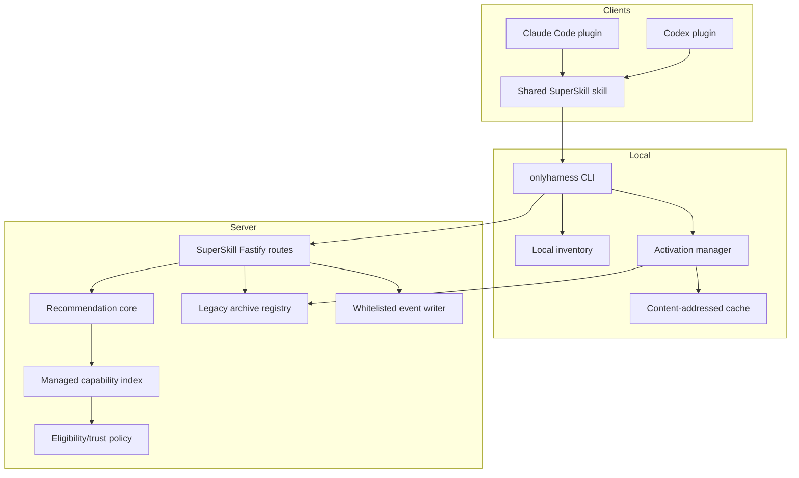

# 01 — System architecture

## 1. Цель

Добавить SuperSkill MVP как узкий managed-контур поверх OnlyHarness, не переписывая
catalog, billing, workspace или social legacy.

Система должна одинаково обслуживать Claude Code и Codex и не дублировать бизнес-логику
по clients.

## 2. Контекст и границы

### Внутри MVP

- curated managed catalog;
- exact releases и content digest;
- trust eligibility;
- deterministic recommendation;
- CLI-first temporary/pinned activation;
- dual-manifest SuperSkill plugin;
- lifecycle telemetry;
- revoke/quarantine;
- internal alpha reporting.

### Вне MVP

- внешний visual redesign;
- enterprise workspace UI;
- author self-service managed approval;
- arbitrary executable packages;
- live sandbox execution;
- LLM/embedding recommendation service;
- monetization;
- cross-device state sync;
- silent updates/removal;
- Cursor и другие clients.

## 3. Компоненты



## 4. Module boundaries

### Shared schema package

Путь: `packages/capability-schema`.

Package обязан иметь два export entrypoint:

- `@harnesshub/capability-schema/browser` — только Zod schemas/types/error enums;
- `@harnesshub/capability-schema/node` — canonical digest и Node byte/path helpers.

Browser entrypoint не импортирует `node:crypto`, `node:fs`, `node:path` и другие
Node-only modules.

Отвечает только за:

- Zod schemas и TypeScript types;
- canonical artifact digest;
- lifecycle enums;
- stable error codes;
- pure validation helpers.

Не знает о Fastify, filesystem locations, Commander, React или Supabase.

### API managed modules

Новые модули:

- `apps/harness-api/src/capabilities.ts` — load/build/query managed index;
- `apps/harness-api/src/trust-policy.ts` — pure eligibility decision;
- `apps/harness-api/src/recommendations.ts` — pure ranking;
- `apps/harness-api/src/routes/superskill.ts` — HTTP binding;
- существующий `events.ts` — whitelisted persistence;
- существующий `registry.ts` — archive source, дополненный digest.

`server.ts` только регистрирует routes и передаёт dependencies. Новая бизнес-логика в
`server.ts` запрещена.

Managed archive is a route inside `routes/superskill.ts` over the safe snapshot builder.
It is intentionally separate from legacy payment-aware archive delivery and cannot import
payment/x402/entitlement helpers.

### CLI managed modules

Новые модули:

- `packages/harness-cli/src/lib/superskill-client.ts`;
- `packages/harness-cli/src/lib/artifact.ts`;
- `packages/harness-cli/src/lib/cache.ts`;
- `packages/harness-cli/src/lib/activation-store.ts`;
- `packages/harness-cli/src/lib/client-adapters.ts`;
- `packages/harness-cli/src/commands/recommend.ts`;
- `packages/harness-cli/src/commands/activation.ts`.

`index.ts` регистрирует команды и не содержит новую state-machine реализацию.

### Client plugin package

Один source directory:

```text
plugins/superskill/
  .claude-plugin/plugin.json
  .codex-plugin/plugin.json
  .mcp.json
  skills/
    superskill/
      SKILL.md
      references/
        consent.md
        lifecycle.md
```

Оба manifests указывают на общий skill и существующий public MCP config. В internal
alpha новый managed recommendation/activation flow идёт через version-pinned CLI;
managed MCP tools откладываются до проверенного bearer transport. Отдельные копии
`SKILL.md` запрещены.

## 5. Runtime data sources

### Authoritative managed inputs

```text
seed-harnesses/*                    native resource content
data/harness-versions/*             immutable snapshots
data/superskill/curated.json        curation and pinned refs
data/superskill/reviews/*           exact-digest attestations
```

Append-only revoke tombstones хранятся отдельно от rollback-able catalog release:

```text
SUPERSKILL_REVOCATIONS_PATH         persisted mounted JSONL, keyed by artifact digest
```

API сначала проверяет tombstone overlay, затем generated index. Deploy/rollback без
текущего overlay запрещён.

### Generated data

```text
data/superskill/index.json          public-safe managed index
```

Generated index создаётся build/check script. API не изменяет curated files в runtime.

### Persistent server data

Только lifecycle events в Supabase или local JSONL fallback.

Recommendation records отдельно не сохраняются. `recommendationId` нужен для корреляции
событий и имеет короткий TTL, но task text не хранится.

### Local client data

```text
<project>/.onlyharness/client.json
<project>/.onlyharness/cache/sha256/<digest>/
<project>/.onlyharness/activations/<activation-id>.json
<project>/.onlyharness/inventory.json
```

CLI добавляет `/.onlyharness/` только в local `.git/info/exclude`; tracked `.gitignore`
не меняется. Repository path не отправляется.

`<project>` вычисляется один раз: explicit `--project-dir` →
`git rev-parse --show-toplevel` → current working directory. Затем используется
canonical realpath. Для git exclude CLI получает путь только через
`git rev-parse --git-path info/exclude`; тот же root используют state, inventory и оба
pinned adapters.

## 6. Main data flows

### 6.1 Recommendation

```text
Shared skill
→ local inventory snapshot
→ privacy-safe task summary
→ hh recommend
→ POST /recommendations
→ eligibility filter
→ deterministic score
→ selected + alternatives + consent contract
```

Recommendation не загружает archive и не меняет local state.

### 6.2 Temporary activation

```text
explicit consent
→ exact release recheck
→ activation_started
→ download immutable archive
→ recompute digest
→ validate manifest/trust locally
→ promote to cache
→ write activation record ready
→ shared skill reads declared workflow files
→ loaded
→ invoked
→ outcome
→ close activation
```

Temporary mode не пишет в client skill discovery directories.

### 6.3 Pinned activation

```text
temporary activation or exact capability
→ explicit keep consent
→ preflight target path
→ staged generated SKILL.md
→ atomic move to client-native skill path
→ managed marker + digest
→ doctor
→ activation_pinned
```

Claude Code target:

```text
<project>/.claude/skills/superskill-<slug>/SKILL.md
```

Codex target:

```text
<project>/.agents/skills/superskill-<slug>/SKILL.md
```

### 6.4 Revoke

```text
curated status changed to revoked
→ catalog build
→ API no longer recommends
→ activation exact-release recheck blocks
→ doctor finds local matching digest
→ user receives remove/replacement action
```

MVP не удаляет pinned resource автоматически.

## 7. Deployment topology

Текущая topology сохраняется:

- Vite static web;
- Fastify API;
- Caddy `/api` and `/mcp` routing;
- Supabase auth/events;
- npm `onlyharness` CLI;
- Git plugin marketplaces.

Новый external service не добавляется.

Internal activation acceptance covers terminal-launched Claude Code and Codex CLI.
Codex app/IDE distribution compatibility may be checked, but managed execution waits for
a separate GUI credential onboarding contract.

Feature flags:

```text
SUPERSKILL_ENABLED=false
SUPERSKILL_TOKEN_HASHES=<comma-separated SHA-256 token hashes>
SUPERSKILL_TELEMETRY_SALT=<rotatable server secret>
SUPERSKILL_SUBJECT_SALT=<stable random secret, minimum 32 bytes>
SUPERSKILL_REVOCATIONS_PATH=<persistent mounted path>
```

Rules:

- disabled → managed endpoints unavailable, legacy healthy;
- user flow → remote MCP and managed routes receive the confirmed Supabase user Bearer
  from an explicitly allowlisted client environment variable;
- every request live-verifies the user, `email_confirmed_at`, and one active,
  non-expired, non-revoked `superskill:managed` grant;
- server derives one stable `user:<HMAC>` subject with `SUPERSKILL_SUBJECT_SALT`; the same
  subject owns hosted releases and correlates recommendation/activation events;
- internal alpha compatibility → each tester may still receive a distinct opaque
  `HH_SUPERSKILL_TOKEN`, but those responses are marked public-GO ineligible;
- raw token, provider user payload, email and client-supplied subject/scope are never
  returned or stored in managed telemetry;
- grant create/revoke is an operator-only control plane; application requests cannot
  self-grant a scope and revocation is effective on the next request.

Exception: `/showroom/capabilities*` is an intentionally public, cached, public-safe
read projection. It accepts no task/context, exposes no archive/activation controls and
does not weaken Bearer auth on recommendation, exact recheck or managed archive routes.

## 8. Failure isolation

| Failure | Required behavior |
|---|---|
| Managed index invalid | SuperSkill endpoints fail `CATALOG_NOT_READY`; legacy stays up |
| Recommendation error | No activation, no local mutation |
| Event storage unavailable | User flow continues; local retry queue bounded |
| Archive download failure | Staging removed; activation failed |
| Digest mismatch | Cache not promoted; security error surfaced |
| Client adapter collision | No target files changed |
| Node/npm/version-pinned CLI unavailable | Stop before recommendation with `LOCAL_CLI_UNAVAILABLE` |
| Resource revoked | New activation blocked regardless of cached artifact |

## 9. Simplicity constraints

Implementation review должен отклонять:

- database Resource Graph для internal alpha;
- queue/broker для lifecycle events;
- microservice split;
- server-side LLM router;
- Kubernetes/operator work;
- generic plugin abstraction beyond the two adapters;
- UI state machine до получения design;
- auto-update daemon;
- remote execution.

Добавлять сложность можно только если существующий acceptance test невозможно пройти
без неё и это подтверждено отдельным architecture decision.

## 10. Architecture acceptance

- Одна recommendation implementation для HTTP и CLI; будущий MCP adapter обязан вызвать
  тот же core без отдельного ranking.
- Одна activation state machine для Claude Code и Codex.
- Один shared `SKILL.md`.
- Client-specific code ограничен detection, paths, plugin manifests и smoke.
- Legacy endpoints не меняют существующую semantics; digest/evidence/managed eligibility
  добавляются только аддитивно.
- SuperSkill можно полностью выключить одним flag.
- Ни один failure managed-контура не ломает `/healthz`, `/registry`, `/resources` или
  legacy archive delivery.
