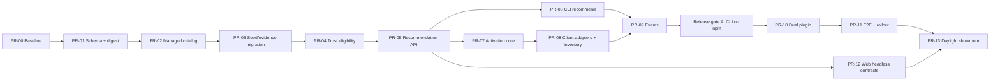

# 06 — Execution backlog

## 1. Delivery rules

- Implement PRs in dependency order.
- One PR may contain multiple commits, but one coherent responsibility.
- Every PR starts from green baseline and ends with scoped tests plus root checks required
  by its risk.
- Do not mix future visual redesign into these PRs.
- Existing unrelated worktree changes must be preserved.
- Runtime behavior, OpenAPI, CLI help, plugin guidance and public docs change together.
- Money/workspace/bounty code remains untouched unless compilation requires a narrow
  compatibility edit.
- CLI characterization is incremental: before changing a shared legacy branch in the
  4,768-line `index.ts`, add focused coverage for that branch; new managed commands get
  separate test files while the existing 51-test suite remains green.

## 2. Dependency graph



PR-07 may be developed behind interfaces while router work proceeds, but cannot merge
before PR-05 exact-release/auth routes exist.

---

## PR-00 — Baseline stabilization

### Goal

Make current repository fully green and document current truth before feature work.

### Files

- `apps/registry-web/vite.config.ts`
- new `apps/registry-web/src/test/setup.ts`
- affected web tests only if required
- `AGENTS.md`
- `apps/registry-web/public/AGENTS.md`
- `apps/registry-web/public/llms.txt`
- `README.md`
- `scripts/check-public-copy.ts` or new docs-sync check
- root `package.json`

### Work

1. Add deterministic localStorage setup for Vitest/jsdom.
2. Prove all 61 current web tests run; do not skip failing suites.
3. Sync workspace subscription runtime claims.
4. Add docs assertion for the corrected claim.
5. Capture legacy response fixtures for `/registry`, `/resources`, archive and MCP tool
   list so later managed work cannot silently change them.

### Verification

```bash
npm run check
npm run check
npm run smoke
npm run smoke
```

### Done

- Four commands pass.
- No production behavior change except docs correctness/test environment.

---

## PR-01 — Shared capability schema and artifact digest

### Goal

Create one strict managed contract and exact artifact identity shared by API/CLI/web.

### New files

- `packages/capability-schema/package.json`
- `packages/capability-schema/tsconfig.json`
- `packages/capability-schema/src/browser.ts`
- `packages/capability-schema/src/node.ts`
- `packages/capability-schema/src/artifact-node.ts`
- `packages/capability-schema/test/schema.test.ts`
- `packages/capability-schema/test/artifact.test.ts`
- `scripts/check-managed-archive-boundary.ts`
- managed archive boundary characterization fixture/test

### Modified files

- root workspace lock/package files
- `apps/harness-api/package.json`
- `packages/harness-cli/package.json`
- `apps/registry-web/package.json`
- `apps/harness-api/src/registry.ts`
- archive response types/tests
- CLI archive types/tests

### Work

1. Implement exact schemas from contract spec.
2. Implement one digest function; API and CLI import it instead of copies.
3. Add digest to archive/snapshot response.
4. Reject symlink, duplicate normalized path and truncated managed artifact.
5. Reject non-regular/out-of-root files before read; enforce 80 file/256 KiB/2 MiB
   shared limits and complete-archive metadata.
6. Keep legacy archive response additive.
7. Add browser-safe package export and prove Vite build does not resolve Node modules.
8. Lock archive/payment separation before PR-05: managed snapshot construction imports
   `registry` only; neither `registry.ts` nor the future SuperSkill route may import
   `payments.ts`, x402 or entitlement helpers.

### Tests

- golden digest fixture;
- one-byte content change changes digest;
- file-order independent;
- path normalization failures;
- symlink-to-outside and 81-file truncation failures;
- characterization test imports/builds a snapshot without loading payment modules;
- dependency-boundary check fails on payment/x402/entitlement imports from registry or
  managed route;
- legacy archive consumer ignores new field.

### Verification

```bash
npm run test -w @harnesshub/capability-schema
npm run test -w @harnesshub/api
npm run check:managed-archive-boundary
npm test -w onlyharness
npm run build -w @harnesshub/registry-web
npm run smoke
```

### Done

- API/CLI digest identical.
- No managed artifact without explicit snapshot/digest.

---

## PR-02 — Managed curated catalog build

### Goal

Create separate managed index without changing browse catalog semantics.

### New files

- `data/superskill/curated.json`
- `data/superskill/reviews/README.md`
- `data/superskill/router-cases/README.md`
- generated `data/superskill/index.json`
- `scripts/build-superskill-catalog.ts`
- `scripts/check-superskill-catalog.ts`
- `scripts/superskill-catalog.test.ts`
- `apps/harness-api/src/capabilities.ts`
- `apps/harness-api/test/capabilities.test.ts`

### Modified files

- root `package.json`
- API startup/config wiring
- production env example/checks

### Work

1. Add `SUPERSKILL_ENABLED` and configurable managed index path.
2. Implement curated/build schemas.
3. Require exact snapshot/digest; `candidate.reviewFile` is optional, while `approved`
   requires a valid attestation created in PR-04.
4. Generate public-safe index deterministically.
5. Load index fail-closed only for managed routes.
6. Seed catalog initially contains candidates, not falsely approved entries.

### Tests

- missing review/digest/source/license;
- duplicate IDs/refs;
- candidate vs approved;
- quarantine/revoke kept for doctor history;
- invalid index does not break health/legacy registry.

### Verification

```bash
npm run check:superskill-catalog
npm run test:scripts
npm run test -w @harnesshub/api
npm run smoke
```

### Done

- Managed index is independent of 253-resource browse catalog.
- Feature off leaves legacy unchanged.

---

## PR-03 — Honest seed runtime and evidence migration

### Goal

Convert 12 generated seeds from pretend runtime/verification to honest instruction
resources and create new immutable versions.

### Modified files

- `scripts/create-seeds.ts`
- all generated `seed-harnesses/*`
- `packages/harness-schema/src/index.ts` only where needed
- eval/gate CLI implementation/tests
- API publish gate/detail types/tests
- public copy/docs

### Work

1. Set instruction seeds to `runtime.primary=none`.
2. Remove nonexistent entrypoint and false required secret.
3. Keep workflow stages/prompts.
4. Add known first-party source/license metadata.
5. Introduce result schema/evidence level.
6. Author-declared case score is not independent verification.
7. Preserve legacy `verified` byte/behavior semantics; add `evidenceLevel` and
   `managedEligible`, changing only copy/interpretation.
8. Increment versions and write immutable snapshots.
9. Update curated expected digests.

### Tests

- seed generator is deterministic;
- every generated seed validates;
- no seed declares nonexistent entrypoint;
- author score cannot set `managedEligible`;
- old result file still reads as legacy evidence;
- legacy response fixture stays byte/behavior compatible;
- new snapshot conflict guard works.

### Verification

```bash
npm run seed
npm run check
npm run smoke
git diff --check
```

### Done

- 12 resources are honest candidates.
- No public copy calls author score independent proof.

---

## PR-04 — Trust eligibility and reviews

### Goal

Implement internal-alpha safety policy, capability inference and exact-digest approval.

### New files

- `apps/harness-api/src/trust-policy.ts`
- `apps/harness-api/test/trust-policy.test.ts`
- review files for migrated seeds as each passes
- optional shared capability-diff module/tests
- `scripts/superskill-revoke.ts` and tests

### Modified files

- `apps/harness-api/src/security-scan.ts`
- `packages/harness-schema/src/index.ts`
- scanner tests
- catalog build/check

### Work

1. Add hard-block policy.
2. Add secret/Unicode/obfuscation/secondary-download checks.
3. Add declared-vs-inferred capability diff.
4. Add review attestation validation/freshness.
5. Implement exact `superskill.review.v1` fields and digest/client/human-case binding.
6. Add Claude Code and Codex compatibility check slots; only fresh `verified` passes.
7. Approve exact free-archive resources only after evidence exists.
8. Implement quarantine/replacement and append-only persisted revoke tombstones.
9. Add strict revoke command with dry-run, actor/reason/replacement, fsync-safe append,
   global digest aliases and concurrent/idempotent behavior.

### Tests

- every hard block;
- warn and consent-required states;
- digest change invalidates approval;
- expired client smoke invalidates approval;
- public trust DTO hides excerpts/reviewer private fields.
- concurrent revoke append, duplicate event and same-digest alias behavior.

### Verification

```bash
npm run check:superskill-catalog
npm run test -w @harnesshub/api
npm run check
```

### Done

- `managedEligible` is a pure exact-release decision.
- No unscanned/unknown-license/executable item approved.

---

## PR-05 — Recommendation core and managed HTTP

### Goal

Return deterministic task-first recommendation from approved managed releases.

### New files

- `apps/harness-api/src/recommendations.ts`
- `apps/harness-api/src/routes/superskill.ts`
- `apps/harness-api/test/recommendations.test.ts`
- 30+ initial router fixture cases, growing to 60/100 through rollout
- `scripts/check-superskill-router.ts`

### Modified files

- `apps/harness-api/src/server.ts` registration only
- `apps/harness-api/src/openapi.ts`
- root scripts

### Work

1. Normalize task.
2. Candidate generation and exclusions.
3. Exact 40/15/15/10/10/5/5 scoring.
4. Stable sort, gap, confidence and decision.
5. POST recommendations + capability detail routes.
6. Per-tester Bearer auth using stored token hashes and server-derived subject.
7. Add request privacy/logging guards and reject body identity.
8. Keep new managed MCP tools disabled in internal alpha.
9. Bind activation consent to decision digest and expiry.
10. Add managed free-only archive route that never calls payment/x402/entitlement code.

### Tests

- exact score math;
- tie order;
- both clients;
- no popularity influence;
- ambiguity/no match;
- revoke between queries;
- 401/403/200 auth matrix;
- task not persisted/logged fixture;
- paid/pricing-drift fixture proves payment helpers/events are never called;
- full router gate.

### Verification

```bash
npm run check:superskill-router
npm run test -w @harnesshub/api
npm run smoke
```

### Done

- HTTP/core result is deterministic; future MCP may only wrap this core.
- initial 30-fixture gate passes at the same 90% top-3 threshold; 60/100 are Stage B/C
  rollout gates.

---

## PR-06 — CLI recommend

### Goal

Expose managed recommendation to shell-capable clients without changing `hh suggest`.

### New files

- `packages/harness-cli/src/lib/superskill-client.ts`
- `packages/harness-cli/src/commands/recommend.ts`
- dedicated CLI tests

### Modified files

- `packages/harness-cli/src/index.ts` registration
- CLI README/help
- root/public docs
- SuperSkill skill draft

### Work

1. Add explicit target.
2. Local task validation/secret guard.
3. JSON/text rendering.
4. Permission delta honesty.
5. Stable exit codes/reasonCode.
6. Read `HH_SUPERSKILL_TOKEN` only for Authorization header; never persist/log it.
7. Keep `suggest` behavior and label it legacy catalog suggestion.

### Verification

```bash
npm test -w onlyharness
npm run build -w onlyharness
node packages/harness-cli/dist/hh.mjs recommend "market research" --target codex --json
```

Use isolated local API fixture for deterministic test; do not depend on production result.

### Done

- Both targets produce same selected release for same context.

---

## PR-07 — Transactional activation core

### Goal

Implement client-neutral local state/cache/state machine.

### New files

- `packages/harness-cli/src/lib/artifact.ts`
- `packages/harness-cli/src/lib/cache.ts`
- `packages/harness-cli/src/lib/activation-store.ts`
- `packages/harness-cli/src/commands/activation.ts`
- state/cache/command tests

### Modified files

- CLI registration/package docs
- local event sender/retry

### Work

1. Resolve project root once: explicit override → git top-level → cwd, canonical realpath.
2. Update exclude via `git rev-parse --git-path info/exclude`.
3. Staging/digest/atomic cache promotion.
4. Exact release status recheck.
5. Idempotent activation request ID and atomic record writes.
6. Store recommendation ID, mode and pinned source marker correlation.
7. Separate execution state and pin state with full transition/crash recovery table.
8. Require explicit consent/decision digest/expiry; implement mark/finish core.
9. Add common `--project-dir` to managed local commands.
10. Bounded pending event queue.

### Tests

- all state transitions;
- concurrent cache start;
- digest/snapshot/revoke failures;
- cleanup/rollback;
- no tracked git status pollution;
- nested CWD and linked worktree;
- offline pinned reuse blocked;
- no local path in emitted event.

### Verification

```bash
npm test -w onlyharness
npm run typecheck -w onlyharness
npm run smoke
```

### Done

- Temporary activation reaches ready for both target values with identical core.

---

## PR-08 — Claude/Codex adapters, pinned skills and inventory

### Goal

Add the only client-specific layer and correct legacy Codex path.

### New files

- `packages/harness-cli/src/lib/client-adapters.ts`
- adapter-specific tests/fixtures

### Modified files

- activation keep/remove/doctor
- audit-setup
- old `adaptHarness` Codex behavior/docs/tests

### Work

1. Implement adapter interface.
2. Claude pinned path `.claude/skills`.
3. Codex pinned path `.agents/skills`.
4. Self-contained pinned skill package.
5. Managed marker with per-file/package digests and safe slug/path validation.
6. Pinned reuse activation.
7. Claude/Codex inventory.
8. Detect legacy `.codex/harnesses` and give fresh-pin guidance; no automatic migration.
9. Do not auto-delete legacy path.
10. Keep only after outcome with separate confirmation.
11. Do not implement in-place update; doctor reports remove+fresh-pin path.
12. Pin concrete CLI/activation contract versions in marker; pinned reuse works without
    plugin/global CLI.
13. Make remove marker-based, confirmed, offline and crash-idempotent.
14. Require matching owning activation record; missing state returns guidance and deletes
    nothing.

### Tests

- exact paths;
- target collision;
- rollback;
- changed managed file protection;
- marker/path symlink and traversal rejection;
- pinned package works without temp cache;
- duplicate skills;
- legacy detection leaves source untouched;
- keep/remove crash at every write/delete boundary.
- marker without owning activation record deletes nothing.

### Verification

```bash
npm test -w onlyharness
npm run check
npm run smoke
```

### Done

- No new Codex install writes `.codex/harnesses`.
- Both pinned packages pass filesystem doctor.

---

## PR-09 — Lifecycle events and pilot report

### Goal

Correlate honest funnel without storing user content.

### New files

- Supabase migration for managed event fields/kinds/indexes
- `scripts/superskill-pilot-report.ts`
- report tests

### Modified files

- `apps/harness-api/src/events.ts`
- events tests/OpenAPI/docs
- CLI event sender/retry

### Work

1. Add `event_id` and unique conflict behavior.
2. Add recommendation/activation/evidence/outcome/reason fields.
3. Extend strict sanitizer.
4. Remove public body `subject`; derive stable tester subject server-side from token HMAC.
5. Add local fallback dedupe.
6. Add aggregate report based on distinct issued tester tokens, not project IDs.
7. Add telemetry off.

### Tests

- duplicate event;
- lifecycle order not enforced server-side but report handles gaps;
- adversarial prompt/path/secret drop;
- telemetry off;
- retry queue bounded;
- report uses unique IDs.

### Verification

```bash
npm run test -w @harnesshub/api
npm test -w onlyharness
npm run test:scripts
```

### Done

- Full event chain is correlatable and content-free.

---

## PR-10 — Dual-manifest SuperSkill plugin

### Release gate A — CLI npm availability

Before PR-10 clean-client E2E:

1. Finish PR-06–PR-09 checks against local fixtures.
2. Bump and publish a new `onlyharness` version containing managed commands.
3. Verify `npm view onlyharness@<version>` and `npx --yes onlyharness@<version> --version`
   from a clean temp home.
4. Put that concrete published version in `plugins/superskill/runtime.json`.
5. Treat local binary/package overrides only as development tests, never clean-client
   distribution proof.

The managed commands remain harmless to public users without internal token/feature.
Marketplaces are not published at this gate.

### Goal

Ship one shared skill through native Claude Code and Codex distributions.

### New files

- `plugins/superskill/.claude-plugin/plugin.json`
- `plugins/superskill/.codex-plugin/plugin.json`
- `plugins/superskill/.mcp.json`
- `plugins/superskill/runtime.json`
- `plugins/superskill/skills/superskill/SKILL.md`
- references
- `.agents/plugins/marketplace.json`
- `scripts/check-codex-plugin.ts`

### Modified files

- `.claude-plugin/marketplace.json`
- Claude plugin check
- root scripts
- README/AGENTS/llms/plugin docs

### Work

1. Add both manifests same version.
2. Add one shared skill.
3. Encode routing disclosure, activation consent, no-match, lifecycle and privacy flow.
4. Add Codex marketplace.
5. Add contract checks.
6. Validate privacy/terms URLs or omit optional dead fields.
7. Document exact install/update commands.
8. Check in concrete compatible `onlyharness` CLI/activation contract version in
   `runtime.json`; never use latest or a release-time placeholder.
9. Add Node/npm preflight and `LOCAL_CLI_UNAVAILABLE` behavior.
10. Contract-check runtime file against shared and generated skill commands.

### Verification

```bash
npm run check:plugin
npm run check:codex-plugin
claude plugin validate plugins/superskill
CODEX_HOME=<temp> codex plugin marketplace add <repo>
CODEX_HOME=<temp> codex plugin add superskill@onlyharness
CODEX_HOME=<temp> codex plugin list
```

### Done

- Shared skill byte-identical for both.
- Clean install works in both clients.

---

## PR-11 — End-to-end smoke and internal rollout

### Goal

Prove complete loop and prepare reversible internal alpha.

### New files

- `scripts/smoke-superskill.ts`
- optional revoke smoke
- rollout report template

### Modified files

- root scripts/check chain
- deploy config/scripts only as required
- public docs after verified publish

### Work

1. Happy/failure/revoke smoke for both clients.
2. Clean distribution smoke.
3. Production feature flag/config.
4. Dark deploy.
5. Issue distinct tester tokens, deploy token hashes/HMAC salt, and mount persisted revoke
   overlay.
6. Publish CLI/plugins after live API proof.
7. Run developer canary then team alpha.
8. Prove `revoke → previous index rollback → activation remains blocked`.

### Verification

Use full matrix from verification spec, including two consecutive smoke runs and real
one-task activation in each client.

### Done

- 20-user/100-task gate eventually measured.
- Rollback verified.

---

## PR-12 — Headless web contracts

Can merge after PR-05 and before or after internal alpha. No visual redesign.

### Goal

Prepare stable React data layer for future user-provided design.

### New files

- `apps/registry-web/src/core/superskill-types.ts`
- `apps/registry-web/src/core/useRecommendations.ts`
- `apps/registry-web/src/core/useCapabilityDetail.ts`
- tests/fixtures

### Work

1. Import/re-export shared schemas safely for browser.
2. Implement request/loading/recommend/clarify/no-match/error states.
3. Do not add new skin/layout.
4. Do not show copied command as installed.
5. Preserve current site.

### Verification

```bash
npm test -w @harnesshub/registry-web
npm run build -w @harnesshub/registry-web
npm run check
```

### Done

- Future design can render all required states against typed fixtures; PR-13 adds only a
  public-safe showroom projection without changing managed execution contracts.

---

## PR-13 — Daylight v1.0 showroom implementation

Starts only after PR-12 headless contracts and PR-11 live managed-data proof. It does not
block Claude Code/Codex Stage A.

### Goal

Implement the supplied Daylight design as the new default SuperSkill web skin without
fabricated trust/adoption data or browser access to internal execution tokens.

### Source

- `docs/plans/2026-07-12-superskill-mvp-developer-handoff-daylight.md`
- attached `SuperSkill Design System.dc.html`
- attached `SuperSkill Landing Themes.dc.html`, theme `daylight`
- attached `SuperSkill DS Handoff.dc.html`

### Work

1. Add public-safe `/showroom/capabilities*` projections and exact-digest preview schema.
2. Add showroom hooks/routes and generated concrete CLI runtime version.
3. Add isolated `superskill` skin, Daylight tokens/primitives/components.
4. Implement landing, trust page, install handoff and required states.
5. Keep browser task local and hand it to Claude Code/Codex; never embed internal token.
6. Preserve old skins behind explicit query and hide switcher in production.
7. Complete responsive, keyboard, reduced-motion and content acceptance.
8. Switch default only after live public showroom smoke.

### Verification

```bash
npm run test -w @harnesshub/api
npm run typecheck -w @harnesshub/registry-web
npm test -w @harnesshub/registry-web
npm run build -w @harnesshub/registry-web
npm run check
npm run smoke
npm run smoke:superskill
git diff --check
```

### Done

- Daylight is default with live/honest DTOs.
- No fake metrics/checks/compatibility/outcomes.
- Protected recommendation/archive paths remain Bearer-only.
- Browser evidence exists at desktop/mobile viewports.

## 3. Final backlog audit

Before declaring implementation complete, map every requirement to evidence:

| Requirement | Evidence |
|---|---|
| Claude Code first client | Clean install + real activation chain |
| Codex first client | Isolated marketplace install + real activation chain |
| One shared core | Module/import inspection + parity tests |
| Stage A supply | 12 approved exact releases |
| 20 approved exact releases | Generated index/check output |
| Stage A router | 30-case gate at 90% top-3 + API response |
| Final task-first router | 100-case gate at the same threshold |
| Exact artifact | Snapshot/digest fixtures and mismatch test |
| Honest trust | Named-check DTO and no false verified copy |
| Temporary activation | E2E state chain without pinned directory write |
| Pinned activation | Native paths + self-contained package tests |
| Revoke | Dual-client drill |
| Privacy | Sanitizer adversarial tests and stored rows inspection |
| Internal MVP proof | 20 users/100 attempts report |
| Future design independence | Headless hooks and unchanged skins |
| Daylight design integration | PR-13 handoff acceptance + desktop/mobile browser evidence |

Missing or indirect evidence means requirement is not complete.
